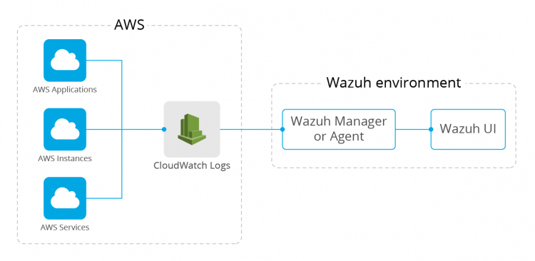

.. Copyright (C) 2021 Wazuh, Inc.

.. _integrating-aws-cloudwatch-logs:

Integrating AWS CloudWatch Logs in Wazuh
========================================

The AWS CloudWatch Logs integration was added with the Wazuh 4.0 release and below we will focus on setting up Wazuh to collect log files from Amazon EC2 and Fargate instances, AWS CloudTrail, and many other sources supported by CloudWatch Logs.

What is AWS CloudWatch Logs
---------------------------

CloudWatch Logs acts as a central log management service that stores the logs from all the systems, applications, and AWS services. It allows users to see all the logs, regardless of their source, as a single and consistent flow of events ordered by time.

To understand how CloudWatch Logs works it is necessary to learn about the following concepts and how they are related:

- **Log events**: CloudWatch saves the logs generated by the application or resource being monitored as log events. A log event is a record with two properties: the timestamp when the event occurred and the raw log message.
- **Log streams**: Log events are stored in log streams. A log stream represents a sequence of events coming from the application instance or resource being monitored. All log events in a log stream share the same source.
- **Log groups**: Log streams are grouped using log groups. A log group defines a group of log streams that shares retention, monitoring, and access control settings.
  

How the Wazuh integration works
-------------------------------

The Wazuh CloudWatch Logs integration establishes a connection with CloudWatch using the AWS API and the credentials provided by the user. It will periodically pull the logs contained in the specified log group and send them to the Analysisd component, which will generate an alert if the log message matches with an applicable rule.

Setting it up
-------------

The following diagram shows what we want to accomplish:

.. note::  
  The following steps describe how to set up the wazuh module. It assumes the user already has CloudWatch Logs configured and working, with some data existing in a log group.

Step 1: Create AWS credentials
------------------------------

Once we have a log group with log events in it we need to set up credentials so that Wazuh is able to connect and extract those events. We recommend doing this instead of hardcoding the user and password for the AWS account in the ``ossec.conf``. More information about how to configure AWS credentials can be found in the `Wazuh documentation <https://documentation.wazuh.com/current/amazon/services/prerequisites/credentials.html>`_.

For testing purposes, we are going to create a file located at ``~/.aws/credentials`` with the following content to grant us access to CloudWatch:

.. code-block:: xml

 [default]
 aws_access_key_id=<YOUR_AWS_ACCESS_KEY>
 aws_secret_access_key=<YOUR_AWS_SECRET_KEY>

This way we will be able to connect to the AWS account if we specify default as the AWS profile in the next step.

