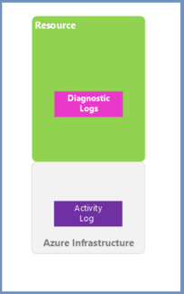

.. Copyright (C) 2018 Wazuh, Inc.

.. _azure:

Using Wazuh to Monitor Microsoft Azure
======================================

.. meta::
  :description: Discover how Wazuh can help you to monitor your Microsoft Azure infrastructure.

.. versionadded:: 3.7.0

This section provides instructions for monitoring **Microsoft Azure** infrastructures, such as:

- How to **monitor all the activity happening in the infrastructure**, for instance, changes that occur in virtual machines, activation of alerts, health data information as well as control data.
- How to install Wazuh agents to **monitor the virtual machines that form the infrastructure**, which will send events to the Wazuh manager for analysis in order to classify the event with a range of alerts that that can be easily viewed.
- How to monitor services of our infrastructure such as **Azure Active Directory (AAD)**.

From a wider perspective, the Microsoft Azure infrastructure resources can be divided into two types of logs, the **Activity logs** and the **Diagnostic logs**.

The operations performed on a resource outside of the infrastructure are stored in the Activity logs, providing information on those operations. On the other hand, the data referring to the operation of a resource is stored in the Diagnostic logs.

Wazuh has the ability to obtain and read Microsoft Azure logs through:

- **Azure Log Analytics**
- **Azure Active Directory Graph**
- **Azure Storage**

As a built-in Wazuh feature, now you can search, analyze and trigger alerts from Microsoft Azure log data.

.. topic:: Contents

    .. toctree::
       :maxdepth: 2

       installation
       monitoring instances
       monitoring activity
       monitoring services
