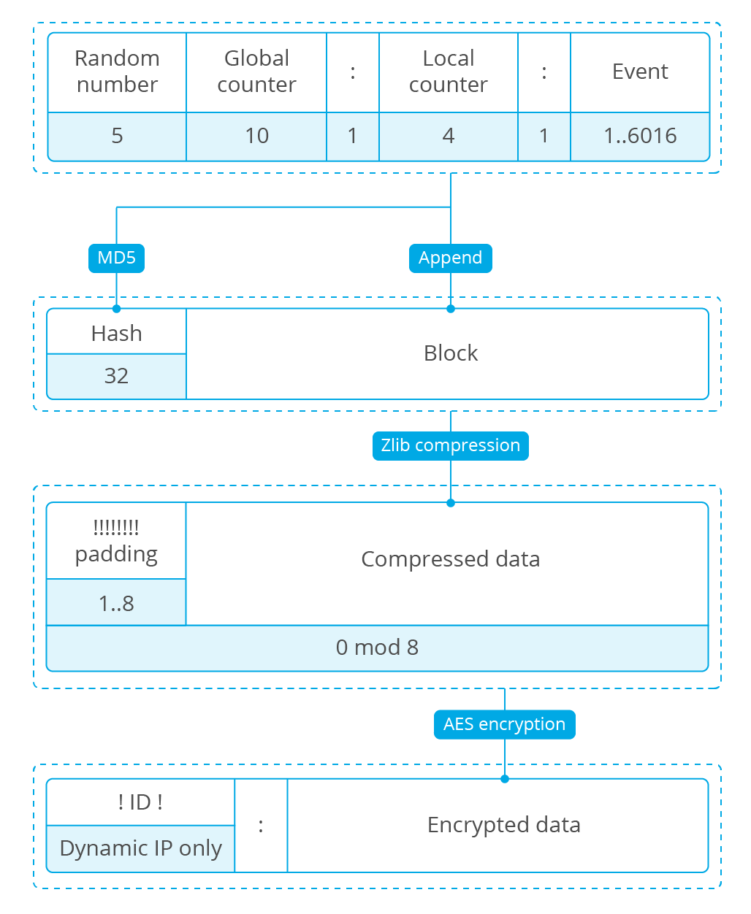

.. Copyright (C) 2018 Wazuh, Inc.

.. _message-format:

.. highlight:: none

Standard OSSEC message format
=============================

This page aims to describe the format of messages that OSSEC (and Wazuh) accepts and sends between its components:

Input logs
    Strings ingested by *Logcollector* from log files, Windows events, program outputs, etc.

Standard OSSEC events
    Data sent **locally** between OSSEC components, usually to *Agent daemon* (in agents) or *Analysis daemon* (in manager).

Secure messages
    Data delivered **remotely** between *Agent daemon* and *Remote daemon*.

Input logs
----------

Input logs are messages ingested by Logcollector. They can be in Syslog format or any other custom format. In the former case the message header is parsed by the pre-decoder.

Syslog message
~~~~~~~~~~~~~~

::

    Nov  9 16:06:26 localhost salute: Hello world.

These logs go through a pre-decoding stage that tries to extract some data from the logs, in the case they are in Syslog format.

- Date: ``Nov  9 16:06:26``
- Host name: ``localhost``
- Program name: ``salute``
- Log: ``Hello world.``

If the message is not in Syslog format, the log will be the full text.

The string in *log* is the input for decoders defined in XML format or plugin decoders.

Standard OSSEC event
--------------------

OSSEC events are transmitted between software components of the same machine, using the local datagram socket at ``/var/ossec/queue/ossec/queue``. For instance:

- Log events from *Logcollector* to *Agent daemon*.
- File integrity monitoring events from *Syscheck* to *Agent daemon*.
- Policy monitoring events from *Rootcheck* to *Agent daemon*.
- All of the previous events from *Remote daemon* to *Analysis daemon*.

The format of these events is:

::

    <Queue>:<Location>:<Message>

Queue
    1-byte event type. It defines the decoding mode for *Analysis daemon*.

    The most common queue types are:

    1
        Local file log, including Syslog messages, Windows event logs, outputs from commands, OpenSCAP results and custom logs.
    2
        Remote Syslog messages, received by the Syslog server at *Remote daemon*.
    4
        Secure messages. They are events from *Remote daemon* to *Analysis daemon*, that contain a standard OSSEC message plus the source agent ID.
    8
        Syscheck event. *Analysis daemon* parses it using the Syscheck decoder.
    9
        Rootcheck event. *Analysis daemon* parses it using the Rootcheck decoder.

Location
    Log source, typically the path to the file where the log was found.

Message
    Content of the log.

Example:

::

    1:/var/log/syslog:Nov  9 16:06:26 localhost salute: Hello world.

Secure message format
---------------------

Secure messages are those messages sent through a network between an agent (*Agent daemon*) and the manager (*Analysis daemon*). They are:

- Encrypted.
- Compressed.
- Randomized.
- Numerated.

Step by step procedure
~~~~~~~~~~~~~~~~~~~~~~

Block
+++++

The *block* is the result of joining a header and the input event::

    <Block> = <Random> <Global counter> ":" <Local counter> ":" <Event>

Random
    5-byte 0-padded random unsigned integer.

    +---------+----------+
    | Size    | 5 digits |
    +---------+----------+
    | Padding | 0-padded |
    +---------+----------+

Global counter
    Most significative part of the message counter.

    +---------+-----------+
    | Size    | 10 digits |
    +---------+-----------+
    | Padding | 0-padded  |
    +---------+-----------+

Local counter
    Least significative part of the message counter.

    +---------+----------+
    | Size    | 4 digits |
    +---------+----------+
    | Padding | 0-padded |
    +---------+----------+

Event
    Input message.

Hash
++++

The *hash* is the 32-byte MD5 digest::

    <Hash> = MD5(<Block>)

Compressed data
+++++++++++++++

This object is the result of compressing the *hash* and the *block* (appended) through the *DEFLATE* algorithm, using *zlib*::

    <CData> = Compress(<Hash> <Block>)

Padding
+++++++

The compressed data is a byte array that must:

1. Have a size multiple of 8.
2. Start with one or more ``!``.

So the ``<Padding>`` object is a string of 1 to 8 ``!`` symbols, so that the array resulting of appending both ``<Padding>`` and ``<CData>`` has asize multiple of 8. ::

    <Padding> = 1..8 "!"
    Length(<Padding> <Block>) = 0 (mod 8)

Encrypted data
++++++++++++++

The padded data is encrypted using Blowfish::

    <Encrypted> = Blowfish(<Padding> <Block>)

The initialization vector and the encryption key are described in `Encryption system`_.

Payload
+++++++

The payload is the final message that will be sent to the peer (secure manager or agent). It starts with ``:`` and, if and only if the agent entry allows more than one host (address ``any`` or netmask different from 32), the agent ID between two ``!`` symbols::

    <Payload> =
        ":" <Encrypted>,                    if <Netmask> = 32
        "!" <Agent ID> "!:" <Encrypted>,    otherwise

Complete encryption formula
~~~~~~~~~~~~~~~~~~~~~~~~~~~

For agents with restricted address::

    ":" Blowfish(<!-padding> Gzip(MD5(<Random> <Global> ":" <Local> ":" <Event>) <Random> <Global> ":" <Local> ":" <Event>))

For agents with unrestricted address (address ``any`` or netmask different from 32)::

    "!" <ID> "!:" Blowfish(<!-padding> Gzip(MD5(<Random> <Global> ":" <Local> ":" <Event>) <Random> <Global> ":" <Local> ":" <Event>))

This is the **encryption flow chart**:

Network protocol
~~~~~~~~~~~~~~~~

The procedure to send a payload via network depends on the connection protocol:

UDP protocol
    The datagram is the payload itself::

        Send(<Payload>)

TCP protocol
    Messages are not delimited by the network, so the payload size must be prepended to the payload::

        Send(<Size> <Payload>)

    The ``Size`` has the following format:

    +------------+---------------+
    | Size       | 4 bytes       |
    +------------+---------------+
    | Sign       | Unsigned      |
    +------------+---------------+
    | Endianness | Little-endian |
    +------------+---------------+

Encryption system
~~~~~~~~~~~~~~~~~

The encryption system uses a constant initialization vector and a key:

Initialization vector
    8-byte hexadecimal array::

        <IV> = FE DC BA 98 76 54 32 10

Encryption key
    They key is built by appending and cutting hexadecimal strings depending on some agent attributes (see :ref:`client-keys`)::

        <Key> = MD5(<Pass>) MD5(MD5(<Name>) MD5(<ID>))[0:15]

    To clarify: the second MD5 hash is cut to its first 15 bytes (from 0 to 14th).

    Example::

        <ID> = 003
        <Name> = myagent
        <Pass> = 2801fb64625a4ca5523395d8ab7370dbed275a227688542493c6577c3d9fdf2c

        MD5(<Pass>) = 7c07f68ea8494b2f8b9fea297119350d
        MD5(<Name>) = 370ca80d72402c8a4dbafa5b6888e2c5
        MD5(<ID>) = e88a49bccde359f0cabb40db83ba6080
        MD5(MD5(<Name>) MD5(<ID>))[0:15] = 78708afa69c1c76
        <Key> = 7c07f68ea8494b2f8b9fea297119350d78708afa69c1c76
