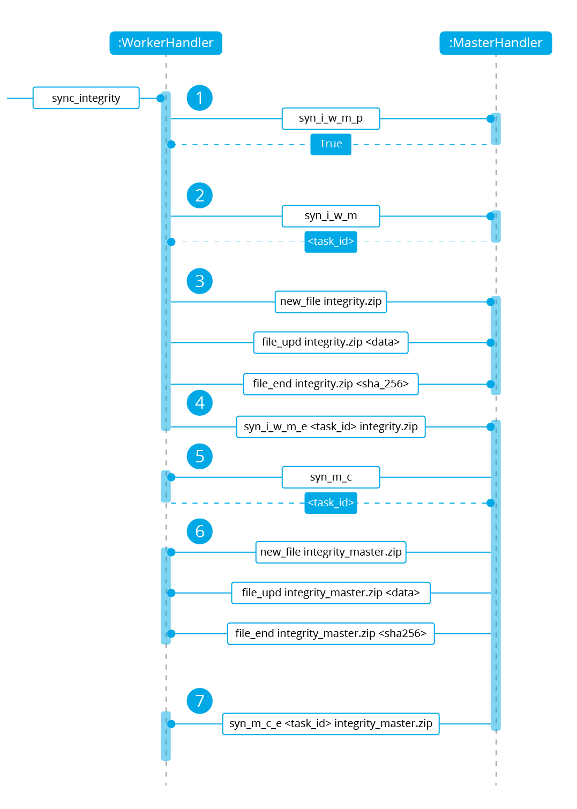
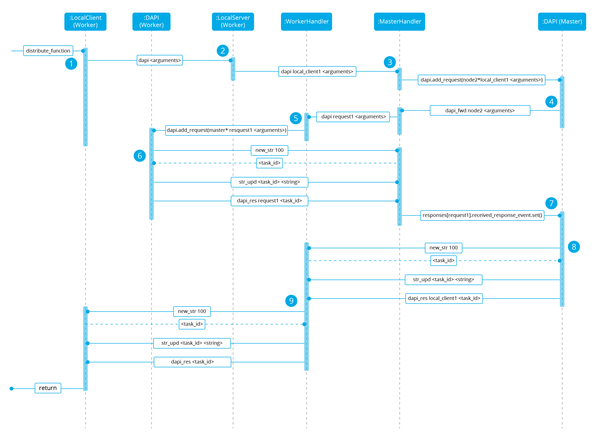

.. Copyright (C) 2019 Wazuh, Inc.

.. _dev-wazuh-cluster:

Wazuh Cluster
=============

- `Introduction`_
- `Architecture Overview`_
- `Code structure`_
- `Troubleshooting`_

Introduction
------------

Recommended reading: :ref:`wazuh-cluster`.

Today's environments usually have thousands of new agents everyday. A single manager architecture is not capable of managing so many events and, therefore, the workload needs to be balanced among multiple nodes. Almost every modern software can work in distributed mode because of this.

Wazuh's main workload is processing events from the agents and raise alerts. This is why all required information to receive events from the agents needs to be synchronized. This information is:

* The agents' keys so the nodes can accept incoming connections from agents.
* The agents' shared configuration so the nodes can send the agents their configuration.
* The agents' groups assigments, so the knows which configuration to send to the agents.
* The custom decoders, rules and CDB lists so the nodes can correctly process events from the agents.
* The agents' last keep alive and OS information, which is received once the agents connect to a node and it's necessary to know whether an agent is reporting or not.

Having all this information synchronized, any cluster node is capable of processing and raising alerts from the agents, making it possible to horizontally scale a Wazuh environment when new agents are added. 

Architecture Overview
---------------------

The following diagram shows a typical Wazuh cluster architecture:

.. thumbnail:: ../images/manual/cluster/cluster_infrastructure.png
    :title: Wazuh cluster infrastructure
    :align: center
    :width: 80%

Agents are usually configured to report to a load balancer which is configured to send network packets to all nodes in the cluster. This way, new nodes can be added without modifying agents' configuration.

.. note::
    The wazuh cluster doesn't manage the load balancer.

Types of nodes
^^^^^^^^^^^^^^

There are two different types of nodes inside the Wazuh cluster. These node types define the node's tasks inside the cluster and also, they define an hierarchy of nodes used to know which information prevails when doing synchronizations.

Master
~~~~~~

The master node is in charge of:

* Registering agents.
* Creating shared configuration groups.
* Updating custom rules, decoders and CDB lists.
* Synchronizing all this information to the workers.

All this information is called *Integrity* and is synchronized **from** the master **to** the workers no matter if the worker's has a more recent modification time or a higher size.

Master nodes can also receive and process events from agents the same way a worker would do.

Worker
~~~~~~

A worker node is in charge of:

* Receiving updates from the master
* Receiving and processing events from agents.
* Sending the master last keep alives from agents and remoted's group assigments.

If any integrity file is modified in a worker node, its content will be replaced with the contents the master node has.

Workflow
^^^^^^^^

The image below shows a schema of how a master node and a worker node interact with each other in the synchronization process. Every dotted square represents a synchronization task and they all work in parallel:

.. image:: ../images/manual/cluster/cluster_flow.png

Keep alive
~~~~~~~~~~

The worker nodes send a keep alive message to the master every so often. The master keeps the date of the last received keep alive and knows the interval the worker is using to send its keep alives. If the last keep alive received by a worker is older than a determined amount of time, the master considers the worker is disconnected and inmediately closes the connection. When a worker realizes the connection has been closed, it automatically tries to reconnect again.

This feature is very useful to drop nodes that are facing a networking issue or aren't available at the moment.  It was implemented  `here <https://github.com/wazuh/wazuh/issues/1355>`_.

Integrity Thread
~~~~~~~~~~~~~~~~

This thread is in charge of synchronizing master's integrity information among all worker nodes. The communication is started by the worker node and it has the following stages:

1. The worker asks the master for permission. This is important to prevent a new synchronization process to start if there is already one synchronization process at the moment (i.e. overlapping).
2. The worker sends the master a JSON file containing the following information:
    * Path
    * Modification time
    * MD5 checksum
    * Whether the file is a merged file or not. And if it's merged:
        * The merge type (agent-groups or agent-info).
        * The filename

3. The master compares the received checksums with its own and creates three different group of files:
    * Missing: Files that are present in the master node but missing in the worker. They must be created in the worker.
    * Extra: Files that are present in the worker node but missing in the master. They must be removed in the worker node as well.
    * Extra valid: Extra files that, instead of be removed in the worker, must be created in the master. This is a special type of file created for agent-groups files. These files can be created in worker nodes when an agent is re-registered and was previously assigned to a group.
    * Shared: Files that are present in both master and worker but have a different checksum. They must be updated in the worker node.

    Then the master prepares a zip package with a JSON containing all this information and the required files the worker needs to update.
4. Once the worker receives the package, it updates the necessary files and then it sends the master the required extra valid files.

If there is no data to synchronize or there has been an error reading data from worker, the worker is always notified about it.

Agent info
~~~~~~~~~~

This thread is in charge of synchronizing the agent's last keep alives and OS information with the master. The communication here is also started by the worker and it has the following stages:

1. The worker sends the master a file containing all agent infos merged in a single one. Only files whose modification date is less than half an hour will be sent.
2. The master decompresses the merged file and updates agent statuses. During the update process the master compares modification dates of its local file and the remote file. In case the master has a more recent file, the remote one is discarded.

If there is an error during this process the worker is NOT notified about it.

File integrity thread
~~~~~~~~~~~~~~~~~~~~~

This thread is only executed by the master. It periodically reads all its integrity files and calculate their cheksums. This was added to prevent the master to keep calculating the same checksums for every worker. This way, the checksums are already calculated and ready to use everytime a worker starts a synchronization process.

Distributed API thread
~~~~~~~~~~~~~~~~~~~~~~
This thread isn't shown in the schema. It runs in both master and worker, since it's independent of node type. It's used to receive API requests and forward them to the most suitable node to process the request. The operation of this thread will be explained later.

To sum up, these are the threads run in the cluster:

+--------------------------------+--------------+
| Name                           | Node running |
+================================+==============+
| Check worker's last keep alive | Master       |
+--------------------------------+              |
| Update file checksums          |              |
+--------------------------------+--------------+
| Sync integrity                 | Worker       |
+--------------------------------+              |
| Sync agent info                |              |
+--------------------------------+              |
| Send last keep alive to master |              |
+--------------------------------+--------------+
| Distributed API                | Both         |
+--------------------------------+--------------+

Code structure
--------------

The cluster is built on top of `asyncio.Protocol <https://docs.python.org/3/library/asyncio-protocol.html>`_. This Python framework helps us develop asynchronous communication protocols by just defining a few functions:

* ``connection_made``: Defines what to do when a client connects to a server / a server receives a new connection.
* ``connection_lost``: Defines what to do when the connection is closed. It includes an argument containing an exception in case the connection was closed due to an error.
* ``data_received``: Defines what to do when data is received from the other peer.

The wazuh cluster protocol is defined on top of this framework. The following diagram shows all Python classes defined based on ``asyncio.Protocol``:

.. thumbnail:: ../images/development/cluster_protocol_handler.png
    :title: Wazuh cluster protocol class inheritance
    :align: center
    :width: 80%

The higher classes on the diagram (``wazuh.cluster.common.Handler``, ``wazuh.cluster.server.AbstractServerHandler`` and ``wazuh.cluster.client.AbstractClient``) define abstract concepts of what a client and a server is. Those abstract concepts are used by the lower classes on the diagram (``wazuh.cluster.local_server.LocalServerHandler``, ``wazuh.cluster.master.MasterHandler``, ``wazuh.cluster.worker.WorkerHandler`` and ``wazuh.cluster.local_client.LocalClientHandler``) to define specific communication protocols. These specific protocols are described in the `Protocols`_ section.

There are abstract server and client classes to handle mutliple connections from multiple clients and connecting to the server. This way, all the logic to connect to a server or handling multiple clients can be shared between all types of servers and clients in the cluster. These classes are shown in the diagrams below:

.. thumbnail:: ../images/development/cluster_clients.png
    :title: Wazuh cluster protocol class inheritance
    :align: center
    :width: 80%

.. thumbnail:: ../images/development/cluster_servers.png
    :title: Wazuh cluster protocol class inheritance
    :align: center
    :width: 80%

Protocols
^^^^^^^^^

Protocol definition
~~~~~~~~~~~~~~~~~~~

The communication protocol used in all communications (both cluster and API) is defined in the ``wazuh.cluster.common.Handler``. Each message in the protocol has the following structure:

.. math::

    \underbrace{\underbrace{counter}_{integer} \underbrace{payload~length}_{integer} \underbrace{command}_{12~characters}}_{header~(22~bytes)} \underbrace{payload}_{5242880~bytes}

The protocol message has two parts: a header and a payload. The payload will be 5242880 bytes long at maximum and the header will be exactly 22 bytes long.

The header has three subparts:

* **Counter**: It specifies the message ID. It's randomly initialized and then increased with every new sent request. It's very useful when receiving a response, so it indicates which sent request it is replying to.
* **Payload length**: Specifies the amount of data contained in the message payload. Used to know how much data to expect receiving.
* **Command**: Specifies protocol message. This string will always be 12 characters long. If the command is not 12 characters long, a padding of ``-`` is added until the string reaches the expected length. All available commands in the protocol are shown below.

Wazuh cluster protocol
~~~~~~~~~~~~~~~~~~~~~~

This communication protocol is used by all cluster nodes to synchronize the necessary information to receive reports from the agents. All communications are made through TCP. These commands are defined in ``wazuh.cluster.master.MasterHandler.process_request`` and in ``wazuh.cluster.worker.WorkerHandler.process_request``.

+-------------------+-------------+-----------------------+-------------------------------------------------------------------------------------------------+
| Message           | Received in | Arguments             | Description                                                                                     |
+===================+=============+=======================+=================================================================================================+
| ``hello``         | Master      | - Node name<str>,     | First message sent by a worker to the master on its first connection.                           |
|                   |             | - Cluster name<str>,  |                                                                                                 |
|                   |             | - Node type<str>,     |                                                                                                 |
|                   |             | - Wazuh version<str>  |                                                                                                 |
+-------------------+-------------+-----------------------+-------------------------------------------------------------------------------------------------+
| ``sync_i_w_m_p``, | Master      | None                  | - Ask permission to start synchronization protocol. Message characters define the action to do: |
| ``sync_e_w_m_p``, |             |                       | - I (integrity), E (extra valid), A (agent-info).                                               |
| ``sync_a_w_m_p``  |             |                       | - W (worker), M (master), P (permission).                                                       |
+-------------------+-------------+-----------------------+-------------------------------------------------------------------------------------------------+
| ``sync_i_w_m``,   | Master      | None                  | - Start synchronization protocol. Message characters define the action to do:                   |
| ``sync_e_w_m``,   |             |                       | - I (integrity), E (extra valid), A (agent-info).                                               |
| ``sync_a_w_m``    |             |                       | - W (worker), M (master).                                                                       |
+-------------------+-------------+-----------------------+-------------------------------------------------------------------------------------------------+
| ``sync_i_w_m_e``, | Master      | None                  | - End synchronization protocol. Message characters define the action to do:                     |
| ``sync_e_w_m_e``, |             |                       | - I (integrity), E (extra valid), A (agent-info).                                               |
| ``sync_a_w_m_e``  |             |                       | - W (worker), M (master), E(end).                                                               |
+-------------------+-------------+-----------------------+-------------------------------------------------------------------------------------------------+
| ``sync_i_w_m_r``, | Master      | None                  | - Notify an error during synchronization. Message characters define the action to do:           |
| ``sync_e_w_m_r``, |             |                       | - I (integrity), E (extra valid), A (agent-info).                                               |
| ``sync_a_w_m_r``  |             |                       | - W (worker), M (master), R(error).                                                             |
+-------------------+-------------+-----------------------+-------------------------------------------------------------------------------------------------+
| ``get_nodes``     | Master      | Arguments<Dict>       | Request sent from ``cluster_control -l`` from worker nodes.                                     |
+-------------------+-------------+-----------------------+-------------------------------------------------------------------------------------------------+
| ``get_health``    | Master      | Arguments<Dict>       | Request sent from ``cluster_control -i`` from worker nodes.                                     |
+-------------------+-------------+-----------------------+-------------------------------------------------------------------------------------------------+
| ``dapi_cluster``  | Master      | Arguments<Dict>       | Receive an API call related to cluster information: Get nodes information or healthcheck.       |
+-------------------+-------------+-----------------------+-------------------------------------------------------------------------------------------------+
| ``dapi``          | Both        | Sender node<str>,     | Receive a distributed API request. If the API call has been forwarded multiple times,           |
|                   |             | Arguments<Dict>       | the sender node contains multiple names separated by a ``*`` character.                         |
+-------------------+-------------+-----------------------+-------------------------------------------------------------------------------------------------+
| ``dapi_res``      | Both        | Request ID<str>,      | Receive a distributed API response from a previously forwarded request.                         |
|                   |             | String ID<str>        | Responses are sent using send long strings protocol so this request only needs the string ID.   |
+-------------------+-------------+-----------------------+-------------------------------------------------------------------------------------------------+
| ``dapi_err``      | Both        | Local client ID<str>, | Receive an error related to a previously requested distributed API request.                     |
|                   |             | Error message<str>    |                                                                                                 |
+-------------------+-------------+-----------------------+-------------------------------------------------------------------------------------------------+
| ``sync_m_c_ok``   | Worker      | None                  | Master verifies that worker integrity is correct.                                               |
+-------------------+-------------+-----------------------+-------------------------------------------------------------------------------------------------+
| ``sync_m_c``      | Worker      | None                  | Master will send the worker integrity files to update.                                          |
+-------------------+-------------+-----------------------+-------------------------------------------------------------------------------------------------+
| ``sync_m_c_e``    | Worker      | - Error msg<str> or   | Master has finished sending integrity files.                                                    |
|                   |             | - Task name<str>,     | The files were received in task *Task name* previously created by the worker in ``sync_m_c``.   |
|                   |             | - Filename<str>       | If master had issues sending/processing/receiving worker integrity an error message will be     |
|                   |             |                       | sent instead of the task name and filename.                                                     |
+-------------------+-------------+-----------------------+-------------------------------------------------------------------------------------------------+

Local protocol
~~~~~~~~~~~~~~

This communication protocol is used by the API to forward requests to other cluster nodes. All communications are made using an Unix socket since the communication is all local (from the process running the API to the process running the cluster). These commands are defined in ``wazuh.cluster.local_server.LocalServerHandler.process_request``, ``wazuh.cluster.local_server.LocalServerHandlerMaster.process_request`` and ``wazuh.cluster.local_server.LocalServerHandlerWorker.process_request``.

+-------------------+-------------+-----------------------+-------------------------------------------------------------------------------------------------+
| Message           | Received in | Arguments             | Description                                                                                     |
+===================+=============+=======================+=================================================================================================+
| ``get_config``    | Both        | None                  | Returns active cluster configuration. Necessary for config on demand API calls.                 |
+-------------------+-------------+-----------------------+-------------------------------------------------------------------------------------------------+
| ``get_nodes``     | Both        | Arguments<Dict>       | Request sent from ``cluster_control -l``.                                                       |
+-------------------+-------------+-----------------------+-------------------------------------------------------------------------------------------------+
| ``get_health``    | Both        | Arguments<Dict>       | Request sent from ``cluster_control -i``.                                                       |
+-------------------+-------------+-----------------------+-------------------------------------------------------------------------------------------------+
| ``send_file``     | Both        | Filepath<str>,        | Request used to test send file protocol.                                                        |
|                   |             | Node name<str>        | Node name parameter is ignored in worker nodes (it's always sent to the master node).           |
+-------------------+-------------+-----------------------+-------------------------------------------------------------------------------------------------+
| ``dapi``          | Both        | Arguments<Dict>       | Receive a distributed API request from the API.                                                 |
+-------------------+-------------+-----------------------+-------------------------------------------------------------------------------------------------+
| ``dapi_forward``  | Server      | Node name<str>,       | Forward a distributed API request to the specified node.                                        |
|                   |             | Arguments<Dict>       | To forward the request to all nodes use ``fw_all_nodes`` as node name.                          |
+-------------------+-------------+-----------------------+-------------------------------------------------------------------------------------------------+

Common messages
~~~~~~~~~~~~~~~

As said before, all protocols are built from a common abstract base. This base defines some messages to manage connections, keep alives, etc. These commands are defined in ``wazuh.cluster.common.Handler.process_request``, ``wazuh.cluster.server.AbstractServerHandler.process_request`` and ``wazuh.cluster.client.AbstractClient.process_request``.

+---------------+-------------+--------------------+--------------------------------------------------------------------------+
| Message       | Received in | Arguments          | Description                                                              |
+===============+=============+====================+==========================================================================+
| ``echo``      | Both        | Message<str>       | Used to send keep alives to the peer. Replies the same received message. |
+---------------+-------------+--------------------+--------------------------------------------------------------------------+
| ``new_file``  | Both        | Filename<str>      | Used to start the sending file process.                                  |
+---------------+-------------+--------------------+--------------------------------------------------------------------------+
| ``new_str``   | Both        | String length<int> | Used to start the sending long strings process.                          |
+---------------+-------------+--------------------+--------------------------------------------------------------------------+
| ``file_upd``  | Both        | Filename<str>,     | Used to send a file chunk during the sending file process.               |
|               |             | Data chunk<str>    |                                                                          |
+---------------+-------------+--------------------+--------------------------------------------------------------------------+
| ``str_upd``   | Both        | String Id<str>,    | Used to send a string chunk during the sending long strings process.     |
|               |             | Data chunk<str>    |                                                                          |
+---------------+-------------+--------------------+--------------------------------------------------------------------------+
| ``file_end``  | Both        | Filename<str>,     | Used to finish the sending file process.                                 |
|               |             | File checksum<str> |                                                                          |
+---------------+-------------+--------------------+--------------------------------------------------------------------------+
| ``echo-c``    | Server      | Message<str>       | Used by the client to send keep alives to the server.                    |
+---------------+-------------+--------------------+--------------------------------------------------------------------------+
| ``echo-m``    | Client      | Message<str>       | Used by the server to send keep alives to the client.                    |
+---------------+-------------+--------------------+--------------------------------------------------------------------------+
| ``hello``     | Server      | Client name<str>   | First message sent by a client to the server on its first connection.    |
|               |             |                    | The wazuh protocol modifies this command to add extra arguments.         |
+---------------+-------------+--------------------+--------------------------------------------------------------------------+

Asynchronous tasks
^^^^^^^^^^^^^^^^^^

The magic behind the cluster performance is using asynchronous tasks. An asynchronous task is like a thread, because it will be executed in "parallel" with the main task and other ones, but it is much more lightweight than a thread and it's faster to create. Asynchronous tasks take advantage of how slow I/O is to do its "parallel" execution: while a task is waiting for some data to be fetched/sent from/to a socket, another one is executing. Imagine a chef who's cooking multiple meals at the same time to better picture the idea of "asynchronous" in your head.

Each of the "threads" described in the `Workflow`_ section are implemented as asynchronous tasks. These tasks are started in ``wazuh.cluster.client.AbstractClientManager.start``, ``wazuh.cluster.server.AbstractServer.start`` and ``wazuh.cluster.local_server.LocalServer.start`` and they are all implemented using infinite loops.

In addition to those already mentioned, there are more tasks that are created when a received request requires a complex process to be solved. These tasks are created to solve the received request and destroyed once the response has been sent. This type of architecture is necessary to prevent the server to be busy serving a single request.

One of those tasks, which is defined as a class, is the task created to receive and process a file from the other peer. This task is created when a synchronization process is started and it's destroyed once the synchronization process ends. It includes a `callback <https://docs.python.org/3/library/asyncio-task.html#asyncio.Task.add_done_callback>`_ that checks if there was any error during the synchronization process.

.. thumbnail:: ../images/development/receive_file_task_cluster.png
    :title: Receive file class inheritance
    :align: center
    :width: 80%

Integrity synchronization process
^^^^^^^^^^^^^^^^^^^^^^^^^^^^^^^^^

Let's review the integrity synchronization process to see how asyncio tasks are created to process data from peer. The following diagram shows the whole process of synchronizing integrity:

* **1**: The worker's ``sync_integrity`` task wakes up after sleeping during *interval* seconds. The first thing it does is checking whether the previous synchronization process is finished or not using the ``sync_i_w_m_p`` command. The master replies with a boolean value specifying that the previous synchronization process is finished and, therefore, the worker can start a new one.
* **2**: The worker starts the synchronization process using ``sync_i_w_m`` command. When the master receives the command, it creates an asyncio task to process the received integrity from the worker node. But since no file has been received yet, the task remains waiting until the worker sends the file. The master sends the worker the task ID so the worker can notify the master to wake it up once the the file has been sent.
* **3**: The worker starts the sending file process. Which has three steps: ``new_file``, ``file_upd`` and ``file_end``.
* **4**: The worker notifies the master that the integrity file has already been sent. In that moment, the master wakes the previously created task up and compares the worker files with its own. In this example the master finds out the worker integrity is outdated.
* **5**: The master starts a sync integrity process with the worker using the ``sync_m_c`` command. The worker creates a task to process the received integrity from the master but the task is sleeping since it's not been received yet. This is the same process the worker has done with the master but changing directions.
* **6**: The master sends all information to the worker using the sending file process.
* **7**: The master notifies the worker that the integrity information has already been sent using the ``sync_m_c_e`` command. The worker wakes the previously created task up to process and update the required files. In this example, no extra valid files were required by the master so the worker doesn't send any more requests to the master and the synchronization process ends.

To sum up, asynchronous tasks are created in this process when the necessary data to serve a request wasn't still available at the moment, so the server could serve other requests while it waits for the data it needs. But when the request required a simple execution to be solved (creating a file or updating a file chunk), the server itself did it by itself. If the master would have required any extra valid files an asynchronous task would have been created to synchronize them.

Distributed API requests
^^^^^^^^^^^^^^^^^^^^^^^^

Another example that can show how asynchronous tasks are used is Distributed API requests. Before explaining the example, let's review the different type of requests that can be done in the distributed API:

* ``local_any``: The request can be solved by any node. These requests are usually information that the master distributes to all nodes such as rules, decoders or CDB lists. These requests will never be forwarded or solved remotely.
* ``local_master``: The request can be solved by the master node. These requests are usually information about the global status/management of the cluster such as agent information/status/management, agent groups management, cluster information, etc.
* ``distributed_master``: The master must forward the request to the most suitable node to solve it.

The type association with every endpoint can be found in the `requests_list.py <https://github.com/wazuh/wazuh/blob/3.9/framework/wazuh/cluster/dapi/requests_list.py>`_ file.

Imagine a cluster with two nodes, where there is an agent reporting to the worker node with id *020*. The following diagram shows the process of requesting ``GET/syscollector/020/os`` API endpoint:

* **1**: The user does an API request. The API server receives the connection and calls ``distribute_function``. Since the requested endpoint is ``distributed_master`` the worker realizes it can't solve the request locally and proceeds to forward the request to the master node.
* **2**: The API server doesn't have direct contact with the cluster master node. So the API process forwards the request to a Unix socket the cluster has to receive API requests locally. This Unix server is running inside the cluster process, so it can send requests to the master node. In order to identify the API request when the master sends a response back, the local server adds an ID (``local_client1`` in the example).
* **3**: When the master receives the API request, it is added to a queue where all pending requests from all nodes are stored. Since this queue is shared with all other nodes, the master adds the node ID to the request (``node2`` in this example).
* **4**: The master pops the received request out of its queue. It then realizes the agent *020* is reporting in the worker node ``node2`` so it forwards the request to this node because it's the one who has the most updated information about the agent.
* **5**: The master creates a new request to get the necessary information from the worker. This request includes a new ID (``request1`` in the example) so the master can identify the response when the worker sends it. The original request sent by the worker node remains in the master node awaiting to be solved.
* **6**: The worker receives the request from the master and adds it to its request queue. The worker solves the request locally and sends the request response to the master using the long string process. Once the response has been sent, the worker notifies the master using the ``dapi_res`` command. The ``task_id`` is necessary since the master can receive multiple long string at the same time and it needs a way to identify each one.
* **7**: Once the master receives the required information from the worker, it's able to solve the originally received request from the worker. The master notifies the distributed API that the response has already been received.
* **8**: The master uses the long string process to send the response to the worker node.
* **9**: The worker node receives the response from the master and starts a new send long string process to forward it to the API process. Once the API receives the response over the Unix socket connection it had with the cluster process, the response is returned to the user.

To sum up, asynchronous tasks are created to forward the request from one node to the other so the servers can always be available to receive new requests. None of the objects shown in the diagram remain blocked waiting for a response, they just wait to be notified when the response is available. That is achieved using `Events <https://docs.python.org/3/library/asyncio-sync.html#asyncio.Event>`_.

Why is it necessary to forward the request to the master node if the agent was reporting in the worker where the request was originally done? The worker nodes don't have a global vision of the cluster state. Just a local one. If an agent was previously reporting to a node and then changes to a new one, the worker won't realize about the change since it's not notified about it. Only the master receives the ``agent-info`` files from all worker nodes, it's the only node that knows where an agent is really reporting. This is why all API requests are always forwarded to the master node, except the ``local_any`` ones.

Troubleshooting
---------------
