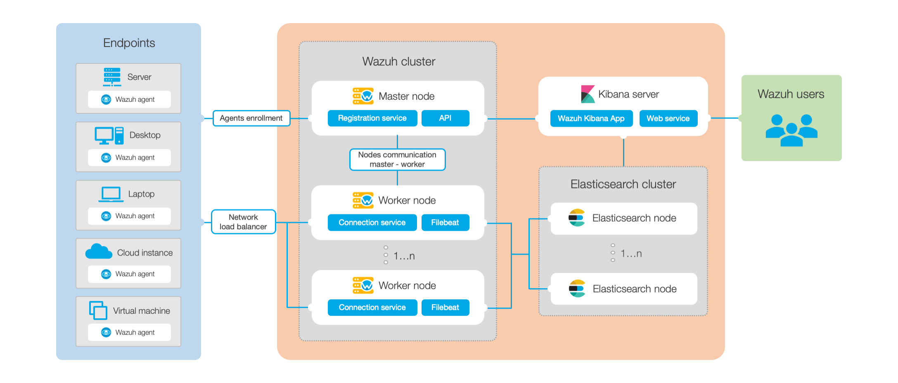

.. Copyright (C) 2021 Wazuh, Inc.

.. _architecture:

Architecture
============

The Wazuh architecture is based on :ref:`agents <wazuh_agent>`, running on the monitored endpoints, that forward security data to a central :ref:`server <wazuh_server>`. Moreover, agentless devices (such as firewalls, switches, routers, access points, etc.) are supported and can actively submit log data via Syslog, SSH, or using their own API. The central server decodes and analyzes the incoming information, and passes the results along to an Elasticsearch cluster for indexing and storage.

An Elasticsearch cluster is a collection of one or more nodes that communicate with each other to perform read and write operations on indexes. Small Wazuh deployments, which do not require processing large amounts of data, can easily be handled by a single-node cluster. Multi-node clusters are recommended when there is a large number of monitored endpoints, when a large volume of data is anticipated, or when high availability is required.

For production environments it is recommended to deploy the Wazuh server and Elasticsearch to different hosts. In this scenario, Filebeat is used to securely forward Wazuh alerts and/or archived events to the Elasticsearch cluster (single-node or multi-node) using TLS encryption.

The diagram below represents a Wazuh deployment architecture. It shows the solution components and how the :ref:`Wazuh servers <wazuh_server>` and :ref:`Elasticsearch <elastic_stack>` can be configured as a cluster, providing load balancing and high-availability.

Wazuh agent - Wazuh server communication
----------------------------------------

:ref:`Wazuh agent <wazuh_agent>` continuously sends events to the :ref:`Wazuh server <wazuh_server>` for analysis and threat detection. In order to start shipping them, the agent establishes a connection with the server service for agents connection, which listens on port 1514 (this is configurable). The Wazuh server then decodes and rule-checks the received events, utilizing the analysis engine. Events that trip a rule are augmented with alert data such as rule id and rule name. Events can be spooled to one or both of the following files, depending on whether or not a rule is tripped:

- The file ``/var/ossec/logs/archives/archives.json`` contains all events whether they tripped a rule or not.
- The file ``/var/ossec/logs/alerts/alerts.json`` contains only events that tripped a rule with high enough priority (the threshold is configurable).

The Wazuh messages protocol uses AES encryption by default, with 128 bits per block and 256-bit keys (Blowfish encryption is also optional).

.. note:: Read the `Benefits of using AES in Wazuh communications <https://wazuh.com/blog/benefits-of-using-aes-in-our-communications>`_ document for more information.

Wazuh server - Elastic Stack communication
------------------------------------------

Wazuh server uses Filebeat to send alert and event data to the Elasticsearch server, using TLS encryption. Filebeat reads the Wazuh server output data and sends it to Elasticsearch (by default listening on port 9200/TCP). Once the data is indexed by Elasticsearch, Kibana is used to mine and visualize the information.

The Wazuh web user interface runs inside Kibana, as a plugin. It queries the Wazuh RESTful API (by default listening on port 55000/TCP on the Wazuh server) in order to display configuration and status-related information of the :ref:`Wazuh server <wazuh_server>` and :ref:`agents <wazuh_agent>`. It can also modify, through API calls, agents or server configuration settings when desired. This communication is encrypted with TLS and authenticated with username and password.

Required ports
--------------

For the communication of Wazuh components several services are used. Below is the list of default ports used by these services. Users can modify these port numbers when necessary.

+---------------+---------------+-----------+---------------+----------------------------------------------+
| Component     | Software      | Port      | Protocol      | Purpose                                      |
+===============+===============+===========+===============+==============================================+
|               |               | 1514      | TCP (default) | Agents connection service                    |
+               +               +-----------+---------------+----------------------------------------------+
|               |               | 1514      | UDP           | Agents connection service                    |
+               +               +-----------+---------------+----------------------------------------------+
|               | Wazuh manager | 1515      | TCP           | Agents registration service                  |
+               +               +-----------+---------------+----------------------------------------------+
| Wazuh server  |               | 1516      | TCP           | Wazuh cluster daemon                         |
+               +               +-----------+---------------+----------------------------------------------+
|               |               | 514       | UDP (default) | Wazuh syslog collector (disabled by default) |
+               +               +-----------+---------------+----------------------------------------------+
|               |               | 514       | TCP           | Wazuh syslog collector (disabled by default) |
+               +---------------+-----------+---------------+----------------------------------------------+
|               | Wazuh API     | 55000     | TCP           | Wazuh RESTful API                            |
+---------------+---------------+-----------+---------------+----------------------------------------------+
|               |               | 9200      | TCP           | Elasticsearch RESTful API                    |
+               + Elasticsearch +-----------+---------------+----------------------------------------------+
| Elastic Stack |               | 9300-9400 | TCP           | Elasticsearch cluster communication          |
+               +---------------+-----------+---------------+----------------------------------------------+
|               | Kibana        | 5601      | TCP           | Kibana web interface                         |
+---------------+---------------+-----------+---------------+----------------------------------------------+

Archival data storage
---------------------

Both alerts and non-alert events are stored in files on the Wazuh server, in addition to being sent to Elasticsearch. These files can be written in JSON format (``.json``) and/or in plain text format (``.log`` - no decoded fields but more compact). These files are daily compressed and signed using MD5, SHA1, and SHA256 checksums. The directory and filename structure is as follows:

.. code-block:: bash

  root@wazuh-manager:/var/ossec/logs/archives/2020/Jan# ls -l
  total 176
  -rw-r----- 1 wazuh wazuh 234350 Jan  2 00:00 ossec-archive-01.json.gz
  -rw-r----- 1 wazuh wazuh    350 Jan  2 00:00 ossec-archive-01.json.sum
  -rw-r----- 1 wazuh wazuh 176221 Jan  2 00:00 ossec-archive-01.log.gz
  -rw-r----- 1 wazuh wazuh    346 Jan  2 00:00 ossec-archive-01.log.sum
  -rw-r----- 1 wazuh wazuh 224320 Jan  2 00:00 ossec-archive-02.json.gz
  -rw-r----- 1 wazuh wazuh    350 Jan  2 00:00 ossec-archive-02.json.sum
  -rw-r----- 1 wazuh wazuh 151642 Jan  2 00:00 ossec-archive-02.log.gz
  -rw-r----- 1 wazuh wazuh    346 Jan  2 00:00 ossec-archive-02.log.sum
  -rw-r----- 1 wazuh wazuh 315251 Jan  2 00:00 ossec-archive-03.json.gz
  -rw-r----- 1 wazuh wazuh    350 Jan  2 00:00 ossec-archive-03.json.sum
  -rw-r----- 1 wazuh wazuh 156296 Jan  2 00:00 ossec-archive-03.log.gz
  -rw-r----- 1 wazuh wazuh    346 Jan  2 00:00 ossec-archive-03.log.sum

Rotation and backups of archive files are recommended according to the storage capacity of the :ref:`Wazuh server <wazuh_server>`. By using *cron* jobs, you could easily arrange to keep only a certain time window of archive files locally on the server (e.g., last year or last three months).

On the other hand, you may choose to dispense with storing archive files at all and simply rely on Elasticsearch for archive storage, especially if you are running periodic Elasticsearch snapshot backups and/or a multi-node Elasticsearch cluster with shard replicas for high availability. You could even use a *cron* job to move snapshotted indexes to a final data storage server, and sign them using MD5, SHA1, and SHA256 hashing algorithms.
