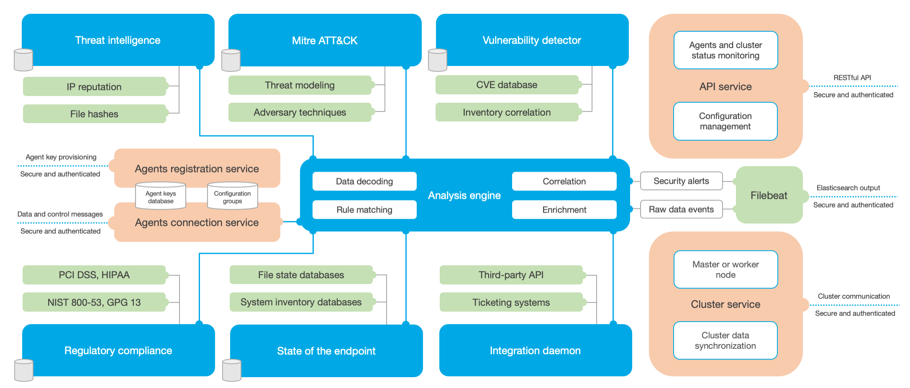

.. Copyright (C) 2021 Wazuh, Inc.

.. _wazuh_manager:

Wazuh manager
=============

The Wazuh manager component is in charge of analyzing the data received from the :ref:`agents <wazuh_agent>`, triggering alerts when threats or anomalies are detected. It is also used to manage the agents configuration remotely and to monitor their status.

The Wazuh manager uses threat intelligence sources to improve its detection capabilities. It also makes use of regulatory compliance requirements (e.g. PCI DSS, HIPAA, NIST 800-53...) and Mitre ATT&CK framework to enrich alerts data, providing useful context around them.

Additionally, the Wazuh manager can be integrated with external software such as ticketing systems (e.g. Service Now, Jira, PagerDuty) and instant messaging platforms (e.g. Slack). This is convenient to streamline security operations.

Wazuh manager architecture
--------------------------

The Wazuh manager runs the analysis engine, the Wazuh RESTful API, the agents registration service, the agents connection service, the Wazuh cluster daemon, and the Wazuh forwarder. The diagram below represents the manager architecture and components:

The manager usually runs on a stand-alone physical machine, virtual machine, docker container, or cloud instance. It is installed on a Linux operating system. Below is a list of the main manager components:

- **Agents registration service:** It is used to register new agents by provisioning and distributing pre-shared authentication keys that are unique to each agent. This process runs as a network service and supports authentication via TLS/SSL certificates or by providing a fixed password.

- **Agents connection service:** This is the service that receives data from the agents. It makes use of the pre-shared keys to validate each agent identity and to encrypt the communications between the agent and the Wazuh manager. Additionally, this service is used to provide centralized configuration management, being able to push new agent settings remotely.

- **Analysis engine:** This is the process that performs the data analysis. It utilizes *decoders* to identify the type of information being processed (e.g. Windows events, SSHD logs, web server logs, etc.) and to extract relevant data elements from the log messages (e.g. source IP address, event ID, username, etc.). Next, by using *rules*, it identifies specific patterns in the decoded events which could trigger alerts and possibly even call for automated countermeasures (e.g. an IP ban on the firewall).

- **Wazuh RESTful API:** This service provides an interface to interact with the Wazuh infrastructure. It is used to manage agents and managers configuration settings, to monitor the infrastructure status and overall health, to manage and edit Wazuh decoders and rules, and to query about the state of the monitored endpoints. It is also used by the Wazuh Web user interface.

- **Wazuh cluster daemon:** This service is used to scale Wazuh managers horizontally, deploying them as a cluster. This kind of configuration, in combination with a network load balancer, provides high-availability and load balancing. The Wazuh cluster daemon is what Wazuh managers use to communicate with each other and to keep synchronized.

- **Wazuh forwarder:** It is used to ship events and alerts to Wazuh indexer. It reads the output of Wazuh analysis engine and ships events in real time. It also provides load balancing when connected to a multi-node Wazuh indexer cluster.
