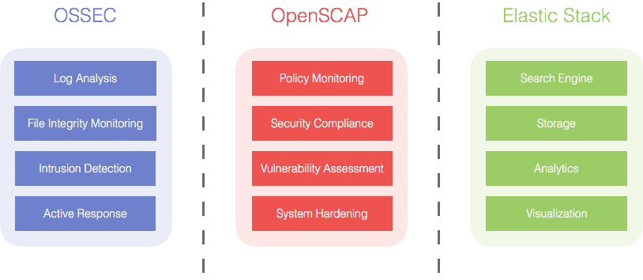

.. _getting_started:

Getting started guide
=====================

Wazuh is an Open Source project for security visibility, compliance and infrastructure monitoring. It provides log analysis, file integrity monitoring, intrusion detection and policy and compliance monitoring capabilities.

Wazuh relies on a multi-platform agent used to scan the monitored host looking for anomalies, indicators of compromise or applications that have not been hardened correctly (or are known to be vulnerable). The agent is also used to collect log messages, file hashes and other useful system information (e.g. applications installed, open ports, running processes).
  
Agents collected data is forwarded to a central manager, through a secure and authenticated channel, where it is analyzed and processed, resulting in security alerts. 

Wazuh is born as an OSSEC HIDS fork that, based on the integration with Elastic Stack and OpenSCAP, evolves into a more comprehensive solution. Below is a brief description of these tools and what they do:

- OSSEC HIDS is a Host based Intrusion Detection System used both to get security visibility and for compliance purposes. Its architecture is based on a multi-platform agent that do forward system data (e.g log messages, file hashes, detected anomalies) to a central system, where it is further analyzed and processed, resulting in security alerts.

+ OpenSCAP is an OVAL (Open Vulnerability Assessment Language) interpreter used to check system configuration and detect vulnerable applications. It is recognized as a standardized compliance and hardening checking solution for enterprise-level infrastructure. 

- Elastic Stack is collection of tools (Filebeat, Logstash, Elasticsearch, Kibana) to collect, parse, index, store and search log data. It provides a browser-based visualization frontend interface to easily consume data.

.. note:: If you want to contribute to this documentation or our project please head over to our `Github repositories <https://github.com/wazuh>`_. You can also join our `users mailing list <https://groups.google.com/d/forum/wazuh>`_, by sending an email to ``wazuh+subscribe@googlegroups.com``, to ask questions and participate in discussions.

.. toctree::
   :maxdepth: 2

   getting_started/components
   getting_started/architecture
   getting_started/use_cases
