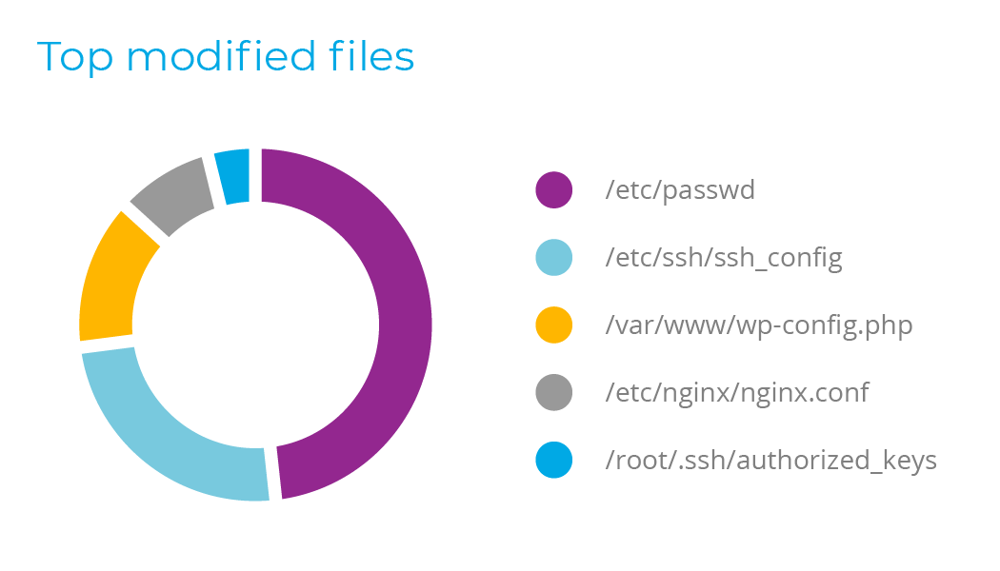
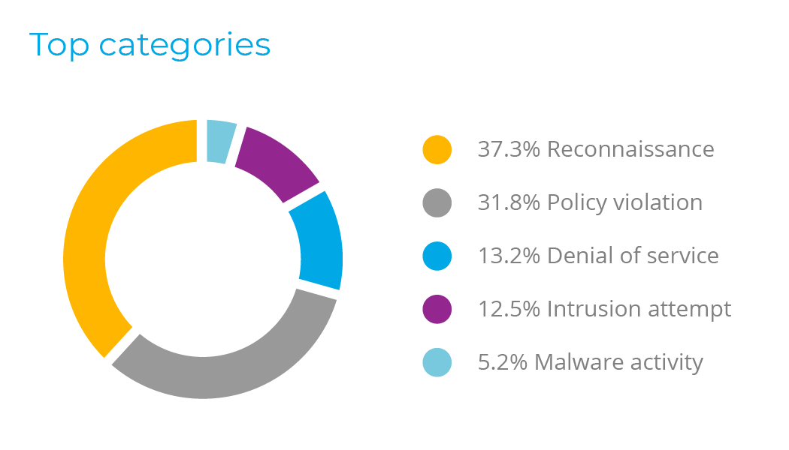
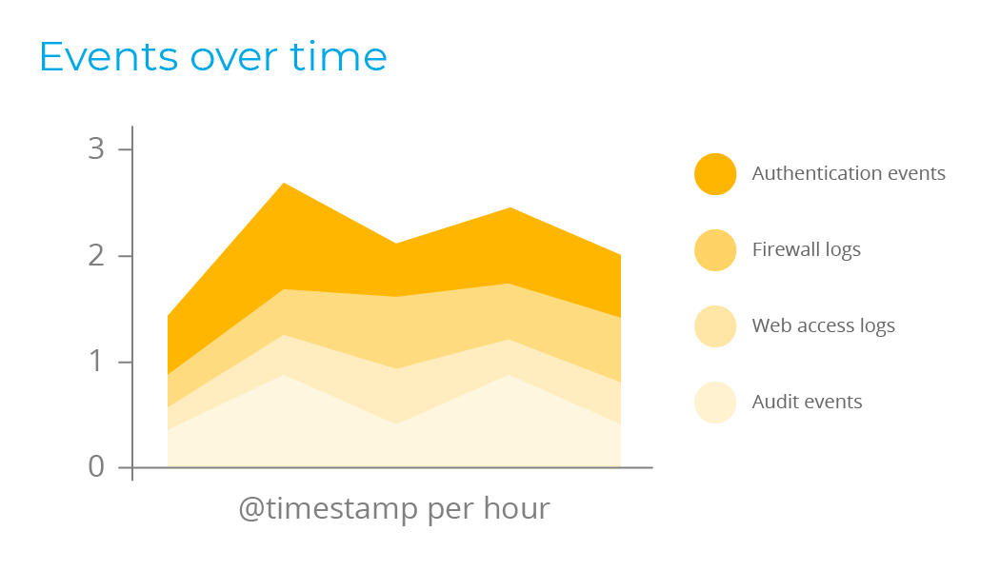
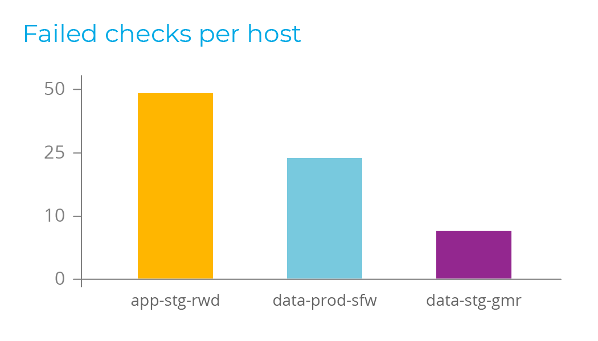

.. Copyright (C) 2018 Wazuh, Inc.

.. _index:

================
Welcome to Wazuh
================

.. meta::
  :description: Wazuh is a free, open source and enterprise-ready security monitoring solution for threat detection, integrity monitoring, incident response and compliance.

.. rst-class:: row

------------
Capabilities
------------

.. rst-class:: col-12

Wazuh helps you to gain deeper security visibility into your infrastructure by monitoring hosts at an operating system and application level. This solution, based on lightweight multi-platform agents, provides the following capabilities:

.. raw:: html

  

  

  

  <button class="btn btn-accordion d-none d-sm-inline-block" type="button" data-toggle="collapse" data-target="#collapse-fim" aria-expanded="true" aria-controls="collapse-fim">File integrity monitoring</button>
  File integrity monitoring
  
 <!-- End of .card-header -->

  

  

  

Wazuh monitors the file system, identifying changes in content, permissions, ownership, and attributes of files that you need to keep an eye on. In addition, it natively identifies users and applications used to create or modify files.

File integrity monitoring capabilities can be used in combination with threat intelligence to identify threats or compromised hosts. In addition, several regulatory compliance standards, such as PCI DSS, require it.

.. raw:: html

  
 <!-- End of .card-text -->
  

.. raw:: html

  
 <!-- End of .card-image -->
  
 <!-- End of .card-body -->
  
 <!-- End of #collapse-fim -->
  
 <!-- End of .card -->

  

  

  <button class="btn btn-accordion collapsed d-none d-sm-inline-block" type="button" data-toggle="collapse" data-target="#collapse-intrusion" aria-expanded="true" aria-controls="collapse-intrusion">Intrusion and anomaly detection</button>
  Intrusion and anomaly detection
  
 <!-- End of .card-header -->

  

  

  

Wazuh agents scan the monitored systems looking for malware, rootkits and suspicious anomalies. They can detect hidden files, cloaked processes or unregistered network listeners, as well as inconsistencies in system call responses.

In addition to agent capabilities, the server component uses a signature-based approach to intrusion detection, using its regular expression engine to analyze collected log data and look for indicators of compromise.

.. raw:: html

  
 <!-- End of .col-12.col-md-6 -->
  

.. raw:: html

  
 <!-- End of .col-12.col-md-6 -->
  
 <!-- End of .card-body -->
  
 <!-- End of #collapse-intrusion -->
  
 <!-- End of .card -->

  

  

  <button class="btn btn-accordion collapsed d-none d-sm-inline-block" type="button" data-toggle="collapse" data-target="#collapse-log" aria-expanded="true" aria-controls="collapse-log">Automated log analysis</button>
  Automated log analysis
  
 <!-- End of .card-header -->

  

  

  

Wazuh agents read operating system and application logs, and securely forward them to a central manager for rule-based analysis and storage.

The Wazuh rules help make you aware of application or system errors, misconfigurations, attempted and/or successful malicious activities, policy violations and a variety of other security and operational issues.

.. raw:: html

  
 <!-- End of .col-12.col-md-6 -->
  

.. raw:: html

  
 <!-- End of .col-12.col-md-6 -->
  
 <!-- End of .card-body -->
  
 <!-- End of #collapse-log -->
  
 <!-- End of .card -->

  

  

  <button class="btn btn-accordion collapsed d-none d-sm-inline-block" type="button" data-toggle="collapse" data-target="#collapse-configuration" aria-expanded="true" aria-controls="collapse-configuration">Policy and compliance monitoring</button>
  Policy and compliance monitoring
  
 <!-- End of .card-header -->

  

  

  

Wazuh monitors system and application configuration settings to ensure they are compliant with your security policies, standards and/or hardening guides. Agents perform periodic scans to detect applications that are known to be vulnerable, unpatched, or insecurely configured.

Additionally, configuration checks can be customized, tailoring them to properly align with your organization. Alerts include recommendations for better configuration, references and mapping with regulatory compliance.

.. raw:: html

  
 <!-- End of .col-12.col-md-6 -->
  

.. raw:: html

  
 <!-- End of .col-12.col-md-6 -->
  
 <!-- End of .card-body -->
  
 <!-- End of #collapse-configuration -->
  
 <!-- End of .card -->
  
 <!-- End of #accordion-capabilities -->

.. rst-class:: col-12

  This diverse set of capabilities is provided by integrating OSSEC, OpenSCAP and Elastic Stack into a unified solution and simplifying their configuration and management.

  Wazuh provides an updated log analysis ruleset and a RESTful API that allows you to monitor the status and configuration of all Wazuh agents.

  Wazuh also includes a rich web application (fully integrated as a Kibana app) for mining log analysis alerts and for monitoring and managing your Wazuh infrastructure.

-----------
Screenshots
-----------

.. raw:: html

  

  

  

.. image:: images/kibana-app/showcase/extensions.png
   :class: d-block w-100

.. raw:: html

  

  

.. image:: images/kibana-app/showcase/agents-general.png
   :class: d-block w-100

.. raw:: html

  

  

.. image:: images/kibana-app/showcase/discover.png
   :class: d-block w-100

.. raw:: html

  

  

.. image:: images/kibana-app/showcase/ruleset.png
   :class: d-block w-100

.. raw:: html

  

  

.. image:: images/kibana-app/showcase/overview-fim.png
   :class: d-block w-100

.. raw:: html

  

  

.. image:: images/kibana-app/showcase/overview-general.png
   :class: d-block w-100

.. raw:: html

  

  <a class="carousel-control-prev" href="#carouselWazuhDocu" role="button" data-slide="prev">
  
  Previous
  </a>
  <a class="carousel-control-next" href="#carouselWazuhDocu" role="button" data-slide="next">
  
  Next
  </a>
  

  

-----------------------
Available documentation
-----------------------

.. toctree::
   :maxdepth: 1

   getting-started/index
   installation-guide/index
   user-manual/index
   development/index
   docker/index
   deploying-with-puppet/index
   deploying-with-ansible/index
   pci-dss/index
   gdpr/index
   amazon/index
   azure/index
   docker-monitor/index
   installing-splunk/index
   migrating-from-ossec/index
   release-notes/index
