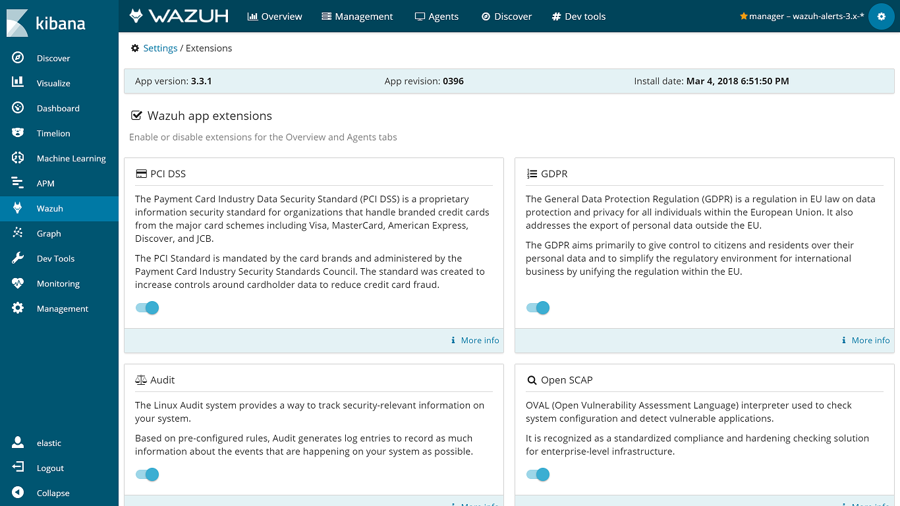
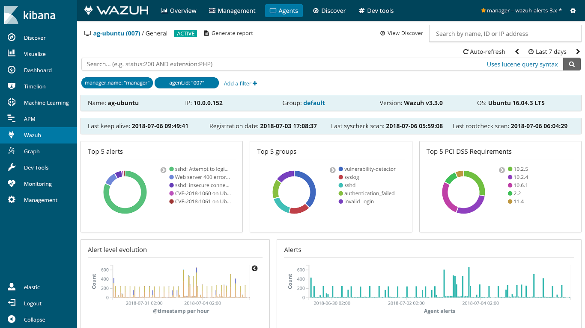
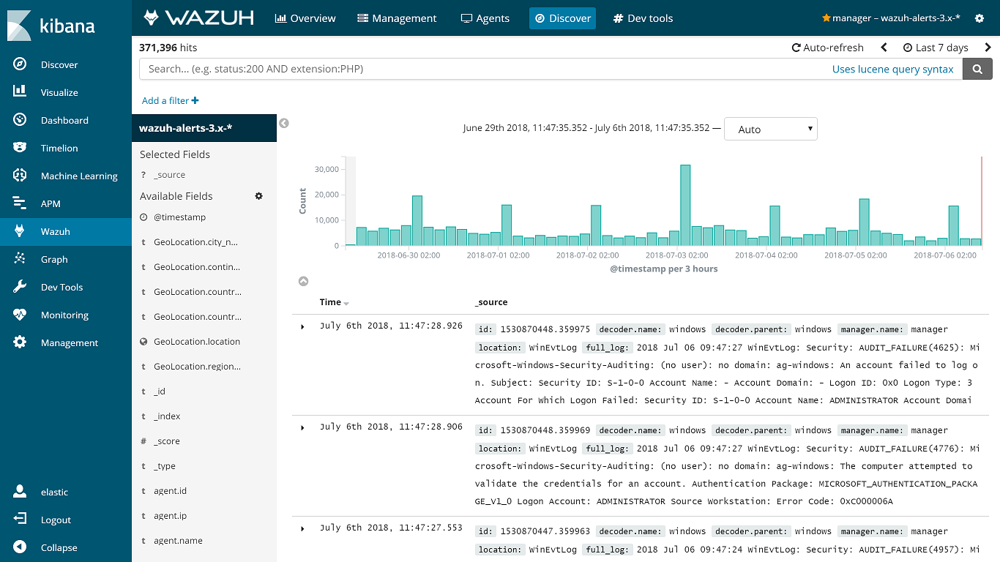
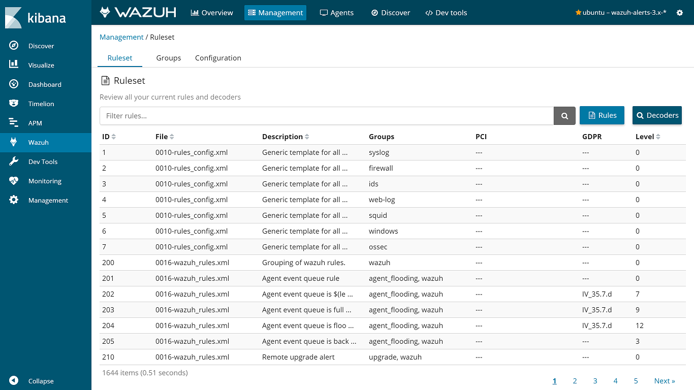
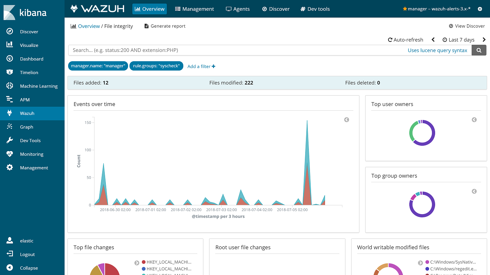
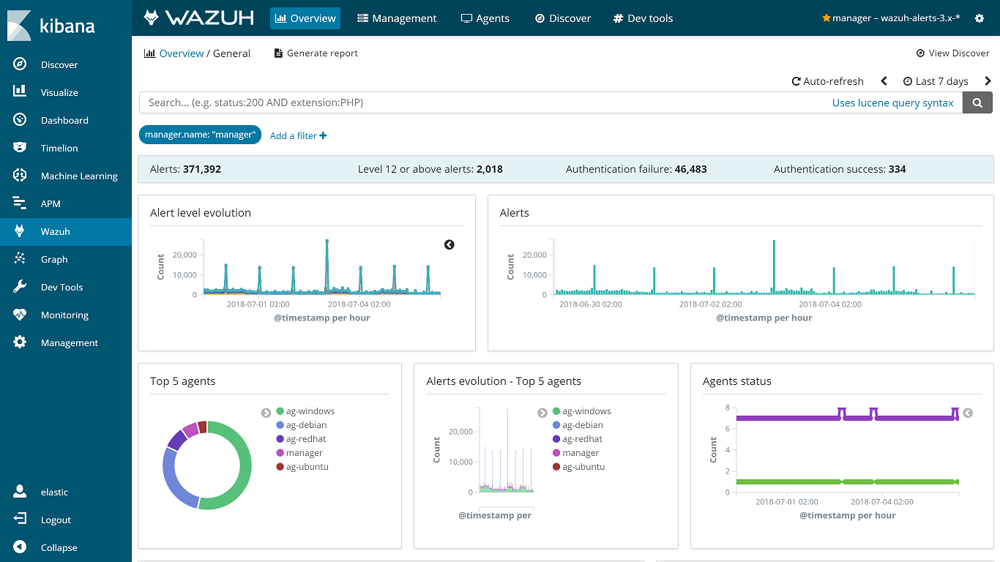

.. Copyright (C) 2018 Wazuh, Inc.

.. _index:

================
Welcome to Wazuh
================

.. meta::
  :description: Wazuh is a free, open source and enterprise-ready security monitoring solution for threat detection, integrity monitoring, incident response and compliance.

.. rst-class:: row

-------
Content
-------

.. rst-class:: content-card col-sm-6 col-lg-4

:ref:`getting_started`
======================

Lorem ipsum dolor sit amet, consectetur adipisicing elit, sed do eiusmod tempor incididunt ut labore et dolore magna aliqua.

- :ref:`installation_guide`
- :ref:`components`
- :ref:`architecture`
- :ref:`use_cases`

.. rst-class:: content-card col-sm-6 col-lg-4

:ref:`user_manual`
==================

Lorem ipsum dolor sit amet, consectetur adipisicing elit, sed do eiusmod tempor incididunt ut labore et dolore magna aliqua.

- :ref:`user_manual_overview`
- :ref:`register_agents`
- :ref:`capabilities`
- :ref:`ruleset`
- :ref:`api`

.. rst-class:: content-card col-sm-6 col-lg-4

Deployment
==========

Lorem ipsum dolor sit amet, consectetur adipisicing elit, sed do eiusmod tempor incididunt ut labore et dolore magna aliqua.

- :ref:`wazuh_docker`
- :ref:`wazuh_puppet`
- :ref:`wazuh_ansible`

.. rst-class:: content-card col-sm-6 col-lg-4

Utilities
=========

Lorem ipsum dolor sit amet, consectetur adipisicing elit, sed do eiusmod tempor incididunt ut labore et dolore magna aliqua.

- :ref:`pci_dss`
- :ref:`gdpr`
- :ref:`amazon`
- :ref:`azure`
- :ref:`docker-monitor-index`

.. rst-class:: content-card col-sm-6 col-lg-4

Wazuh Cloud
===========

Lorem ipsum dolor sit amet, consectetur adipisicing elit, sed do eiusmod tempor incididunt ut labore et dolore magna aliqua.

- First steps
- Wazuh Cloud FAQ
- Support and troubleshooting
- Terms and conditions
- Try Wazuh Cloud for free

.. rst-class:: content-card col-sm-6 col-lg-4

:ref:`release_notes`
====================

Lorem ipsum dolor sit amet, consectetur adipisicing elit, sed do eiusmod tempor incididunt ut labore et dolore magna aliqua.

- :ref:`Wazuh 3.8.2 <release_3_8_2>`
- :ref:`Wazuh 3.8.1 <release_3_8_1>`
- :ref:`Wazuh 3.8 <release_3_8_0>`
- :ref:`Wazuh 3.7.2 <release_3_7_2>`
- :ref:`Wazuh 3.7.1 <release_3_7_1>`

.. rst-class:: row

------------
Capabilities
------------

.. rst-class:: col-12

Wazuh helps you to gain deeper security visibility into your infrastructure by monitoring hosts at an operating system and application level. This solution, based on lightweight multi-platform agents, provides the following capabilities:

.. rst-class:: col-12 col-md-6
.. topic:: File integrity monitoring

    Wazuh monitors the file system, identifying changes in content, permissions, ownership, and attributes of files that you need to keep an eye on.

.. rst-class:: col-12 col-md-6
.. topic:: Intrusion and anomaly detection

    Agents scan the system looking for malware, rootkits or suspicious anomalies. They can detect hidden files, cloaked processes or unregistered network listeners, as well as inconsistencies in system call responses.

.. rst-class:: col-12 col-md-6
.. topic:: Automated log analysis

    Wazuh agents read operating system and application logs, and securely forward them to a central manager for rule-based analysis and storage. The Wazuh rules help make you aware of application or system errors, misconfigurations, attempted and/or successful malicious activities, policy violations and a variety of other security and operational issues.

.. rst-class:: col-12 col-md-6
.. topic:: Policy and compliance monitoring

    Wazuh monitors configuration files to ensure they are compliant with your security policies, standards and/or hardening guides. Agents perform periodic scans to detect applications that are known to be vulnerable, unpatched, or insecurely configured.

.. rst-class:: row

-----------
Screenshots
-----------

.. rst-class:: carousel-wrapper col-12

.. raw:: html

  

  

  

.. raw:: html

  

  

.. raw:: html

  

  

.. raw:: html

  

  

.. raw:: html

  

  

.. raw:: html

  

  

.. raw:: html

  

  <a class="carousel-control-prev" href="#carouselWazuhDocu" role="button" data-slide="prev">
  
  Previous
  </a>
  <a class="carousel-control-next" href="#carouselWazuhDocu" role="button" data-slide="next">
  
  Next
  </a>
  

  

.. rst-class:: col-12

  This diverse set of capabilities is provided by integrating OSSEC, OpenSCAP and Elastic Stack into a unified solution and simplifying their configuration and management.

  Wazuh provides an updated log analysis ruleset and a RESTful API that allows you to monitor the status and configuration of all Wazuh agents.

  Wazuh also includes a rich web application (fully integrated as a Kibana app) for mining log analysis alerts and for monitoring and managing your Wazuh infrastructure.

-----------------------
Available documentation
-----------------------

.. toctree::
   :maxdepth: 1

   getting-started/index
   installation-guide/index
   user-manual/index
   development/index
   docker/index
   deploying-with-puppet/index
   deploying-with-ansible/index
   pci-dss/index
   gdpr/index
   amazon/index
   azure/index
   docker-monitor/index
   installing-splunk/index
   migrating-from-ossec/index
   release-notes/index
