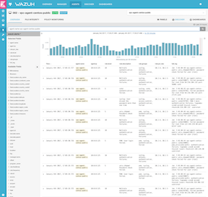
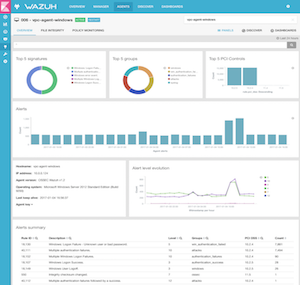
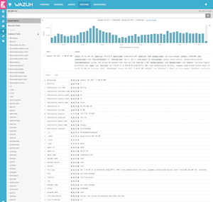
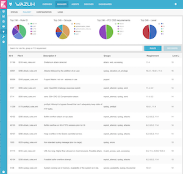
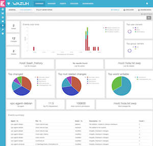
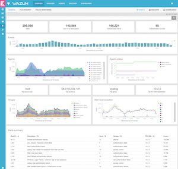

.. _index:

Welcome to Wazuh
================

Wazuh helps to get security visibility into your infrastructure, by monitoring hosts at a system and application level. The solution, based on multi-platform and lightweight agents, provides the following capabilities:

.. topic:: Log management and analysis TEST

    Wazuh agents read operating system logs and events, forwarding them to a central manager for analysis and storage. The purpose of this process is the identification of application or system errors, misconfigurations, intrusion attempts, policy violations or security issues.

.. topic:: File integrity monitoring

    Wazuh monitors the file system, identifying changes in permissions, attributes, contents or ownership.

.. topic:: Intrusions and anomalies detection

    Agents do scan the system looking for malware, rootkits or anomalies. They can detect hidden files, processes or open ports, as well as inconsistencies in system call responses.

.. topic:: Policy and compliance monitoring

    Wazuh monitors configuration files to ensure they are compliant with your security policies, standards or hardening guides. Agents perform periodic scans to detect applications that are known to be vulnerable, not patched, or not properly configured.

This diverse set of capabilities is provided by integrating OSSEC, OpenSCAP and Elastic Stack, making them work together as a single solution, and simplifying their configuration and management.

Wazuh also provides a centralized Web User Interface (fully integrated as a Kibana app), an updated log analysis ruleset, and a RESTful API that allows user to monitor deployment status and configuration.

Sample screenshots
------------------

==================  ==================  ==================
|OVERVIEW_GENERAL|  |OVERVIEW_FIM|      |MANAGER_RULESET|
|AGENT_DISCOVER|    |AGENT_OVERVIEW|    |DISCOVER_ALERT|
==================  ==================  ==================

Available documentation
-----------------------

.. toctree::
   :maxdepth: 1

   getting_started/index
   installation_guide/index
   migrating/index
   learn_examples/index
   user-manual/index
   pci-dss/index
   amazon/index

.. note:: If you want to contribute to this documentation or our project please head over to our `Github repositories <https://github.com/wazuh>`_. You can also join our `users mailing list <https://groups.google.com/d/forum/wazuh>`_, by sending an email to ``wazuh+subscribe@googlegroups.com``, to ask questions and participate in discussions.
