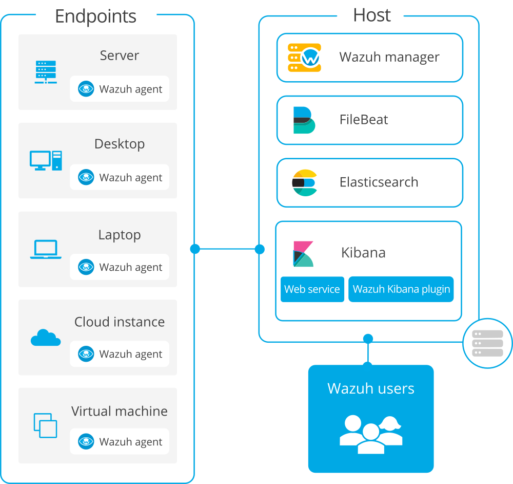
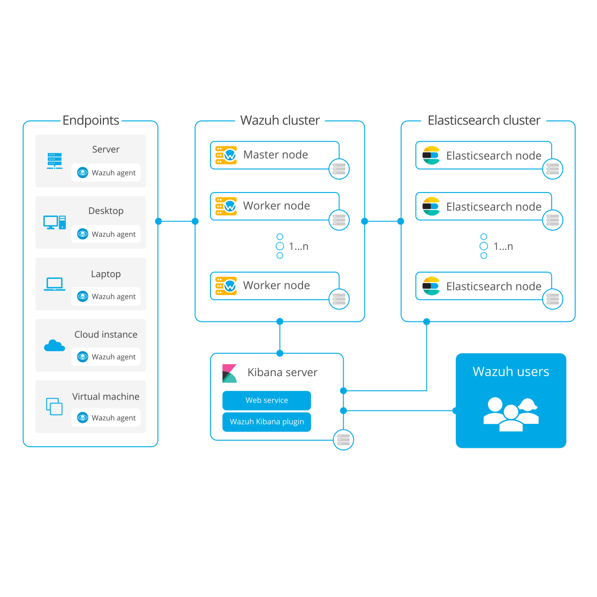

.. Copyright (C) 2022 Wazuh, Inc.

.. meta::
  :description: Visit the Wazuh installation guide and learn more about the deployment process, available installation alternatives, and requirements.
  
.. _installation_guide:

Installation guide
==================

Install Wazuh by following the installation workflow that best suits your needs.
To learn more about each component and its capabilities, check the :ref:`Components <components>` section. 

Wazuh server installation
-------------------------

There are two different options for deploying Wazuh:

- :ref:`All-in-one <all_in_one_index>`: The Wazuh server and Elastic Stack are installed on the same host directly on your system. Alternatively, you can also download our ready-to-use :ref:`OVA <virtual_machine>` or launch an EC2 Instance with our :ref:`AMI <amazon-machine-images>`.

- :ref:`Distributed <distributed_index>`: Each component is installed on a separate host as a single-node or multi-node cluster. This type of deployment provides high availability and scalability of the product, and it is convenient for large working environments.

.. raw:: html

  

    

      <h3>All-in-one deployment</h3>

.. thumbnail:: ../images/installation/all_in_one.png
      :align: center
      :class: detailed

.. raw:: html

    

    

      <h3>Distributed deployment</h3>

.. thumbnail:: ../images/installation/distributed.png
      :align: center
      :class: detailed

.. raw:: html

    

  

Alternatively, Wazuh can also be installed with commercial options like Elastic Stack basic license or Splunk. To learn more about these options and other installation alternatives, see the :ref:`More installation alternatives <more_installation_alternatives>` section.

.. note:: Wazuh also offers the `Wazuh Cloud <https://wazuh.com/cloud/>`_, where all components are hosted on our PCI-DSS and SOC 2 certified SaaS solution and maintained by our team. With the Wazuh cloud, no dedicated hardware is required and everything is ready to use. This service offers a highly flexible infrastructure to match your enterprise needs.

Wazuh agent installation
------------------------

The :ref:`Wazuh agent <wazuh_agent>` is a single, light-weight monitoring software that runs on most operating systems and provides visibility into the endpoint's security by collecting critical system and application records, inventory data, and detecting potential anomalies. If the Wazuh server and its components are already installed on your environment, select your operating system and follow the installation steps to deploy the agent to the endpoints:

.. raw:: html

  

      

          <a href="./wazuh-agent/wazuh-agent-package-linux.html" class="d-flex align-items-center">
            
Linux

.. image:: ../images/installation/linux.png
      :align: center

.. raw:: html

        </a>
    

    

        <a href="./wazuh-agent/wazuh-agent-package-windows.html" class="d-flex align-items-center">
                    
Windows

.. image:: ../images/installation/windows_icon.png
      :align: center

.. raw:: html

        </a>
    

    

        <a href="./wazuh-agent/wazuh-agent-package-macos.html" class="d-flex align-items-center">
            
macOS

.. image:: ../images/installation/macOS_logo.png
      :align: center

.. raw:: html

        </a>
    

    

        <a href="./wazuh-agent/wazuh-agent-package-aix.html" class="d-flex align-items-center">
            
AIX

.. image:: ../images/installation/AIX.png
      :align: center

.. raw:: html

        </a>
    

    

        <a href="./wazuh-agent/wazuh-agent-package-hpux.html" class="d-flex align-items-center">
            
HP-UX

.. image:: ../images/installation/hpux.png
      :align: center

.. raw:: html

        </a>
    

    

        <a href="./wazuh-agent/wazuh-agent-package-solaris.html" class="d-flex align-items-center">
            
Solaris

.. image:: ../images/installation/solaris.png
      :align: center

.. raw:: html

          </a>
      

  

Requirements
------------

Check the :ref:`Requirements <installation_requirements>` section for information about supported operating systems and the minimum recommended hardware specifications to guarantee optimum performance.   

.. toctree::
    :hidden:
    :maxdepth: 1

    requirements
    open-distro/index
    wazuh-agent/index
    packages-list
    more-installation-alternatives/index
