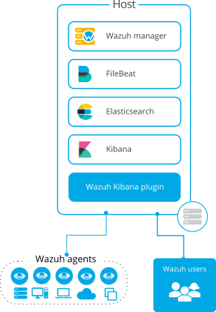
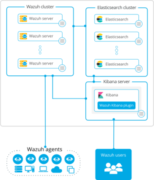

.. Copyright (C) 2020 Wazuh, Inc.

.. _installation_guide:

.. meta::
  :description: Wazuh is a free, open source and enterprise-ready security monitoring solution for threat detection, integrity monitoring, incident response and compliance.

Wazuh installation guide
========================

This section aims to guide the user through the process of installing Wazuh and its multiple components. A brief explanation about each component and its capabilities can be found in the :ref:`getting started <components>` section. 

Install Wazuh with Open Distro for Elasticsearch
------------------------------------------------

.. raw:: html

  

    

.. thumbnail:: ../images/installation/all_in_one.png
      :align: center 
      :class: detailed   

.. raw:: html

    

    

.. thumbnail:: ../images/installation/distributed.png
      :align: center 
      :class: detailed   

.. raw:: html

    

    

.. thumbnail:: ../images/installation/cloud.png
      :align: center 
      :class: detailed   

.. raw:: html

    
        
  

Take Wazuh for a test drive with our ready to use :ref:`OVA <virtual_machine>`.

This installation guide will show how to install Wazuh manager along with Open Distro for Elasticsearch, Filebeat-OSS, and Open Distro for Elasticsearch Kibana. Alternativaly, Wazuh can be installed with the Elastic Stack components. To learn more about this process and other installation alternatives, visit the :ref:`alternative installation methods <other_installation_alternatives>` section.

Install Wazuh agents
--------------------

.. raw:: html

  

      

          <a href="./wazuh-agent/wazuh_agent_package_linux.html" class="d-flex align-items-center">
            
Linux

.. image:: ../images/installation/linux.png        
      :align: center

.. raw:: html

        </a>
    

    

        <a href="./wazuh-agent/wazuh_agent_package_windows.html" class="d-flex align-items-center">
                    
Windows

.. image:: ../images/installation/windows_icon.png        
      :align: center

.. raw:: html

        </a>
    

    

        <a href="./wazuh-agent/wazuh_agent_package_macos.html" class="d-flex align-items-center">
            
macOS
        

.. raw:: html

        </a>
    

    

        <a href="./wazuh-agent/wazuh_agent_package_aix.html" class="d-flex align-items-center">
            
AIX
        

.. image:: ../images/installation/AIX.png        
      :align: center

.. raw:: html

        </a>
    

    

        <a href="./wazuh-agent/wazuh_agent_package_hpux.html" class="d-flex align-items-center">
            
HP-UX
        

.. image:: ../images/installation/hpux.png        
      :align: center

.. raw:: html

        </a>
    

    

        <a href="./wazuh-agent/wazuh_agent_package_solaris.html" class="d-flex align-items-center">
            
Solaris
        

.. image:: ../images/installation/solaris.png        
      :align: center

.. raw:: html

          </a>
      

  

Requirements
------------

The requirements section specifies the supported operating systems as well as the minimum recommended hardware specifications to guarantee the expected performance. Furthermore, information about the expected alerts per second depending on the different types of monitored endpoint can be found, allowing users to calculate the expected data storage needed for their environments.  

Packages list
-------------

The installation can be done by configuring the official repositories or by downloading and installing the packages directly.  A list of all the available packages can be found in the packages list section.

.. toctree::
    :maxdepth: 1

    requirements
    open-distro/index
    wazuh-agent/index
    packages-list
    other-installation-alternatives/index

   

 

