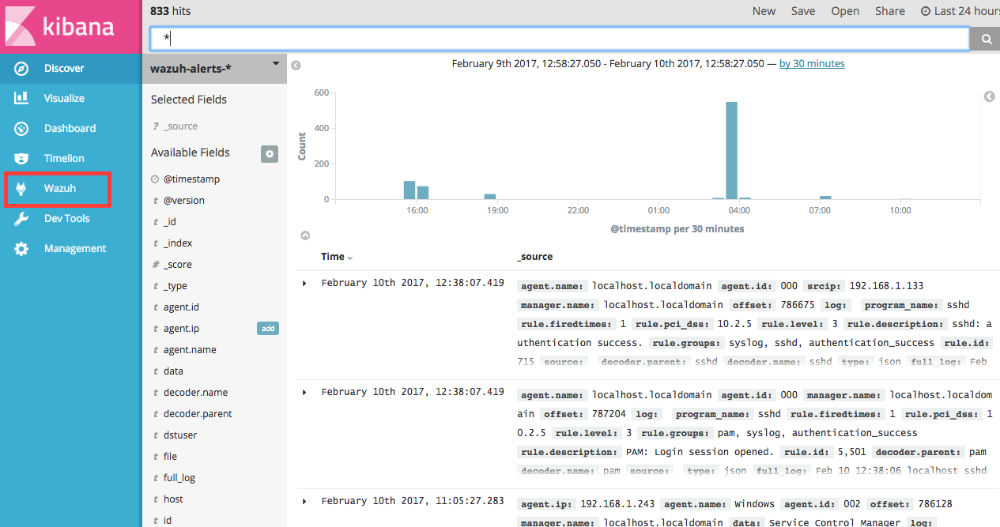
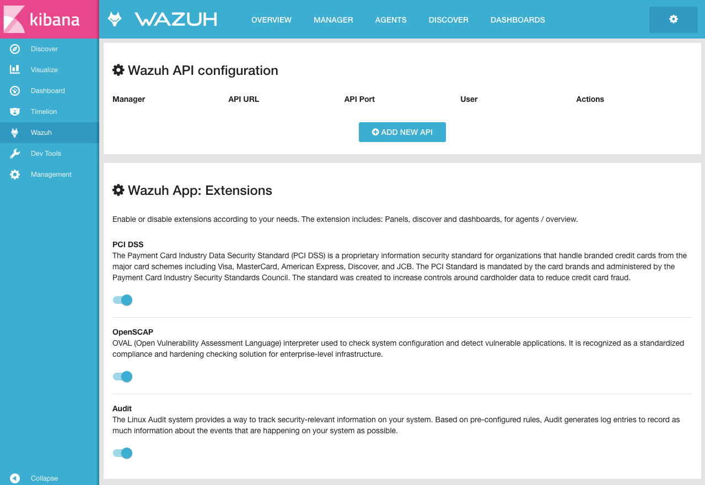
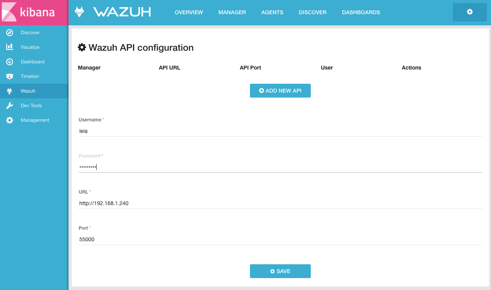
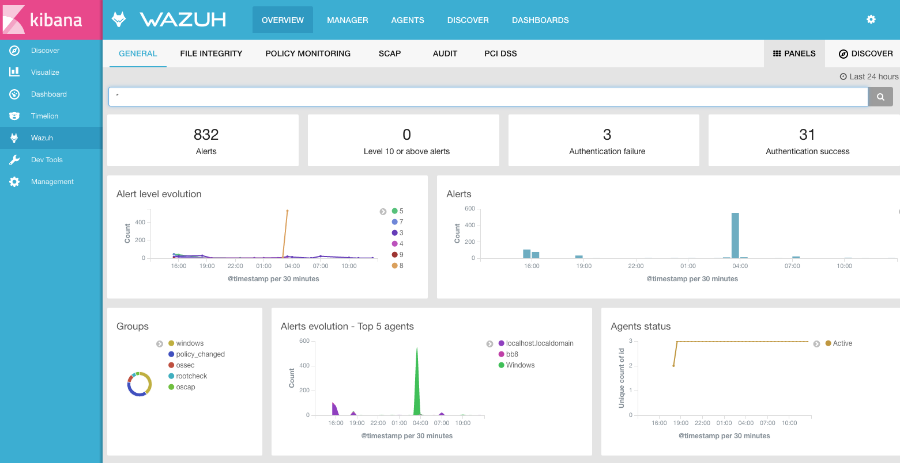

.. _connect_wazuh_app:

Connect the Wazuh App with the API
==================================

In this section, we'll add the Wazuh manager to the Wazuh App on Kibana.

1. Open a web browser and go to the Elastic server address, port 5601 (by default).
2. Go through the menu to the Wazuh App.

3. Click on *Add new API*.

4. Fill in the blanks with the address and the credentials of the API. The default values appear weak in the placeholders.

5. Click on *Save*.

Next steps
----------

Once the Elastic server and Wazuh manager are installed and connected, you can install and connect Wazuh agents. How to do it:

- :ref:`Debian/Ubuntu <wazuh_agent_deb>`
- :ref:`RedHat/CentOS <wazuh_agent_rpm>`
- :ref:`Windows <wazuh_agent_windows>`
