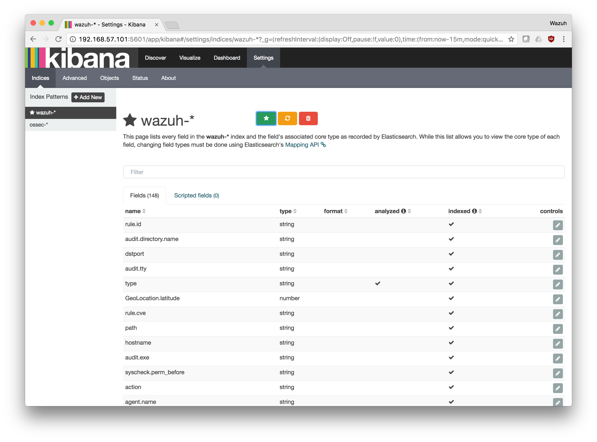

.. _configure_kibana:

Configure Kibana
==========================================

#. Go to Settings and configure a new wildcard

	.. image:: ../../images/installation/kibana-elk2-set.png
			:align: center
			:width: 100%

#. Set ``wazuh-*`` as wildcard and choose ``timestamp`` as time field:

	.. image:: ../../images/installation/kibana-elk2.png
			:align: center
			:width: 100%

	Click on Create

#. Set as default wildcard by clicking on the Star.

#. Go to Discover tag
