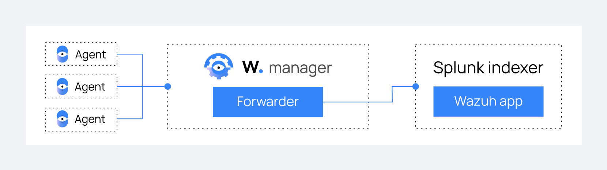

.. Copyright (C) 2018 Wazuh, Inc.

.. _installation_splunk:

Installing Splunk
=================

This guide describes the installation process for a Splunk infrastructure comprised of a Splunk Enterprise instance as indexer and a Splunk Forwarder node, as well as the Wazuh app for Splunk.

These are the two main components in a common Splunk simple distributed architecture:

- **Splunk Forwarder:** This component runs on the Wazuh manager and Wazuh API instance, it reads local data and sends it to the Indexer. It will send alerts generated by Wazuh manager to a Splunk Indexer.

- **Splunk Indexer**: This component runs the Splunk engine. It reads forwarded data, parses, indexes and stores it as events that contain alert data generated by Wazuh manager sent by the Forwarder instance.

.. topic:: Contents

  .. toctree::
    :maxdepth: 1

    splunk_installation
    splunk_wazuh
    splunk_forwarder
    splunk_reverse_proxy
