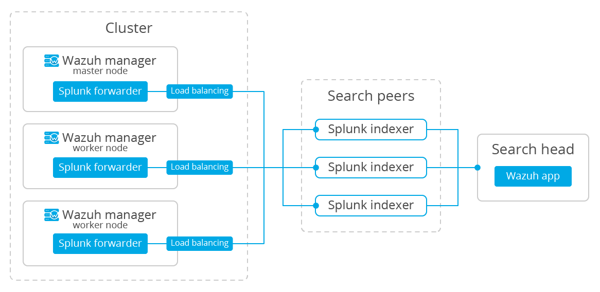

.. Copyright (C) 2018 Wazuh, Inc.

.. _splunk_distributed:

Install Splunk in multi-instance mode
=====================================

This document will guide you through the installation process for a multi-instance distributed architecture, recommended for larger environments with huge amounts of data (in this case, Wazuh alerts) and users.

.. note::
  Many of the commands described below need to be executed with root user privileges.

We're going to perform the most basic installation for a multi-instance deployment. We'll use **two instances** of Splunk Enterprise, one of them being the *search head* and the other one, a *search peer* (commonly known as an indexer); we'll also need a Splunk forwarder.

- The **search head** instance will be in charge of all the searching functionality, and it will look for data on the search peers' indexes. This instance won't have any indexes at all.
- The **search peer** instance (or indexer) collects all the Wazuh data and stores it in the form of indexes. This instance is connected to the search head so it can consult the peer's indexes.
- The **forwarder** runs on the Wazuh manager and Wazuh API instance, it reads local data and sends it to the indexer.

You can have multiple search peer instances, but in this case we're going to stick with the essentials.

.. warning::
  This documentation will install Splunk using the multi-instance deployment schema. If you want a simpler installation, check out the :ref:`single-instance <splunk_basic>` deployment schema.

Install Splunk Enterprise instances
-----------------------------------

Each instance can be installed on different hosts following the same steps described below:

1. Download Splunk v7.2.0 package from `its official website <https://www.splunk.com/en_us/download/partners/splunk-enterprise.html>`_.

  .. note::
    Splunk is not open source software and it requires a registered user and license to work. You can also use a free trial license.

2. Install the Splunk v7.2.0 package:

  a) For RPM based distributions:

  .. code-block:: console

    # yum install splunk-enterprise-package.rpm

  b) For Debian/Ubuntu distributions:

  .. code-block:: console

    # dpkg --install splunk-enterprise-package.deb

3. Ensure Splunk v7.2.0 is installed in ``/opt/splunk`` and start the service:

  .. code-block:: console

    # /opt/splunk/bin/splunk start

  .. note::
    You will be prompted for a password for the ``admin`` user.

  After this step the Splunk Web service will be listening to port 8000. You can browse ``http://<your-instance-ip>:8000`` in order to access the Web GUI.

4. Optional. If you additionally want the Splunk service to start at boot time, please execute the following command:

  .. code-block:: console

    # /opt/splunk/bin/splunk enable boot-start

Configuring the Splunk instances
--------------------------------

Now that we finished installing the Splunk instances, it's time to choose which one will be the *search head* and the *search peer*.

1. On the **search head** instance run the following command to add a search peer:

  .. code-block:: console

    # splunk add search-server http(s)://<host>:<port> -auth <user>:<password> -remoteUsername <user> -remotePassword <passremote>

  **Note the following:**

  1. ``<host>`` is the host name or IP address of the search peer's host machine.
  2. ``<port>`` is the management port of the search peer.
  3. The ``-auth`` flag is used to provide credentials for the search head.
  4. The ``-remoteUsername``and ``remotePassword`` flags are used for the credentials for the search peer. The remote credentials must be for an admin-level user on the search peer.

  .. warning::
    If you're getting login problems when trying to add the search peer, add the ``allowRemoteLogin = always`` option under the ``[general]`` section on the ``/opt/splunk/etc/system/local/server.conf`` file, and then restart the search peer.

2. On the **search peer** instance we need to add the files to configure the Wazuh indexes:

  a) Download and insert the ``inputs.conf`` template:

    .. code-block:: console

      # curl -so /opt/splunk/etc/system/local/inputs.conf https://raw.githubusercontent.com/wazuh/wazuh/3.7/extensions/splunk/peer_props.conf

  a) Download and insert the ``input.conf`` template:

    .. code-block:: console

      # curl -so /opt/splunk/etc/system/local/indexes.conf https://raw.githubusercontent.com/wazuh/wazuh/3.7/extensions/splunk/peer_indexes.conf

  And finally, we need to restart the search peer:

  .. code-block:: console

    # /opt/splunk/bin/splunk restart

You can find useful Splunk CLI commands in the `official documentation <http://docs.splunk.com/Documentation/Splunk/7.2.0/Admin/CLIadmincommands>`_ .

Now that you've finished installing Splunk on a multi-instance mode, you can proceed with the next step and install the :ref:`Wazuh app for Splunk <splunk_app>`.
