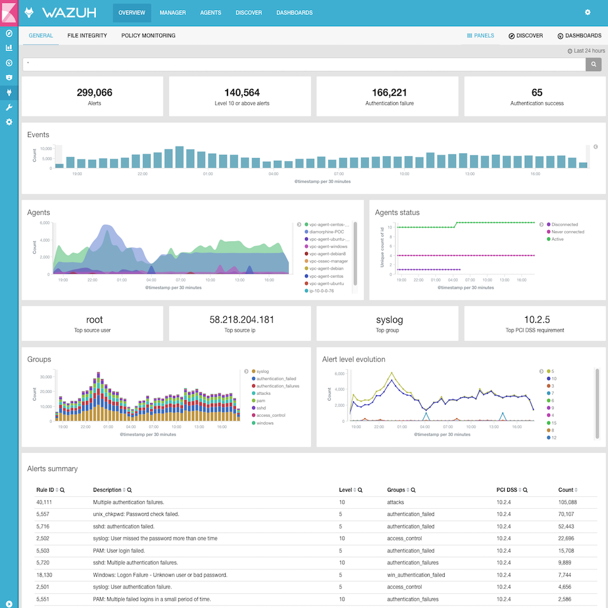

.. _upgrading_ossec:

Migrating from OSSEC
====================

Wazuh is born as a OSSEC HIDS fork, but we added a lot of capabilities that you will only be able to use if you have Wazuh installed in your system. Here we are going to give you the needed steps to migrate your an existing OSSEC installation (agent or server) to Wazuh.

If you already have a ELK stack installed, we are not going to describe here the needed steps to integrate it with Wazuh, but you can ask on our mailing list.

You can join our users `mailing list <https://groups.google.com/d/forum/wazuh>`_ by sending an email to wazuh+subscribe@googlegroups.com, to ask questions and participate in discussions.

#. `Prerequisite`_
#. `Migrating OSSEC installed from packages`_ or `Migrating OSSEC installed from sources`_
#. `Installing Elastic stack`_

Prerequisite
------------
- OSSEC 2.8.3 or higher

OSSEC agents are compatible with Wazuh Manager, but if you don't migrate your agents to the Wazuh agents, you will lost some capabilities like :ref:`openscap<openscap_module>` or some :ref:`syscheck features<manual_file_integrity>` in those agents.

Follow the appropriate section depending on the type of your OSSEC installation: from sources or packages:

+--------------+-------------------+---------------+-----------------------------------------------------------------------+
| Upgrade from | Installation type | Upgrade to    |                             Upgrade type                              |
+==============+===================+===============+=======================================================================+
| OSSEC 2.8.3+ | Packages          | Wazuh 2       | :ref:`Manual <upgrading_ossec_packages>`                              |
+--------------+-------------------+---------------+-----------------------------------------------------------------------+
| OSSEC 2.8.3+ | Sources           | Wazuh 2       | :ref:`Automatic <upgrading_ossec_sources>`                            |
+--------------+-------------------+---------------+-----------------------------------------------------------------------+

.. _upgrading_ossec_packages:

Migrating OSSEC installed from packages
---------------------------------------

This section describes how to migrate from OSSEC to Wazuh in case that OSSEC was installed using official OSSEC packages:

.. toctree::
   :maxdepth: 1

   ossec_packages_agent
   ossec_packages_manager

.. _upgrading_ossec_sources:

Migrating OSSEC installed from sources
--------------------------------------

This section describes how to upgrade from OSSEC to Wazuh in case that OSSEC was installed from sources.

.. warning::
    The configuration file ``/var/ossec/etc/ossec.conf`` **will be overwritten**. The *old* configuration file from the current installation is saved as ``ossec.conf.rpmorig`` or ``ossec.conf.deborig``. You should compare the new file with the old one.

A backup of your previous ruleset will be saved at ``/var/ossec/etc/backup_ruleset``. All the rules/decoders in other files than ``local_rules.xml`` or ``local_decoder.xml`` will be overwritten. You will need to review the backup in order to incorpore those missing rules.

Following the proper installation guide, your OSSEC installation will be automatically upgraded to Wazuh:

+---------------------------------------------+-----------------------------------+-----------------------------------+
|                                             |Wazuh server                       |Wazuh agent                        |
+=============================================+===================================+===================================+
| Red Hat, CentOS and other RPM-based systems | :ref:`Packages <wazuh_server_rpm>`| :ref:`Packages <wazuh_agent_rpm>` |
+---------------------------------------------+-----------------------------------+-----------------------------------+
| Ubuntu, and other Debian-based systems      | :ref:`Packages <wazuh_server_deb>`| :ref:`Packages <wazuh_agent_deb>` |
+---------------------------------------------+-----------------------------------+-----------------------------------+

Installing Elastic stack
------------------------

At this point you should have your OSSEC Manager and agents migrated to Wazuh. Now, we recommend you install the ELK stack, which will allow you to use our web application integrated as a Kibana app.

Install Elastic stack server following this guide:

.. toctree::
   :maxdepth: 1

   ../../installation_guide/installing-elastic-stack/elastic_server_rpm
   ../../installation_guide/installing-elastic-stack/elastic_server_deb

