.. _ossec_amazon:

OSSEC Amazon
============

Iam Use cases
-------------

A simple business use case for ``Ruleset IAM`` can help you understand basic ways you might implement the service to control the AWS access your users have with Ossec.

Create user account
+++++++++++++++++++

For start we can create a user account, after that will apply the ``rule id 80861``:: 

    <rule id="80861" level="2">
        <if_sid>80860</if_sid>
        <action>CreateUser</action>
        <description>Amazon-iam: User created</description>
        <group>amazon,pci_dss_10.2.5,</group>
    </rule>

The Kibana pannels will show:

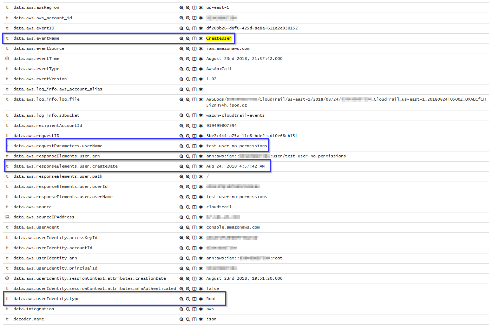

Create user account without permissions
+++++++++++++++++++++++++++++++++++++++

If the user don't has permission to create new users will apply the ``rule id 80862``::

    <rule id="80862" level="5">
        <if_sid>80861</if_sid>
        <match>"errorCode":"AccessDenied"</match>
        <description>Amazon-iam: User creation denied</description>
        <group>amazon,pci_dss_10.2.4,pci_dss_10.2.5,</group>
    </rule>

The Kibana pannels will show:

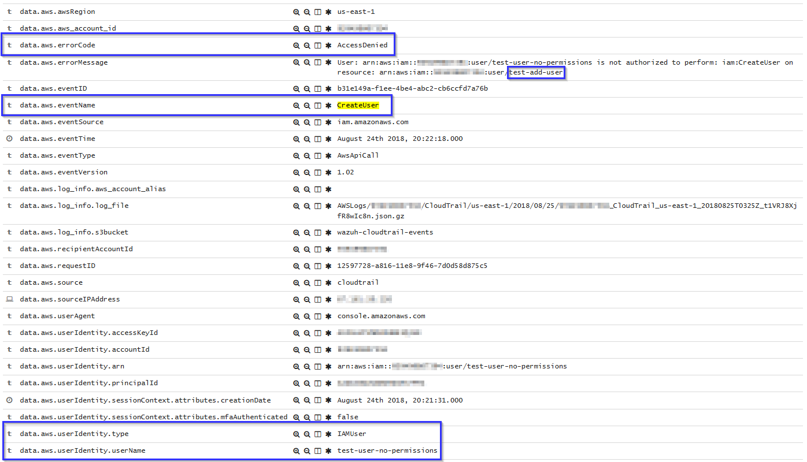

User login failed
+++++++++++++++++

As example in this scenario one user try to login in the system but has a error in the password, in this case apply the ``rule id 80802``::

      <rule id="80802" level="5">
        <if_sid>80801</if_sid>
        <match>'ConsoleLogin': u'Failure'</match>
        <description>Amazon-signin: User Login failed</description>
        <group>amazon,authentication_failed,pci_dss_10.2.4,pci_dss_10.2.5,</group>
    </rule>

The Kibana pannels will show:

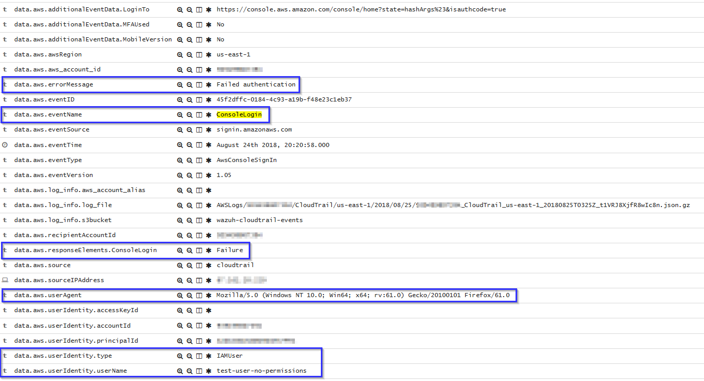

Possible breakin attempt
++++++++++++++++++++++++

If we have more than 4 incorrect access in less than 360 second apply the ``rule id 80803``::

    <rule id="80803" level="10" frequency="4" timeframe="360">
        <if_matched_sid>80802</if_matched_sid>
        <description>Possible breakin attempt (high number of login attempts).</description>
        <group>amazon,authentication_failures,pci_dss_11.4,pci_dss_10.2.4,pci_dss_10.2.5,</group>
    </rule>

The Kibana pannels will show:

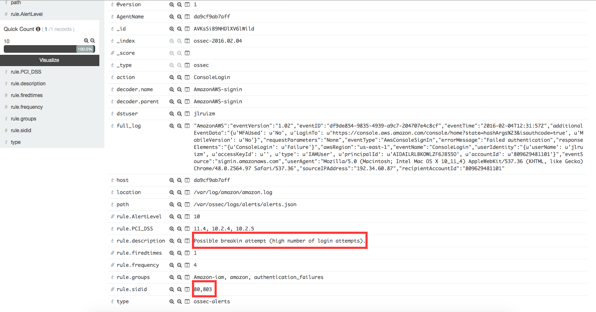

Login success
+++++++++++++

After a login success apply the ``rule id 80801``::

    <rule id="80801" level="2">
        <if_sid>80800</if_sid>
        <action>ConsoleLogin</action>
        <description>Amazon-signin: User Login Success</description>
        <group>amazon,authentication_success,pci_dss_10.2.5,</group>
    </rule>

The Kibana pannels will show:

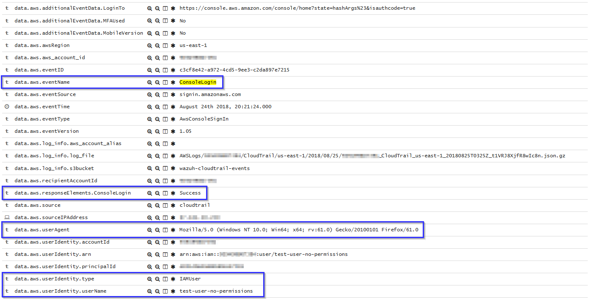

EC2 Use cases
-------------

The next a few examples about how works Wazuh Ruleset

Run a new instance in EC2
+++++++++++++++++++++++++

When one user run a new instance will apply the ``rule id 80301``::

    <rule id="80301" level="2">
        <if_sid>80300</if_sid>
        <action>RunInstances</action>
        <description>Amazon-ec2: Run instance</description>
        <group>amazon,pci_dss_10.6.1,</group>
    </rule>

The Kibana pannels will show:

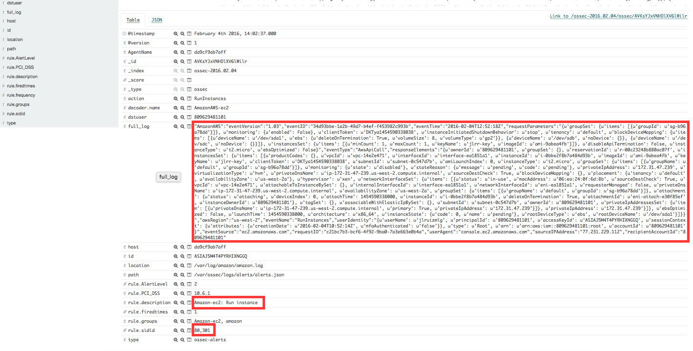

If one user without permissions for run instances try to run one will apply the ``rule id 80303``::

    <rule id="80303" level="5">
        <if_sid>80301</if_sid>
        <match>"errorCode":"Client.UnauthorizedOperation"</match>
        <description>Amazon-ec2: Run instance unauthorized</description>
        <group>amazon,pci_dss_10.6.1,</group>
    </rule>

The Kibana pannels will show:

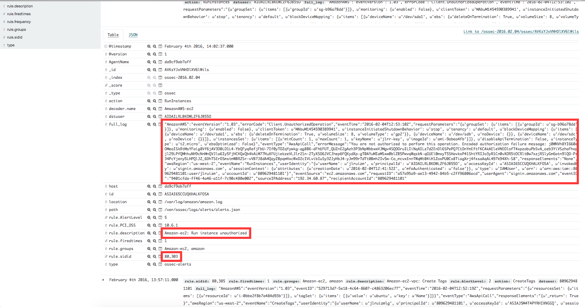

Start instances in EC2
+++++ç++++++++++++++++

When one instance in EC2 is Started, will apply the ``rule id 80305``::

    <rule id="80305" level="2">
        <if_sid>80300</if_sid>
        <action>StartInstances</action>
        <description>Amazon-ec2: Instance started</description>
        <group>amazon,pci_dss_10.6.1,</group>
    </rule>

The Kibana pannels will show:

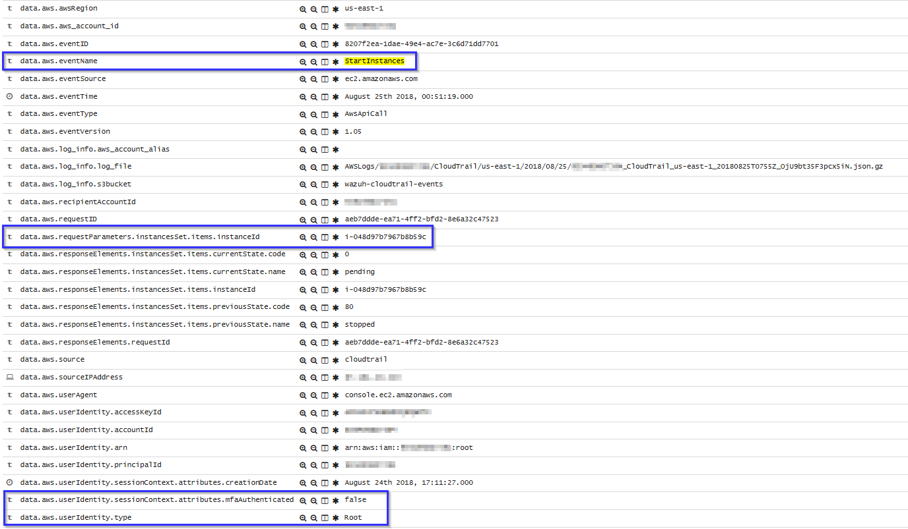

If one user without permissions for Start instances try to run one will apply the ``rule id 80306``::

    <rule id="80306" level="5">
        <if_sid>80305</if_sid>
        <match>"errorCode":"Client.UnauthorizedOperation"</match>
        <description>Amazon-ec2: Start instance unauthorized</description>
        <group>amazon,pci_dss_10.6.1,</group>
    </rule>

The Kibana pannels will show:

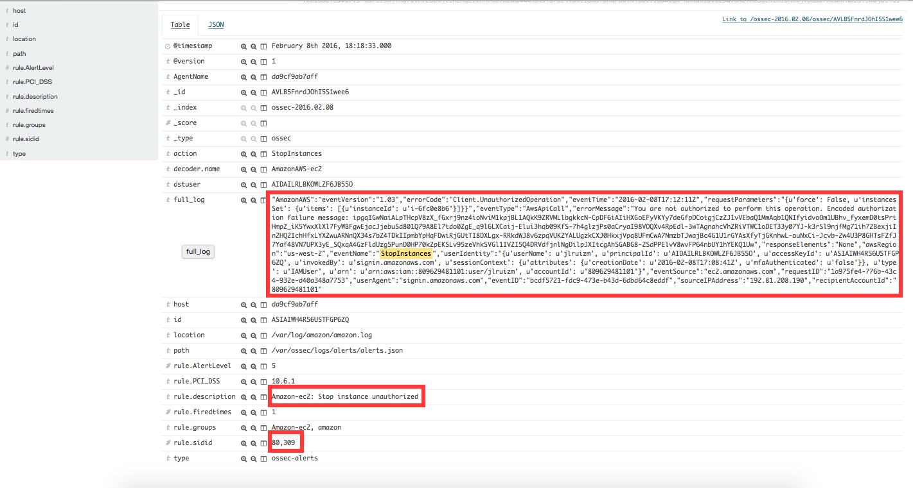

Stop instances in EC2
+++++++++++++++++++++

When one instance in EC2 is Stoped, will apply the ``rule id 80308``::

    <rule id="80308" level="2">
        <if_sid>80300</if_sid>
        <action>StopInstances</action>
        <description>Amazon-ec2: Instance stopped</description>
        <group>amazon,pci_dss_10.6.1,</group>
    </rule>

The kibana pannels will show:

.. image:: images/aws/aws-ec2-5.png
    :align: center
    :width: 100%

If one user without permissions for Start instances try to run one will apply the ``rule id 80309``::

    <rule id="80309" level="5">
        <if_sid>80308</if_sid>
        <match>"errorCode":"Client.UnauthorizedOperation"</match>
        <description>Amazon-ec2: Stop instance unauthorized</description>
        <group>amazon,pci_dss_10.6.1,</group>
    </rule>

The Kibana pannels will show:

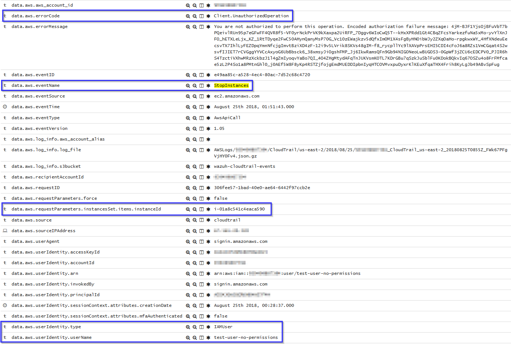

Create Security Groups in EC2
+++++++++++++++++++++++++++++

If a security gruop is created will apply the ``rule id 80404``::

    <rule id="80404" level="2">
        <if_sid>80300</if_sid>
        <action>CreateSecurityGroup</action>
        <description>Amazon-ec2: Create Security Group</description>
        <group>amazon,pci_dss_10.6.1,</group>
    </rule>

The Kibana pannels will show:

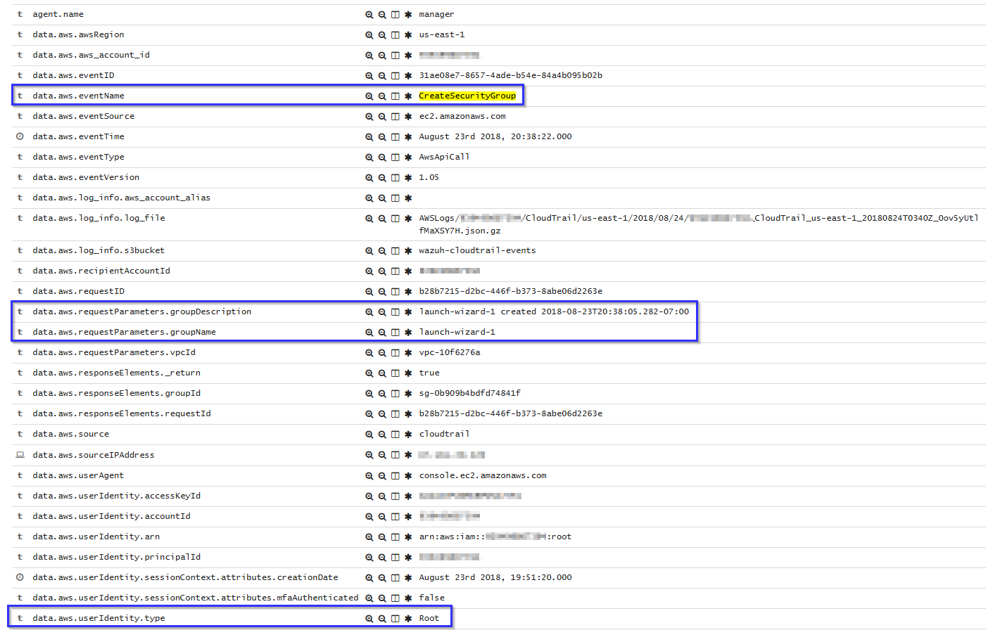

Allocate new address Elastic IP's
+++++++++++++++++++++++++++++++++

If one Elastic IP's is allocated will apply the rule ``rule id 80411``::

    <rule id="80411" level="2">
        <if_sid>80300</if_sid>
        <action>AllocateAddress</action>
        <description>Amazon-ec2: Allocate Address</description>
        <group>amazon,</group>
    </rule>

The Kibana pannels will show:

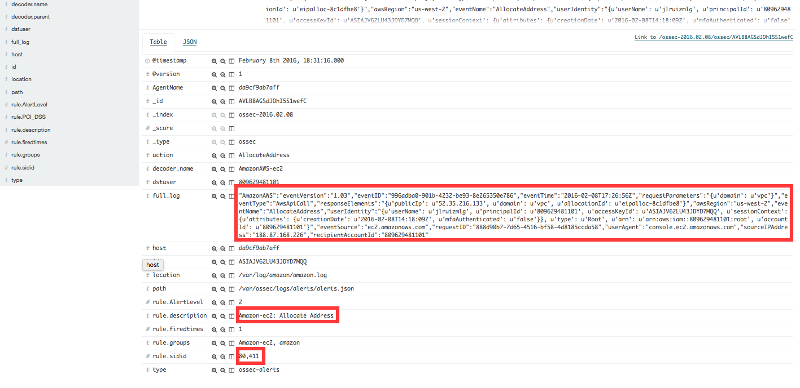

Associate new Elastic IP's address
++++++++++++++++++++++++++++++++++

If one Elastic IP's is associated will apply the rule ``rule id 80446``::

    <rule id="80446" level="2">
        <if_sid>80300</if_sid>
        <action>AssociateAddress</action>
        <description>Amazon-ec2: Associate Address</description>
        <group>amazon,pci_dss_10.6.1,</group>
    </rule>

The Kibana pannels will show:

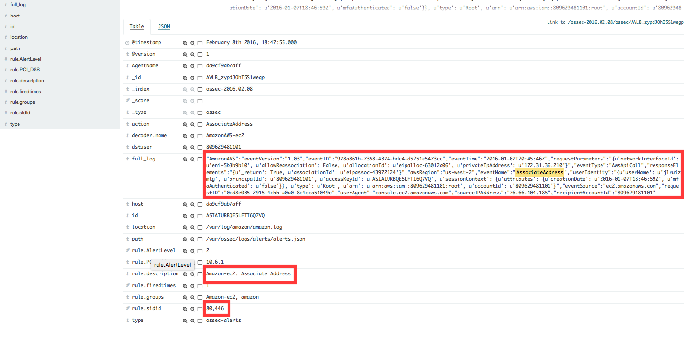

VPC Use cases
-------------

If one VPC is created will apply the rule ``rule id 81000``::

    <rule id="81000" level="2">
        <if_sid>80300</if_sid>
        <action>CreateVpc</action>
        <description>Amazon-vpc: Vpc Created</description>
        <group>amazon,pci_dss_10.6.1,</group>
    </rule>

The Kibana pannels will show:

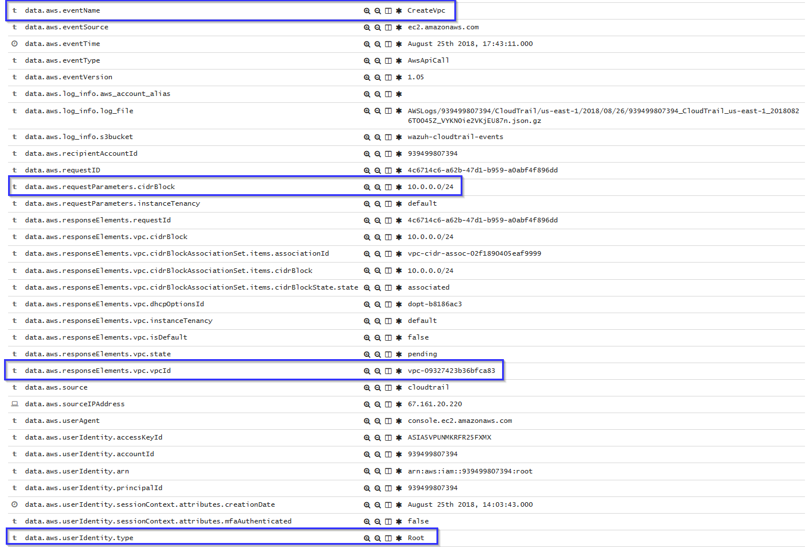

If the user don't has permission will apply the ``rule id 81001``::

    <rule id="81001" level="5">
        <if_sid>81000</if_sid>
        <match>"errorCode":"Client.UnauthorizedOperation"</match>
        <description>Amazon-Vpc: Vpc Created Unauthorized Operation</description>
        <group>amazon,pci_dss_10.6.1,</group>
    </rule>

The Kibana pannels will show:

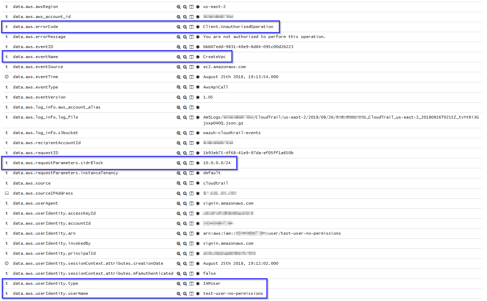
