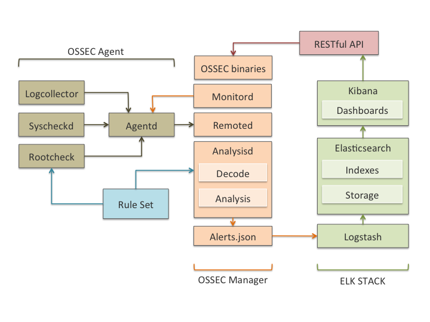
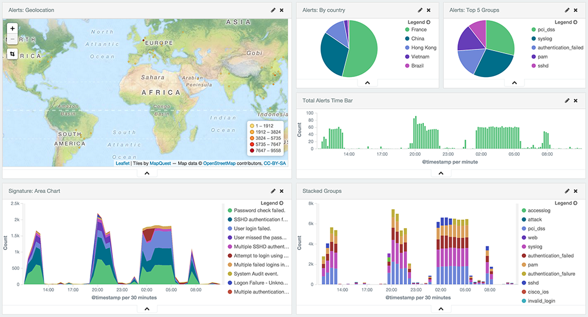
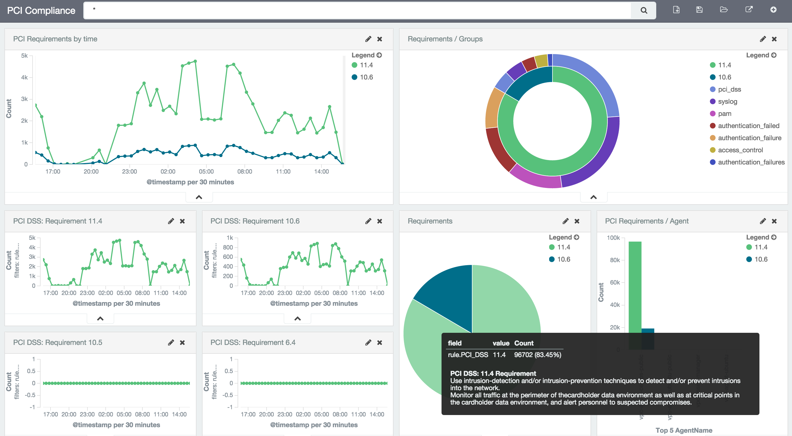

.. _ossec_elk_architecture:

Components and architecture
===========================

Components 
----------

See below a brief description of the components and tools involved in the integration of our :ref:`OSSEC Wazuh fork <ossec_wazuh>` with ELK Stack, for long term data storage, alerts indexing, management and visualization.

+ `OSSEC HIDS forked by Wazuh <http://github.com/wazuh/ossec-wazuh/>`_: Performs log analysis, file integrity checking, policy monitoring, rootkits/malware detection and real-time alerting. The alerts are written in an extended JSON format, and stored locally on the box running the OSSEC manager.

- `Logstash <https://www.elastic.co/products/logstash/>`_: Is a data pipeline used for processing logs and other event data from a variety of systems. Logstash will read and process OSSEC JSON files, adding IP Geolocation information and modeling data before sending it to the Elasticsearch Cluster.

+ `Elasticsearch <https://www.elastic.co/products/elasticsearch/>`_: Is the search engine used to index and store our OSSEC alerts. It can be deployed as a cluster, with multiple nodes, for better performance and data replication. 

- `Kibana <https://www.elastic.co/products/kibana/>`_: Kibana is a WEB framework used to explore all elasticsearch indexes. We will use it to analyze OSSEC alerts and to create custom dashboards for different use cases, including compliance regulations like PCI DSS or benchmarks like CIS.

These components are meant to communicate with each other, so the original data generated by your systems and applications is centralized, analyzed, indexed, stored and made available for you at the Kibana interface. See below a graph describing this data flow:

Architecture
------------

The components for OSSEC and ELK Stack integration can be deployed all in a single host, or distributed across multiple systems. This last type of deployment is useful for load balancing, high availability and data replication. 

In most cases Elasticesearch will only be indexing OSSEC alerts, as opposed to every event processed by the system (also possible using archives.json output). This approach reduces considerably the performance and storage requirements, making it perfectly possible to deploy all the components in a single server. In this case, the same system would run the OSSEC manager, the Logstash server and an Elasticsearch single-node cluster with Kibana user interface on top of it. 

In an effort to cover all possible scenarios, this guide describes both options to deploy OSSEC with ELK Stack (distributed and single-host).

.. topic:: Distributed deployment with four servers

		   See below our recommended deployement when using four different hosts (which includes a 3 nodes Elasticsearch cluster):

		   * *Host 1:* OSSEC Manager + Logstash Forwarder
		   * *Host 2:* Logstash Server + Elasticsearch Node 1 + Kibana
		   * *Host 3:* Elasticsearch Node 2
		   * *Host 3:* Elasticsearch Node 3

Requirements
------------

+ Operating System: This document includes a detailed description of the steps you need to follow to install the components both in Debian (latest stable is version 8) and CentOS (latest stable is version 7) Linux distributions. 

- RAM memory: Elasticsearch tends to utilize a high amount of memory for data sorting and aggregation and, according to their documentation, less than 8GB RAM is counterproductive. For single-host deployments, considering that Elasticsearch will share resources with OSSEC, Logstash and Kibana, we recommend to provision your server with at least 16GB RAM (more if possible). Less than 16GB RAM would only work for small OSSEC deployments.

+ `OSSEC Wazuh fork <http://github.com/wazuh/ossec-wazuh/>`_: It is required for the integration with ELK Stack. You can install it by following the instructions in :ref:`our documentation <ossec_wazuh>`

- :ref:`Java 8 JRE<ossec_elk_java>`: Java 8 is required both by Logstash server and by Elasticsearch. In this guide we have also included a description on how to install it.

OSSEC alerts dashboard 
----------------------

Kibana offers interactive visualization capabilities, that we have used to put together an OSSEC alerts dashboard with visualization of alerts geolocation and timeline. In addition you will be able to see the alerts level evolution, and charts showing you aggregated information for easy analysis. Filters can also be applied, as all alert fields are also indexed by the search engine. See below an screenshot of this dashboard.

PCI DSS compliance dashboard
----------------------------

OSSEC HIDS can be used to become compliant with PCI DSS, especially due to the intrusion detection, file integrity monitoring and policy enforcement capabilities. This dashboard will make use of OSSEC rules mapping with the compliance controls, showing useful information to identify which systems are not fully compliant with the regulation.

