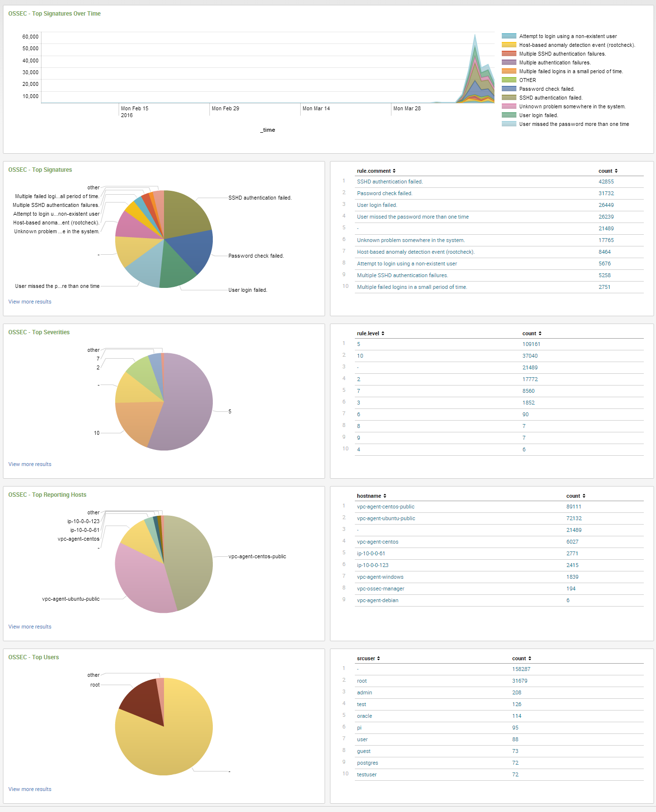
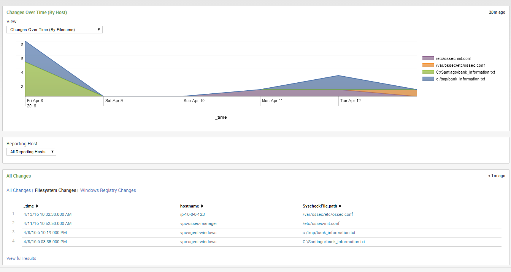

.. _ossec_splunk_reference:

Reference
=========

The app is organized by:

* `Wazuh Dashboards`_
* `Wazuh API Management`_
* `OSSEC Dashboards`_
* `OSSEC Reports`_

Reference List
--------------

* `Wazuh Dashboards`_
    * `Wazuh Overview`_
    * `Wazuh PCI Compliance`_
    * `Wazuh File Integrity`_   

Wazuh Dashboards
----------------

Wazuh Overview
++++++++++++++

.. image:: images/splunk/wazuh-overview.png
   :align: center
   :width: 80%

* **Use case**: To have an overview of the agents and managers status, perform frequent actions and detect inusual alerts peak.
* **Description**: A dashboard with the following elements:
    * A panel with the agents' status for a manager.
    * A panel where for each agent it's possible to perform the following operations: Get info, get key, reset syscheck and remove.
    * A panel where for each agent it's possible to know the files that are being monitored, and the number of changes for each file.
    * A panel for adding new agents.
    * A panel for restarting syscheck on all the agents.
    * A panel with the manager status.
    * A panel with the rules loaded in the manager.
    * A chart displaying the alerts count by time.
* **Anotations**: To add a new agent or restart syscheck, be sure the corresponding security check is enabled.

Wazuh PCI Compliance
++++++++++++++++++++

.. image:: images/splunk/wazuh-pci-compliance.png
   :align: center
   :width: 80%

* **Use case**: To know the PCI compliance requirements for managers and agents.
* **Description**: A dashboard with the following elements:
    * A chart displaying the percent of each requirement.
    * A panel with the requirements for each agent.
    * A chart displaying the OSSEC alert groups.
    * A chart displaying the requirements by time.
    * A char displaying the OSSEC alert signatures by time.

Wazuh File Integrity
++++++++++++++++++++

.. image:: images/splunk/wazuh-file-integrity.png
   :align: center
   :width: 80%

* **Use case**: To know the last file integrity check reports.
* **Description**: A dashboard with the following elements:
    * A chart displaying the count of changes over time. It's possible to filter the chart by agent name, registry key name, file name or type of change (File or registry).
    * A chart displaying the files that have changed.
    * A panel with the ordered count of changes for files or registry keys.
    * A panel with the last file changes. It displays the file name, date of change, old checksum and the new checksum.

Wazuh API Management
--------------------

Wazuh API Agent Management
++++++++++++++++++++++++++

.. image:: images/splunk/wazuh-api-agent-management.png
   :align: center
   :width: 80%

* **Use case**: To perform everyday operations over agents.
* **Description**: A panel where it's possible to perform the following operations:
    * List agents for a manager.
    * Get info of an agent.
    * Extract the key of an agent.
    * Add a new agent with specific IP or any IP.
    * Remove an agent.
    * Restart an agent.
* **Anotations**: For more information see `OSSEC Wazuh RESTful API Reference -> Agents <http://documentation.wazuh.com/en/latest/ossec_api_reference.html#agents>`_.

Wazuh API Manager Management
++++++++++++++++++++++++++++

.. image:: images/splunk/wazuh-api-manager-management.png
   :align: center
   :width: 80%

* **Use case**: To perform everyday operations over managers.
* **Description**: A panel where it's possible to perform the following operations:
    * Get the configuration file of a manager (Entire or filtered by section and field).
    * Test the configuration file of a manager.
    * Get the status of a manager.
    * Restart a manager.
    * Start a manager.
    * Stop a manager.
* **Anotations**: For more information see `OSSEC Wazuh RESTful API Reference -> Manager <http://documentation.wazuh.com/en/latest/ossec_api_reference.html#manager>`_.

Wazuh API Rootcheck Management
++++++++++++++++++++++++++++++

.. image:: images/splunk/wazuh-api-rootcheck-management.png
   :align: center
   :width: 80%

* **Use case**: To perform everyady operations over the rootcheck of the agents.
* **Description**: A panel where it's possible to perform the following operations:
    * Get the rootcheck database of an agent.
    * Get the last rootcheck scan date for an agent.
    * Start a rootcheck scan in all agents.
    * Start a rootcheck scan in a given agent.
    * Clear rootcheck database in all agents.
    * Clear rootcheck database in a given agent.
* **Anotations**: For more information see `OSSEC Wazuh RESTful API Reference -> Rootcheck <http://documentation.wazuh.com/en/latest/ossec_api_reference.html#rootcheck>`_.

Wazuh API Syscheck Management
+++++++++++++++++++++++++++++

.. image:: images/splunk/wazuh-api-syscheck-management.png
   :align: center
   :width: 80%

* **Use case**: To perform everyday operations over the syscheck of the agents.
* **Description**: A panel where it's possible to perform the following operations:
    * Get the syscheck database of an agent.
    * Get the changes in a file detected by syscheck.
    * Get the last syscheck scan date for an agent.
    * Start a syscheck scan in all agents.
    * Start a syscheck scan in a given agent.
    * Clear syscheck database in all agents.
    * Clear syscheck database in a given agent.
* **Anotations**: For more information see `OSSEC Wazuh RESTful API Reference -> Syscheck <http://documentation.wazuh.com/en/latest/ossec_api_reference.html#syscheck>`_.

OSSEC Dashboards
----------------

OSSEC Agent Coverage
++++++++++++++++++++

.. image:: images/splunk/ossec-agent-coverage.png
   :align: center
   :width: 80%

* **Use case**:
* **Description**:
* **Anotations**:

OSSEC Agent Status
++++++++++++++++++

.. image:: images/splunk/ossec-agent-status.png
   :align: center
   :width: 80%

* **Use case**:
* **Description**:
* **Anotations**:

OSSEC Dashboards
++++++++++++++++

* **Use case**:
* **Description**:
* **Anotations**:

OSSEC Event Search
++++++++++++++++++

.. image:: images/splunk/ossec-event-search.png
   :align: center
   :width: 80%

* **Use case**:
* **Description**:
* **Anotations**:

OSSEC File Integrity
++++++++++++++++++++

* **Use case**:
* **Description**:
* **Anotations**:

OSSEC Reports
-------------

OSSEC Malware Alert
+++++++++++++++++++

* **Use case**:
* **Description**:
* **Anotations**:

OSSEC High-Severity Alert
+++++++++++++++++++++++++

* **Use case**:
* **Description**:
* **Anotations**:

OSSEC Top Events 
++++++++++++++++

.. image:: images/splunk/ossec-top-reporting-hosts.png
   :align: center
   :width: 80%

* **Use case**:
* **Description**:
* **Anotations**:

OSSEC Timecharts
++++++++++++++++

.. image:: images/splunk/ossec-timechart-signature.png
   :align: center
   :width: 80%

* **Use case**:
* **Description**:
* **Anotations**:

OSSEC Agent Started/Disconnected
++++++++++++++++++++++++++++++++

.. image:: images/splunk/ossec-agent-started.png
   :align: center
   :width: 80%

* **Use case**:
* **Description**:
* **Anotations**:

OSSEC Agent Status (Search)
+++++++++++++++++++++++++++

.. image:: images/splunk/ossec-agent-status-search.png
   :align: center
   :width: 80%

* **Use case**:
* **Description**:
* **Anotations**:

OSSEC Bruteforce
++++++++++++++++

.. image:: images/splunk/ossec-bruteforce-top-ip.png
   :align: center
   :width: 80%

* **Use case**:
* **Description**:
* **Anotations**:

OSSEC File Changes
++++++++++++++++++

.. image:: images/splunk/ossec-file-changes.png
   :align: center
   :width: 80%

* **Use case**:
* **Description**:
* **Anotations**:

OSSEC Malware Hash Check
++++++++++++++++++++++++

* **Use case**:
* **Description**:
* **Anotations**:

OSSEC Registry Changes
++++++++++++++++++++++

* **Use case**:
* **Description**:
* **Anotations**:

OSSEC Unix Package Changes
++++++++++++++++++++++++++

.. image:: images/splunk/ossec-unix-packages.png
   :align: center
   :width: 80%

* **Use case**:
* **Description**:
* **Anotations**:

Special Search Commands
-----------------------

Initialize OSSEC Server Lookup Table
++++++++++++++++++++++++++++++++++++

* **Use case**:
* **Description**:
* **Anotations**:

Rebuild OSSEC Server Lookup Table
+++++++++++++++++++++++++++++++++

* **Use case**:
* **Description**:
* **Anotations**:

Track Expected Hosts
++++++++++++++++++++

* **Use case**:
* **Description**:
* **Anotations**:

Track Last Checkin
++++++++++++++++++

* **Use case**:
* **Description**:
* **Anotations**:

What's next
-----------

Once you have installed Reporting and Management for Wazuh, we recommend you to check the following resources:

* `OSSEC for PCI DSS <http://documentation.wazuh.com/en/latest/ossec_pci_dss.html>`_ 
* `OSSEC integration with ELK Stack <http://documentation.wazuh.com/en/latest/ossec_elk.html>`_ 