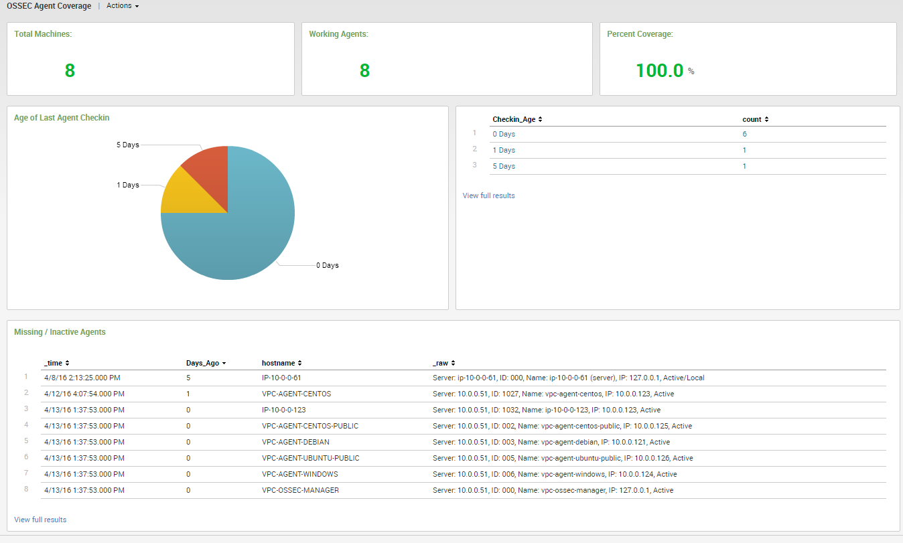
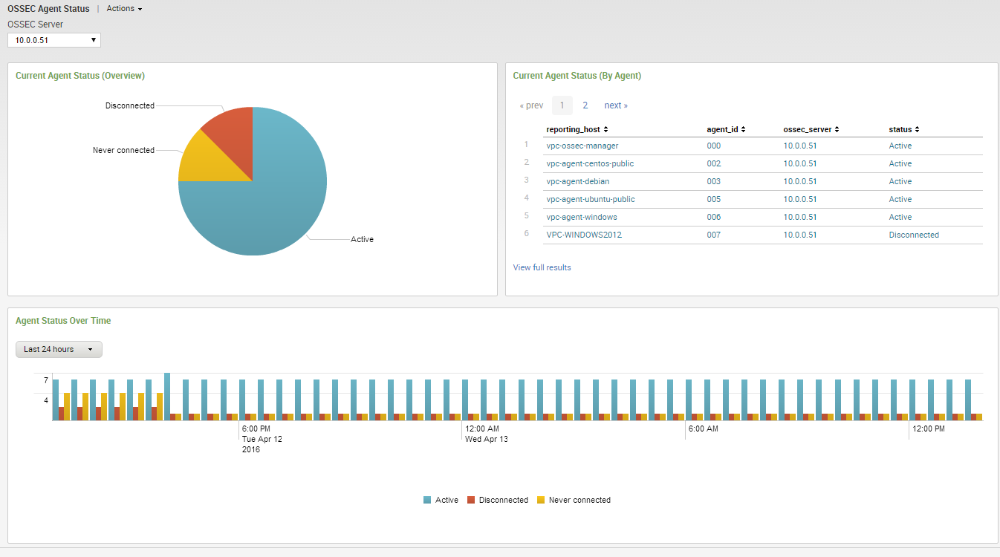
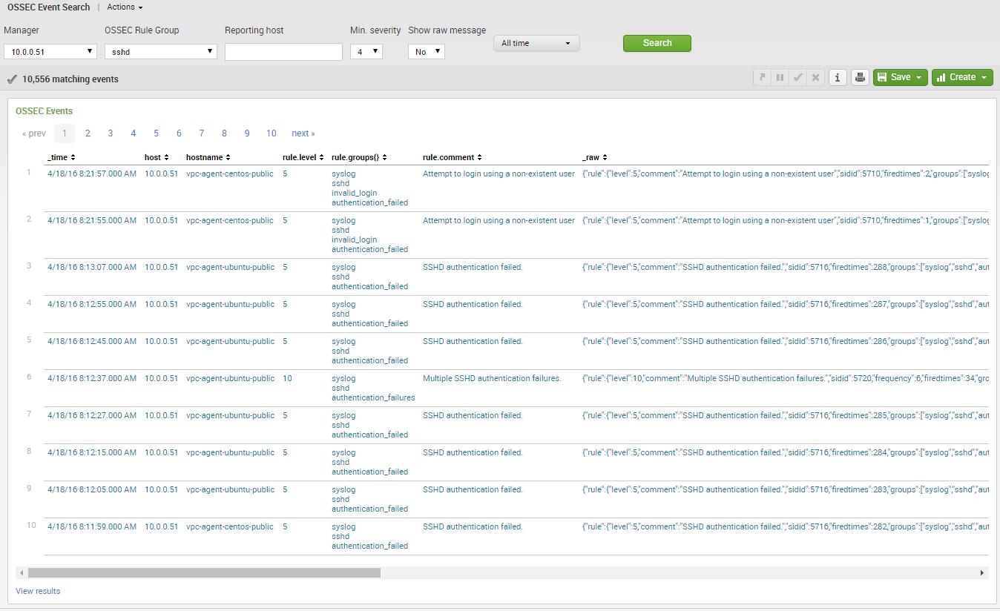

.. _ossec_splunk_reference_ossec_dashboards:

OSSEC Dashboards Reference
==========================

Reference List
--------------

* `OSSEC Dashboards`_
    * `Agent Coverage`_
    * `Agent Status`_
    * `Event Search`_ 
    
OSSEC Dashboards
----------------

Agent Coverage
++++++++++++++

* **Use case**: To have an overview of the agents coverage.
* **Description**: A dashboard with the following elements:
    * Total agents.
    * Active agents.
    * Percent coverage.
    * Age of last agent checkin.
    * Missing and inactive agents.
* **Anotations**: The percent will change if an agent is inactive during seven days or more.

Agent Status
++++++++++++

* **Use case**: To have an overview of the agents status.
* **Description**: A dashboard with agent status:
    * Overview.
    * By agent.
    * Over time.

Event Search
++++++++++++

* **Use case**: Events search easily.
* **Description**: A form where it's possible to perform an event search, filtering with the following fields:
    * Manager.
    * Rule group.
    * Agent.
    * Rule severity.
    * Time.
