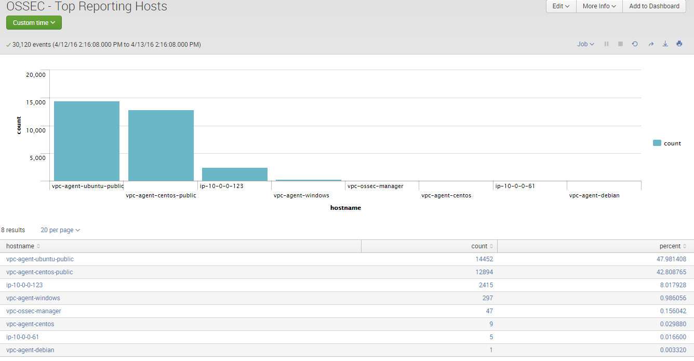
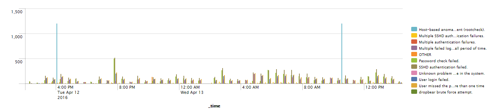
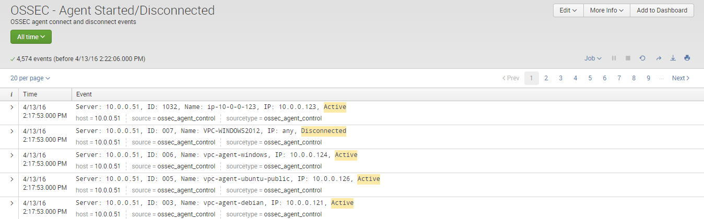
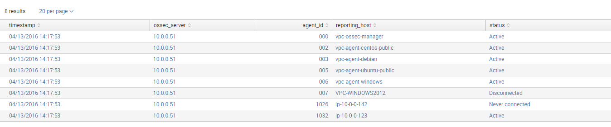
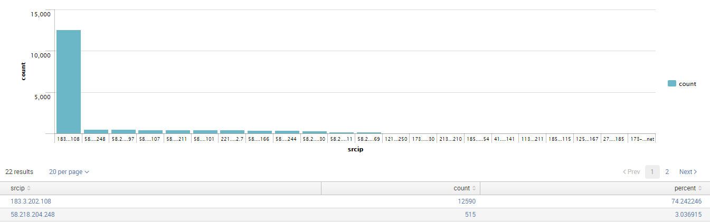
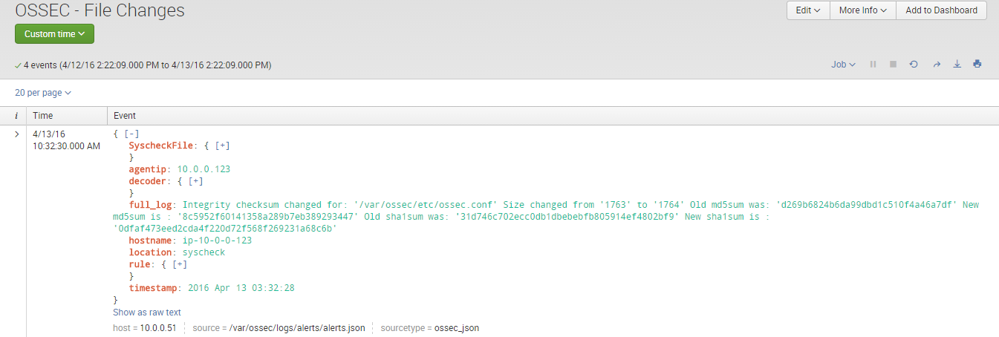
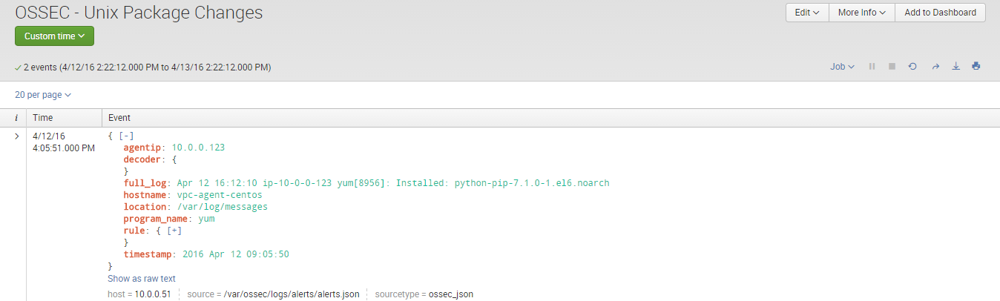

.. _ossec_splunk_reference_ossec_searches:

OSSEC Searches and Reports Reference
====================================

Reference List
--------------

* `OSSEC Searches and Reports`_
    * `Malware Alert`_
    * `High-Severity Alert`_
    * `Top Events`_   
    * `Timecharts`_
    * `Agent Started/Disconnected`_
    * `Agent Status (Search)`_
    * `Bruteforce`_
    * `File Changes`_
    * `Malware Hash Check`_
    * `Registry Changes`_
    * `Unix Package Changes`_

OSSEC Searches and Reports
--------------------------

Malware Alert
+++++++++++++++++++

* **Use case**: To alert when the new hash of a file is reported as potential malware by the Cymru MHR.
* **Description**: Positive reports with the agent name, file path and detection percent.

High-Severity Alert
+++++++++++++++++++++++++

* **Use case**: To alert when OSSEC reports a high-severity alert (Rule level nine or more).
* **Description**: High-severity alerts with agent name, rule id, rule signature, user and IP.

Top Events 
++++++++++++++++

* **Use case**: To quickly have frequently used charts of top rankings.
* **Description**: A set of the following top ranking charts:
    * Reporting hosts
    * Rules
    * Rule level
    * Signature
    * IP
    * User

Timecharts
++++++++++++++++

* **Use case**: To quickly have frequently used timecharts.
* **Description**: A set of the following charts by time:
    * Reporting hosts
    * Rules
    * Rule level
    * Signature
    * IP
    * User

Agent Started/Disconnected
++++++++++++++++++++++++++++++++

* **Use case**: To quickly search events reporting that an agent has been started or disconnected.
* **Description**: A set of events reporting the status of an agent.

Agent Status (Search)
+++++++++++++++++++++++++++

* **Use case**: To have a report of the agents status.
* **Description**: A table with agents, the status for each agent, and the time when the status changed.

Bruteforce
++++++++++++++++

* **Use case**: To have a report of the IP addresses that do bruteforce attacks.
* **Description**: A table with the IP addresses, count of attacks and percent.

File Changes
++++++++++++++++++

* **Use case**: To quickly search events about file changes.
* **Description**: The events about file changes.

Malware Hash Check
++++++++++++++++++++++++

* **Use case**: To quickly search events generated when the new hash of a file is reported as potential malware by the Cymru MHR.
* **Description**: The events about malware check with positive result.

Registry Changes
++++++++++++++++++++++

* **Use case**: To quickly search events about registry changes.
* **Description**: The events about registry changes.

Unix Package Changes
++++++++++++++++++++++++++

* **Use case**: To quickly search events about unix package changes.
* **Description**: The events about unix package changes (Install, uninstall, update).