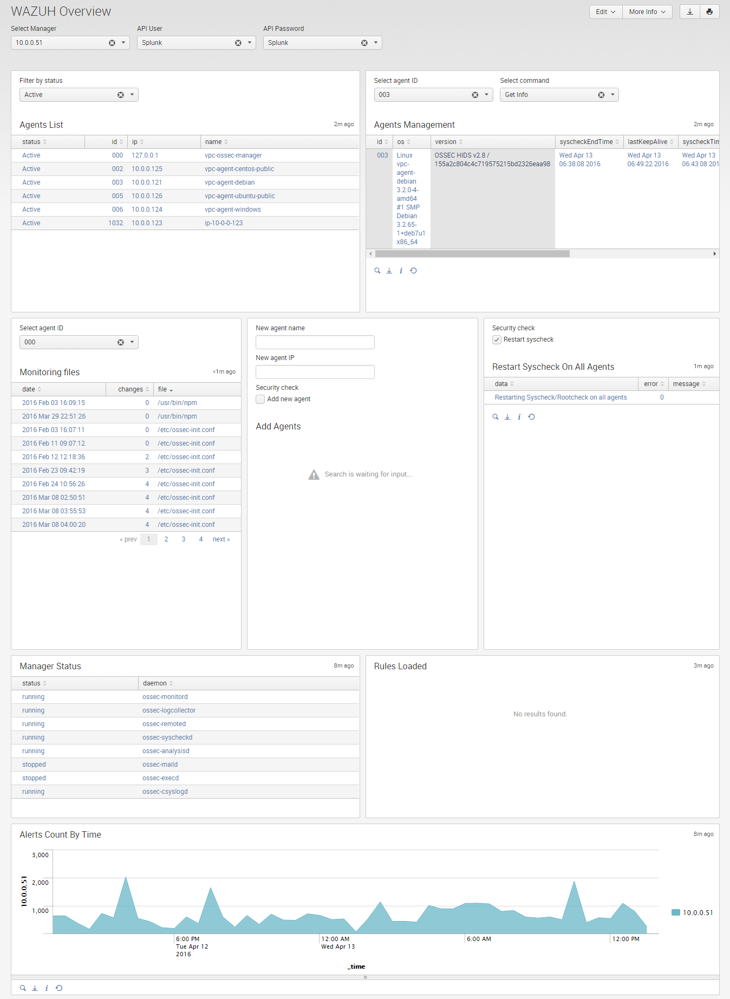
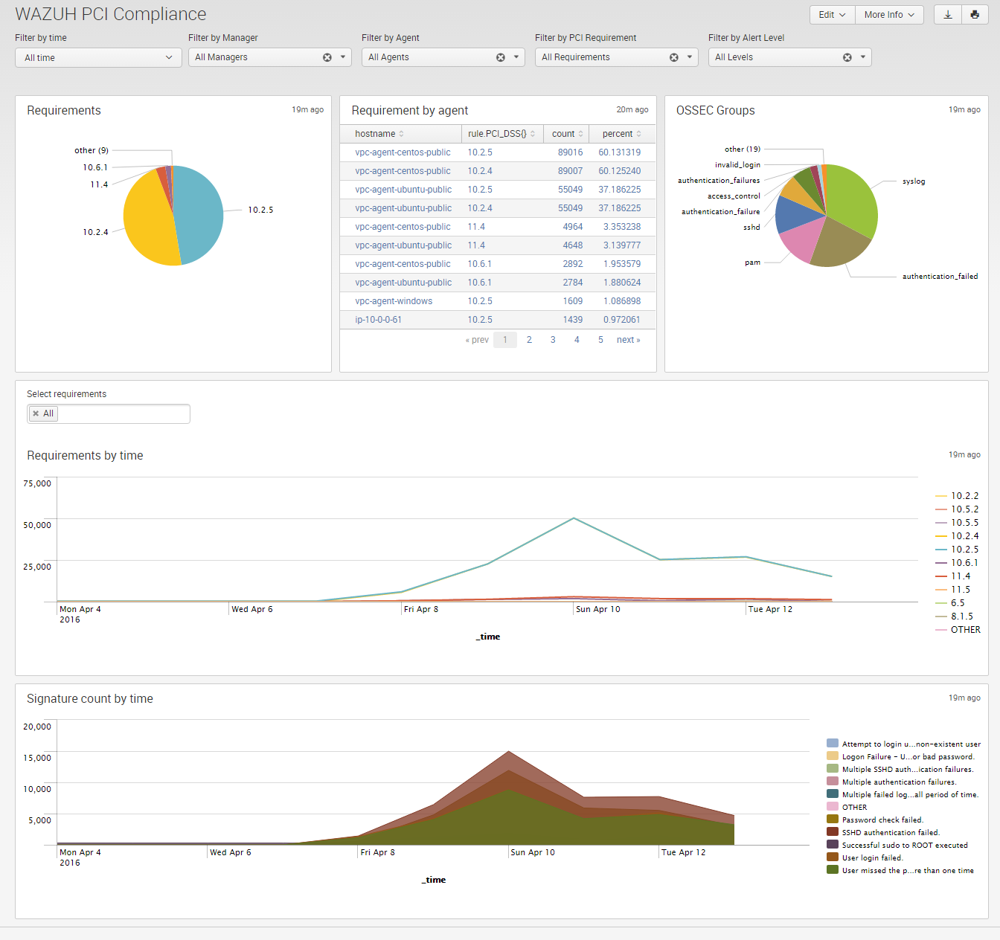
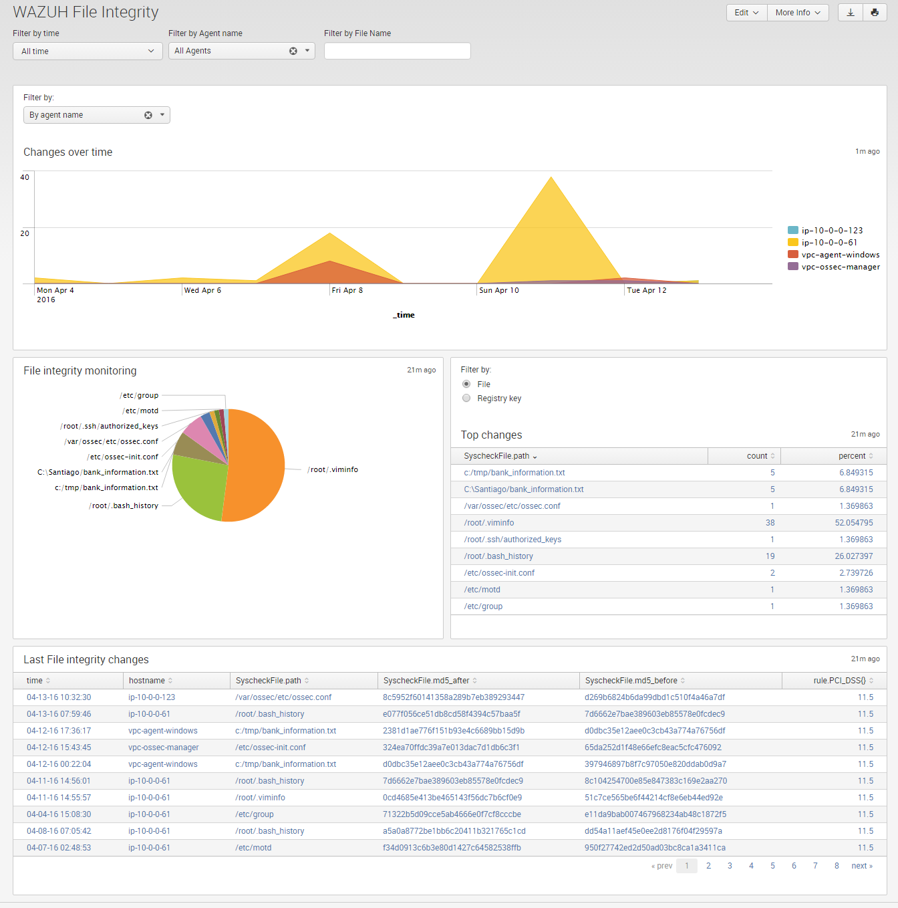
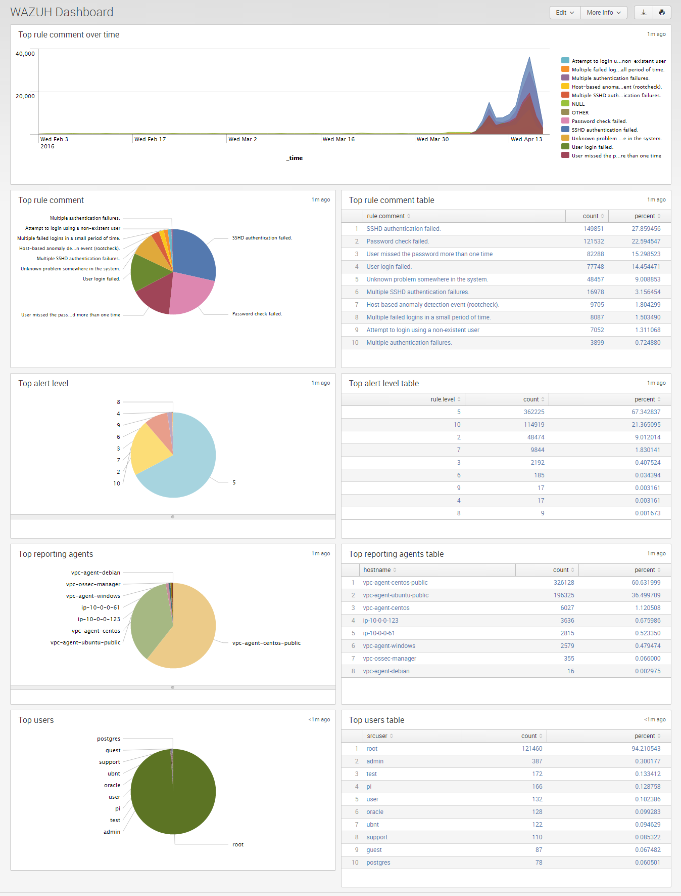

.. _ossec_splunk_reference_wazuh_dashboards:

Wazuh Dashboards Reference
==========================

Reference List
--------------

* `Wazuh Dashboards`_
    * `Wazuh Overview`_
    * `Wazuh PCI Compliance`_
    * `Wazuh File Integrity`_   
    * `Wazuh Dashboard`_

Wazuh Dashboards
----------------

Wazuh Overview
++++++++++++++

* **Use case**: To have an overview of the agents and managers status, perform frequent actions and detect inusual alerts peaks.
* **Description**: A dashboard with the following elements:
    * The agents' status for a manager.
    * Given an agent perform the following operations: Get info, get key, reset syscheck and remove.
    * Given an agent know the files that are being monitored, and the number of changes for each file.
    * Adding new agents.
    * Restarting syscheck on all the agents.
    * Manager status.
    * Rules loaded in the manager.
    * Chart displaying the alerts count by time.
* **Anotations**: To add a new agent or restart syscheck, be sure the corresponding checkbox is enabled.

Wazuh PCI Compliance
++++++++++++++++++++

* **Use case**: To know the PCI compliance requirements for managers and agents.
* **Description**: A dashboard with the following elements:
    * The percent of each requirement.
    * Requirements for each agent.
    * OSSEC alert groups.
    * Chart displaying the requirements by time.
    * Chart displaying the OSSEC alert signatures by time.

Wazuh File Integrity
++++++++++++++++++++

* **Use case**: To know the last file integrity check reports.
* **Description**: A dashboard with the following elements:
    * Count of changes over time. It's possible to filter the chart by agent name, registry key name, file name or type of change (File or registry).
    * Chart displaying the files that have changed.
    * Ordered count of changes for files or registry keys.
    * Last file changes (Displaying the file name, date of change, old checksum and the new checksum).

Wazuh Dashboard
+++++++++++++++

* **Use case**: To have an overview of frequent metrics.
* **Description**: A dashboard with the following top rankings:
    * Rule signatures over time.
    * Rule signatures.
    * Rule level.
    * Reporting hosts.
    * Users.