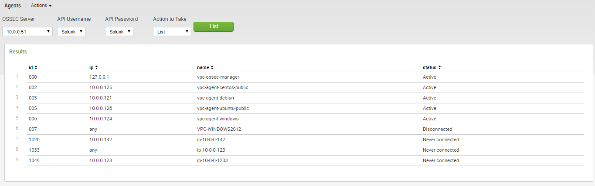
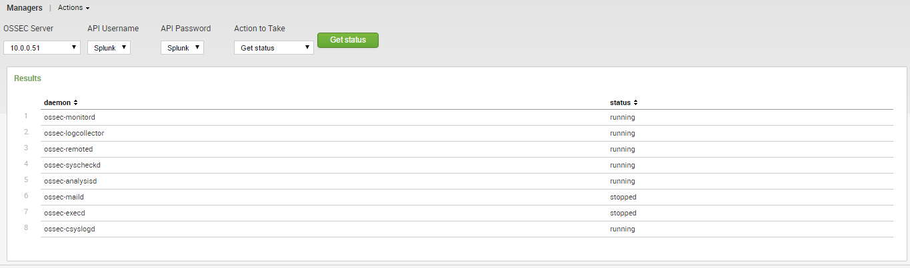
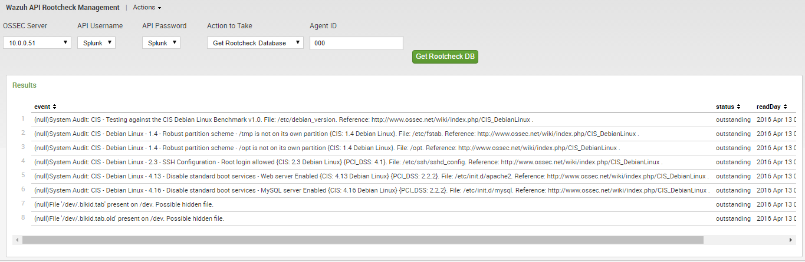
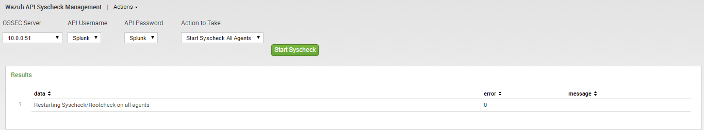

.. _ossec_splunk_reference_wazuh_management:

Wazuh Management Reference
==========================

Reference List
--------------

* `Wazuh Management`_
    * `Agents`_
    * `Manager`_
    * `Rootcheck`_ 
    * `Syscheck`_ 

Wazuh Management
----------------

Agents
++++++

* **Use case**: To perform everyday operations over agents.
* **Description**: A panel where it's possible to perform the following operations:
    * List agents for a manager.
    * Get info of an agent.
    * Extract the key of an agent.
    * Add a new agent with specific IP or any IP.
    * Remove an agent.
    * Restart an agent.
* **Anotations**: For more information see `OSSEC Wazuh RESTful API Reference -> Agents <http://documentation.wazuh.com/en/latest/ossec_api_reference.html#agents>`_.

Manager
+++++++

* **Use case**: To perform everyday operations over managers.
* **Description**: A panel where it's possible to perform the following operations:
    * Get the configuration file of a manager (Entire or filtered by section and field).
    * Test the configuration file of a manager.
    * Get the status of a manager.
    * Restart a manager.
    * Start a manager.
    * Stop a manager.
* **Anotations**: For more information see `OSSEC Wazuh RESTful API Reference -> Manager <http://documentation.wazuh.com/en/latest/ossec_api_reference.html#manager>`_.

Rootcheck
+++++++++

* **Use case**: To perform everyady operations over the rootcheck of the agents.
* **Description**: A panel where it's possible to perform the following operations:
    * Get the rootcheck database of an agent.
    * Get the last rootcheck scan date for an agent.
    * Start a rootcheck scan in all agents.
    * Start a rootcheck scan in a given agent.
    * Clear rootcheck database in all agents.
    * Clear rootcheck database in a given agent.
* **Anotations**: For more information see `OSSEC Wazuh RESTful API Reference -> Rootcheck <http://documentation.wazuh.com/en/latest/ossec_api_reference.html#rootcheck>`_.

Syscheck
++++++++

* **Use case**: To perform everyday operations over the syscheck of the agents.
* **Description**: A panel where it's possible to perform the following operations:
    * Get the syscheck database of an agent.
    * Get the changes in a file detected by syscheck.
    * Get the last syscheck scan date for an agent.
    * Start a syscheck scan in all agents.
    * Start a syscheck scan in a given agent.
    * Clear syscheck database in all agents.
    * Clear syscheck database in a given agent.
* **Anotations**: For more information see `OSSEC Wazuh RESTful API Reference -> Syscheck <http://documentation.wazuh.com/en/latest/ossec_api_reference.html#syscheck>`_.
