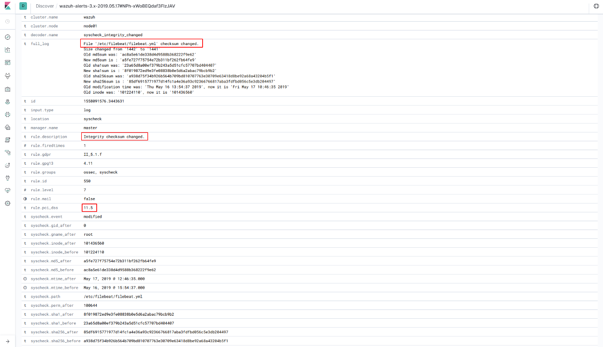
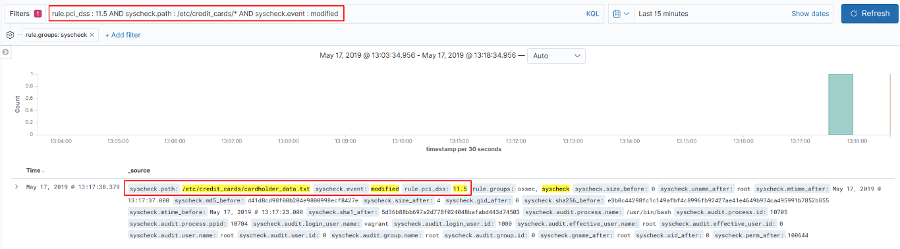
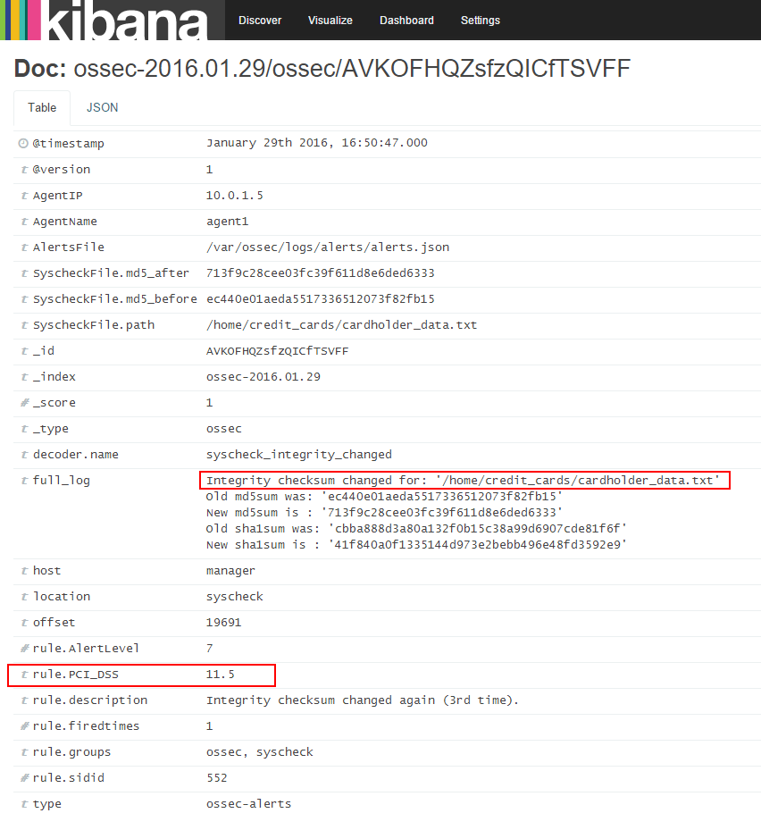
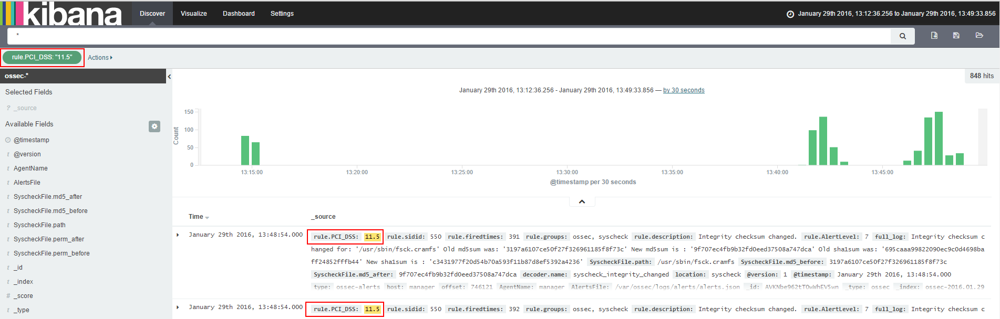

.. _pci_dss_file_integrity_monitoring:

File integrity monitoring
=========================

File integrity Monitoring (syscheck) is performed by comparing the cryptographic checksum of a known good file against the checksum of the file after it has been modified. The OSSEC agent scans the system at an interval you specify, and it sends the checksums of the monitored files and registry keys (for Windows systems) to the OSSEC server. The server stores the checksums and looks for modifications by comparing the newly received checksums against the historical checksum values of that file or registry key. An alert is sent if anything changes.

`Syscheck <http://ossec-docs.readthedocs.org/en/latest/manual/syscheck/index.html>`_  can be used to meet PCI DSS requirement 11.5:

*11.5 Deploy a change-detection mechanism (for example, file-integrity monitoring tools) to alert personnel to unauthorized modification (including changes, additions, and deletions) of critical system files, configuration files, or content files; and configure the software to perform critical file comparisons at least weekly.*

Use cases
---------

In this example, we have configured OSSEC to detect changes in the file */home/credit_cards*.

::

    <syscheck>
        <directories check_all="yes">/home/credit_cards</directories>
    </syscheck>

So, when we modify the file, OSSEC generates an alert.

As you can see, syscheck alerts are tagged with the requirement 11.5.

