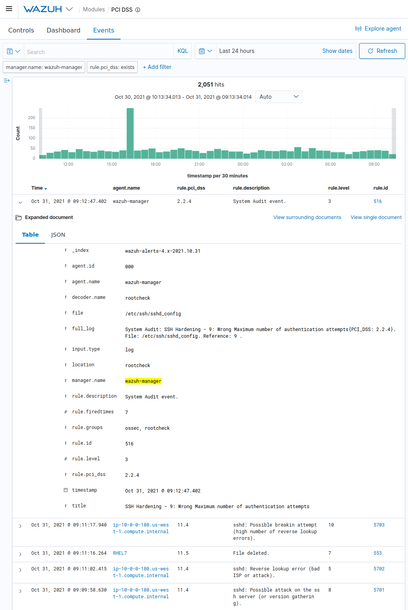
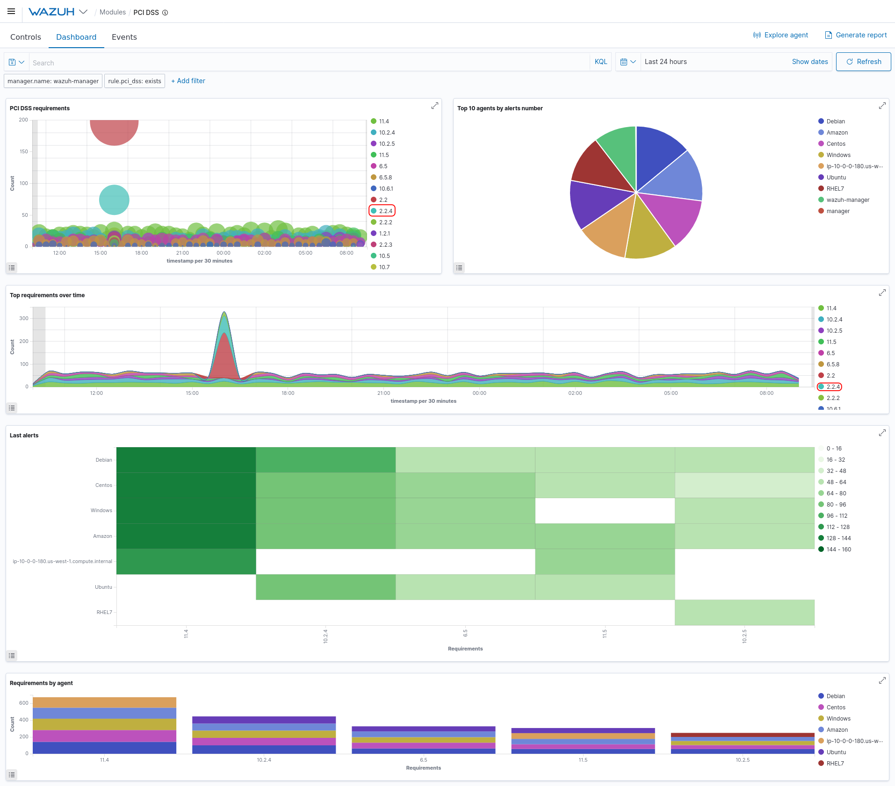

.. _pci_dss_policy_monitoring:

Policy monitoring
=================

The OSSEC rootcheck module can be used to enforce and monitor your security policy. This is the process of verifying that all systems conform to a set of pre-defined rules surrounding configuration settings and approved application usage.

There are several PCI DSS requirements to verify that systems are properly hardened. An example would be:

*2.2 Develop configuration standards for all system components. Assure that these standards address all known security vulnerabilities and are consistent with industry-accepted system hardening standards. Sources of industry-accepted system hardening standards may include, but are not limited to: Center for Internet Security (CIS), International Organization for Standardization (ISO), SysAdmin Audit Network Security (SANS), Institute National Institute of Standards Technology (NIST).*

Wazuh includes out-of-the-box CIS baselines for Debian and Redhat and other baselines could be created for other systems or applications, just by adding the corresponding rootcheck file:

::

    <rootcheck>
        <system_audit>/var/ossec/etc/shared/cis_debian_linux_rcl.txt</system_audit>
        <system_audit>/var/ossec/etc/shared/cis_rhel_linux_rcl.txt</system_audit>
        <system_audit>/var/ossec/etc/shared/cis_rhel5_linux_rcl.txt</system_audit>
    </rootcheck>

Other PCI DSS requirements will ask us to check that applications (especially network services) are configured in a secure way. One example is the following control:

*2.2.4 Configure system security parameters to prevent misuse.*

The following are good examples of rootcheck rules developed to check the configuration of SSH services:

::

    [SSH Configuration - Protocol version 1 enabled {PCI_DSS: 2.2.4}] [any]
    f:/etc/ssh/sshd_config -> !r:^# && r:Protocol\.+1;

    [SSH Configuration - Root login allowed {PCI_DSS: 2.2.4}] [any]
    f:/etc/ssh/sshd_config -> !r:^# && r:PermitRootLogin\.+yes;

In our :ref:`OSSEC Wazuh fork <installation>`, the rootcheck rules use this syntax in the rootcheck name: **{PCI_DSS: X.Y.Z}**. Meaning that all rootchecks already have the PCI DSS requirement tag.

Use cases
---------

In order to check the security parameters of SSH (and meet the requirement 2.2.4), we have developed the rootchecks *system_audit_ssh*. In our example, when OSSEC runs the rootcheck scan, it is able to detect some errors in the SSH configuration.

Kibana shows the full information about the alert.

.. image:: ../images/pci/policy_monitoring_3.png
    :align: center
    :width: 100%
