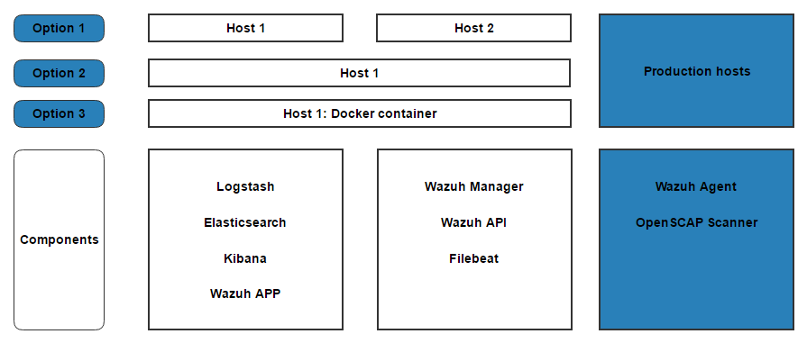

.. _installation_agents:

Installing agents
======================================================

This installation guide describes how to deploy Wazuh agents in production hosts.

Manual deployment
--------------------------
.. toctree::
    :maxdepth: 1

    wazuh_agent_debian
    wazuh_agent_centos

Automatic deployment
--------------------------
.. toctree::
    :maxdepth: 1

    wazuh_puppet
