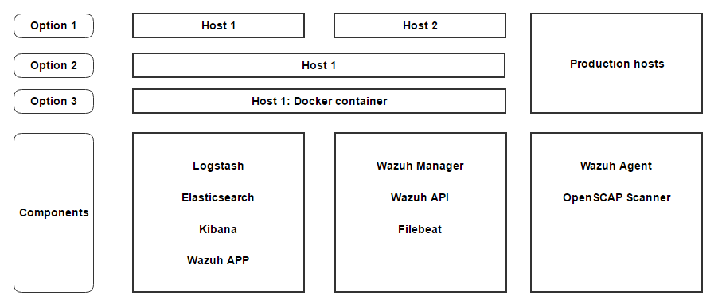

.. _installation:

Installing Wazuh
==================

This installation guide describes the installation and configuration of Wazuh. There are 3 types of installations depending on where you want to install each component:

Option 1: Recommended installation
--------------------------------------

Text

.. toctree::
	:maxdepth: 2

	recommended-installation/index

Option 2: Single host installation
--------------------------------------

Text

.. toctree::
	:maxdepth: 2

	installation_single

Option 3: Docker container
--------------------------------------

Text

.. toctree::
	:maxdepth: 2

	wazuh_docker
