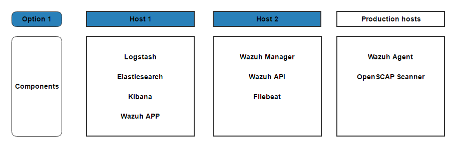
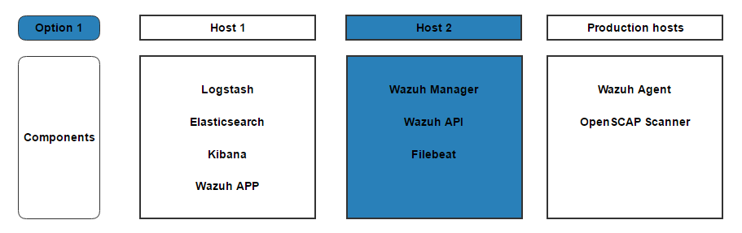
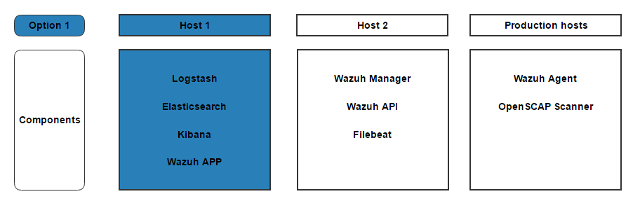

.. _installation_main:

Introduction
---------------

This installation guide describes the installation and configuration of Wazuh in two servers:

- Elastic Stack server: Runs the Elasticsearch engine, Logstash server and Kibana (including the Wazuh App).
- Wazuh server: Runs the Wazuh Manager, API and Filebeat.

.. warning::
	Some of the following command require to be run with **root privileges**. You may become *root* by executing one of the following command at the begining of the session::

		$ su
		$ sudo -s

.. note::
	Some of the instructions below depend on your machine's init system. If you aren't sure about which init system you have, check it with the following command::

		$ ps -p 1

.. note::
	Before installing the components please configure your NTP to sync time.

.. _installing_wazuh_server:

Installing Wazuh server
-----------------------

These services will typically be installed on a machine other than the Elastic server.

.. toctree::
	:maxdepth: 1

	wazuh_server_debian
	wazuh_server_centos

.. _installation_elastic:

Installing Elastic Stack server
-------------------------------

These are the steps to install Elastic Stack server, and configure it to work with Wazuh. The other server, Wazuh manager, which will usually run in a different machine.

.. toctree::
	:maxdepth: 1

	elastic_server_debian
	elastic_server_centos

Configuring Elastic Stack server
------------------------------------

Finally, we configure the Elastic server and Wazuh App.

.. toctree::
	:maxdepth: 1

	elastic_ssl
	connect_wazuh_app
