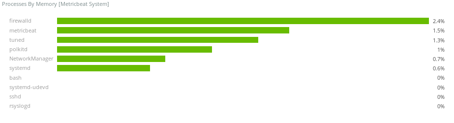
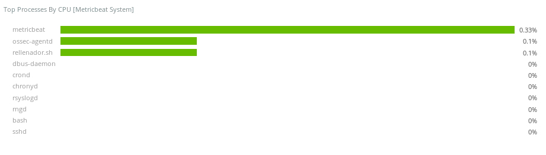
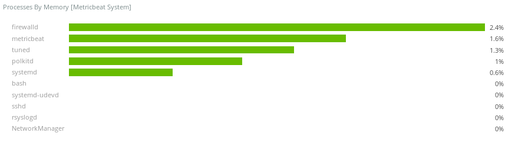
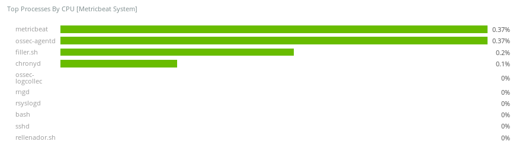
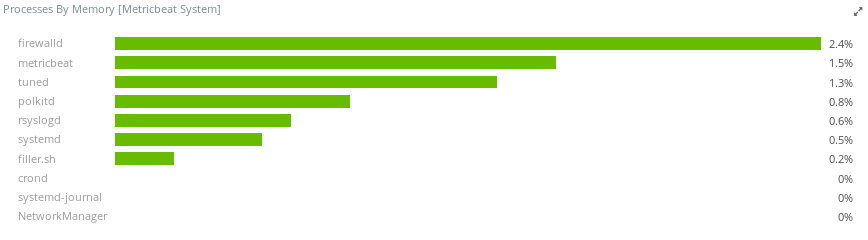
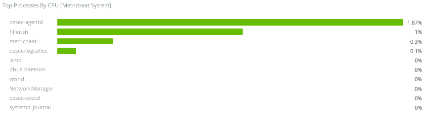
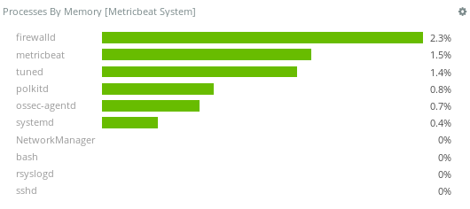
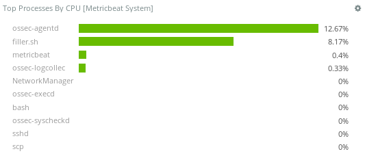

.. _hardware_specs:

Recommended Specs
=================
This section describes hardware recommendations as well as the recommended operating systems where Wazuh can be deployed.

Manager recommendations
-----------------------

To maintain a stable performance, the following features are recommended.

+------------------------------------------------------------------+------------------------------------------------------------------------+
| Type                                                             | Value                                                                  |
+==================================================================+========================================================================+
| CPU (1)                                                          | Dual-Core 2.5 GHz                                                      |
+------------------------------------------------------------------+------------------------------------------------------------------------+
| RAM                                                              | 8 GB DDR3 1066 MHz                                                     |
+------------------------------------------------------------------+------------------------------------------------------------------------+
| Hard disk (2)                                                    | 256 GB Solid State Drive                                               |
+------------------------------------------------------------------+------------------------------------------------------------------------+
| Recommended Distributions (3)                                    | * RPM Based:  Centos7, RHEL7                                           |
|                                                                  | * DEB Based:  Debian 9, ubuntu 16.04                                   |
+------------------------------------------------------------------+------------------------------------------------------------------------+

.. note::
	1) Preferably increase processor frequency rather than the number of processors.
	2) Disk size depends on the number of events generated per second, in the case of registering "archives" is necessary a bigger capacity.
	3) Older operating systems are supported, but the use of the newer stable operating systems within each distribution is recommended.

Agent recommendations
---------------------

Most significant values of consumption are shown in the following table:

+-------------------------------+---------------+---------------------+----------------+-----------------------+
| Type                          | Low (5 EPS)   | Medium (20 EPS)     | High (60 EPS)  | Very high (> 500 EPS) |
+===============================+===============+=====================+================+=======================+
| CPU usage                     | 0.1 %         | 0.37 %              | 1.97 %         |      13.00 %          |
+-------------------------------+---------------+---------------------+----------------+-----------------------+
| RAM usage                     | < 0.1 %       | < 0.1 %             | < 0.1 %        |    0.7 %              |
+-------------------------------+---------------+---------------------+----------------+-----------------------+
| Outbound traffic              | 1.4 KB/s      | 4.9 KB/s            | 25.1 KB/s      |    174.6 KB/s         |
+-------------------------------+---------------+---------------------+----------------+-----------------------+
| Inbound traffic               | < 0.1 KB/s    | < 0.1 KB/s          | < 0.1 KB/s     |    < 0.1 KB/s         |
+-------------------------------+---------------+---------------------+----------------+-----------------------+
| I/O                           | < 1 KB/s      | < 1 KB/s            | < 1  KB/s      |    < 1 KB/s           |
+-------------------------------+---------------+---------------------+----------------+-----------------------+

It can be observed that Wazuh's agents do not consume significant resources, even in the most extreme cases, such as the last experiment, CPU consumption is less than 15%, memory consumption less than 1% and bandwidth consumption is minimal regard to the bandwidth of current networks.

The data included in the table above have been obtained through the following 4 experiments. The machine configuration for testing will have a 3.0 GHz processor and 1 GB RAM memory.

- `Low load`_
- `Medium load`_
- `High load`_
- `Very high load`_

Low load
--------

For this test, the agent receives 5 events per second.

In this test the cpu consumption is 0.1 % and the memory usage is lower than 0.1 % of the total memory.

Regarding network traffic, the total bandwidth consumption of the agent is 1.4 KB/s of outgoing traffic. The inbound traffic is lower than 0.1 %.

The memory consumption of Wazuh processes is trivial for this load.

The above list shows how the only Wazuh process that has an appreciable CPU consumption is ossec-agentd.

Medium load
-----------

This second test use the same machine as in the previous example, but receiving 20 events per second.

The use of CPU has increased by 0.2% since the previous example and memory usage has been maintained. 

As far as network traffic is concerned, the output traffic has doubled but the input traffic has remained practically the same.

As in the previous tests, the memory usage of Wazuh processes is insignificant.

Here you can see how the ossec-agentd cpu usage percentage has tripled but remains below 1%.

High load
---------

For this test, the agent will receive 60 EPS, which is well above the maximum values a Wazuh agent receives under normal circumstances.

As in all other experiments, the use of ram remains constant, indicating that the Wazuh agent is not having a significant memory consumption. The CPU usage in this case it has multiplied by three times with respect to the previous example, which makes sense since the EPS has also multiplied by three times.

Outgoing traffic has increased by less than 25 KB/s since the previous case.

In this case the consumption of CPU exceeds are much higher than those that a "normal" operation of a Wazuh agent would have, since in no case are going to reach the 60 EPS in an agent. Memory consumption remains within the limits at which it has remained in all experiments.

Memory consumption relative to Wazuh processes still does not appear in the top 10 most memory consuming processes.

The top 10 of processes by CPU consumption shows in this case two Wazuh processes, ossec-agentd, with a consumption of 1.87 %, and appears for the first time in ossec-logcollector with 0.1 %, even so neither between the two processes reach the 2 % consumption of a processor.

Very high load
----------------

At this point a test will be done to saturate the agent's event buffer, to check the maximum consumption that an agent can reach. In Wazuh's agent there is a "bucket" of events that can host 500 events. If it is possible to receive more than 500 events per second, the agent will reach the highest possible consumption and the agent's log will show a saturated buffer error.

The consumption of CPU has increased to an average of 13 %. Compared to the previous test you can see how it has multiplied by 10, although the case of memory consumption remains unchanged.

The outgoing traffic has only increased by 5 times, this is because not all the events that the agent receives are processed and sent to the manager, since the event bucket is saturated and some are being lost.

In the top 10 list processes by memory consumption, the ossec-agentd process appears for the first time in this series of experiments, using 0.7% of the total RAM memory. This tells us that even when the buffer is saturated, memory consumption is still insignificant.

The top 10 processes list by CPU consumption shows how ossec-agentd has consumed 12.67% and ossec-logcollector 0.33%. This consumption is the maximum that an agent will be able to have in a system with the characteristics specified in these experiments since the event bucket prevents a Denial of Service from occurring on the machine where the agent is held.
