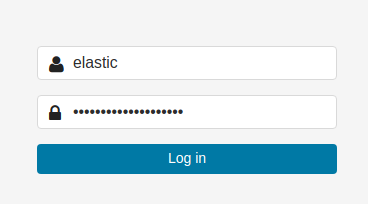
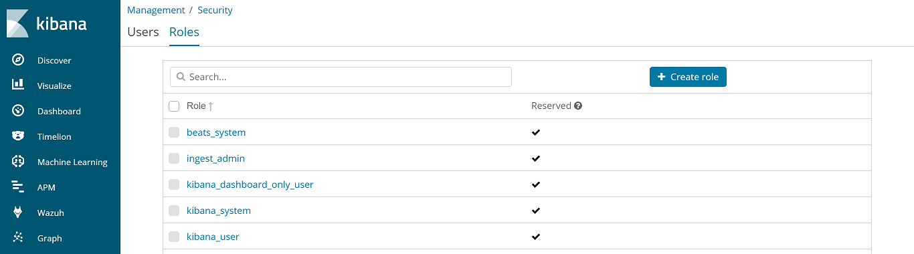
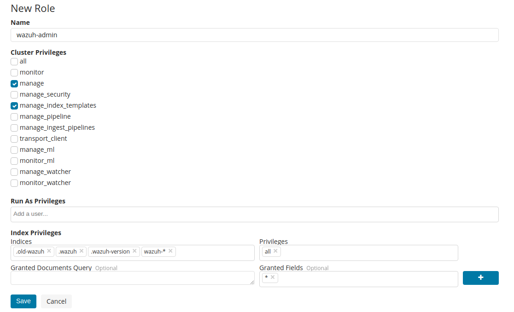
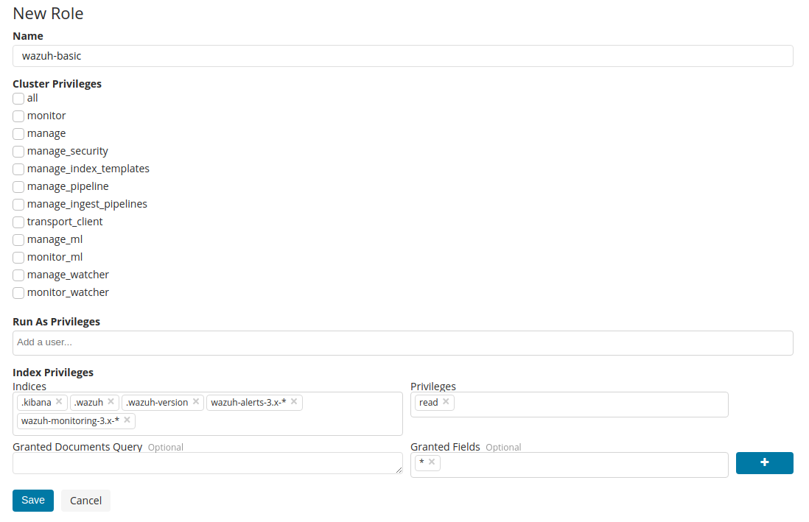
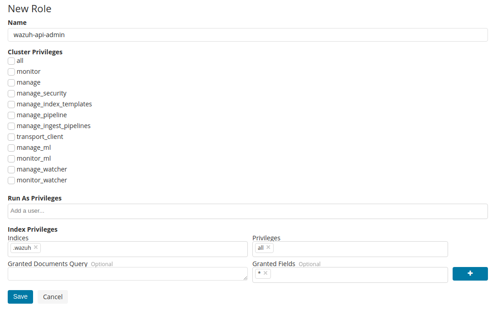
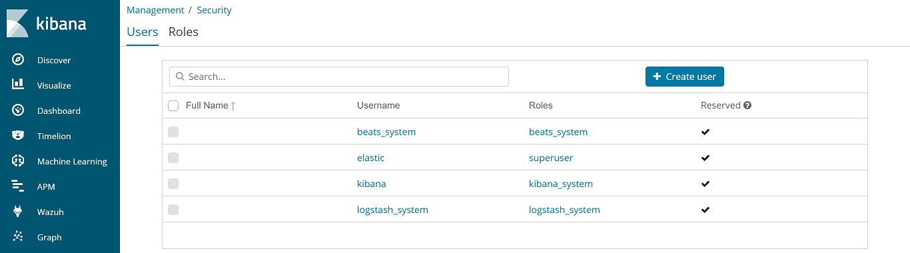
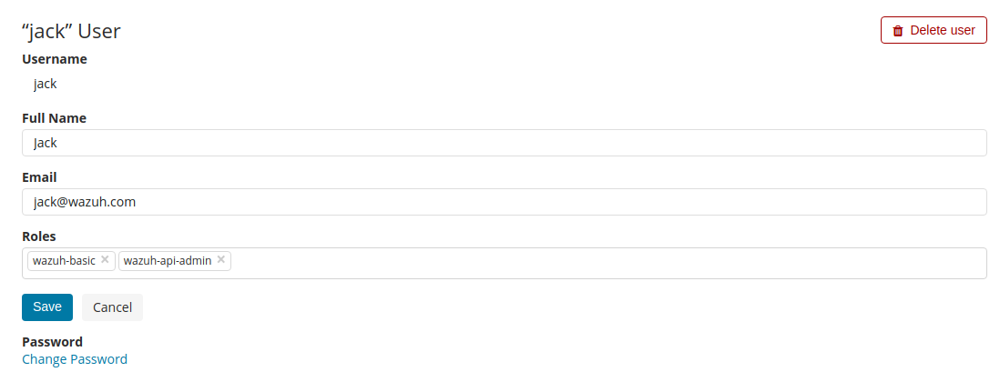
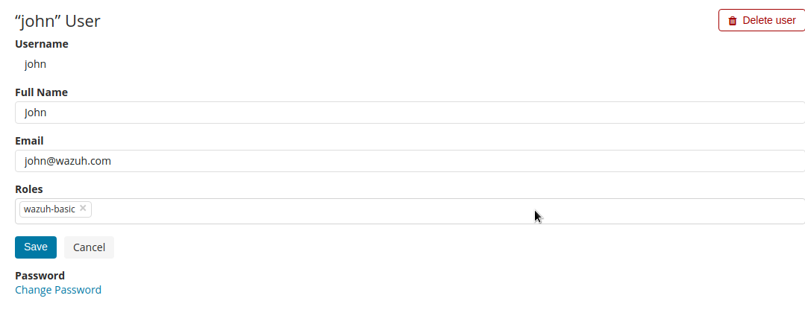
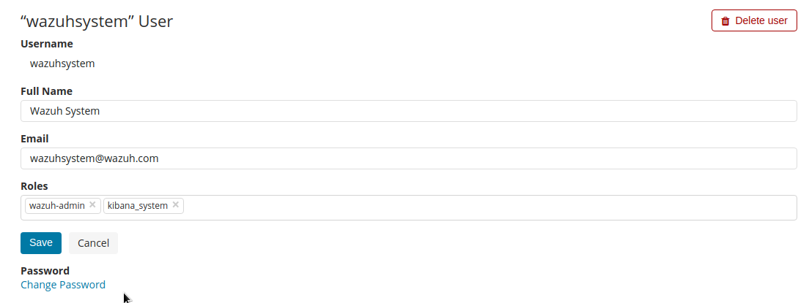

.. Copyright (C) 2018 Wazuh, Inc.

.. _configure_xpack_users:

Configure X-Pack users
======================

Using Kibana UI with the `elastic` user
---------------------------------------

1. Login into Kibana using the ``elastic`` user:

2. Go to *Management > Security > Roles*:

3. Create the ``wazuh-admin`` role:

4. Create the ``wazuh-basic`` role:

5. Create the ``wazuh-api-admin`` role:

6. Go to *Management > Security > Users*:

7. Create the Wazuh admin user:

8. Create a standard user:

  .. note::

    This user is not able to add/remove/edit a Wazuh API, use the Wazuh admin user instead (step 7).

9. Create the Kibana system user:

  .. warning::

    Ensure the password is strong enough, it will be the superuser for your environment.

10. Set the right user on `kibana.yml` file:

  .. code-block:: console

    # vi /etc/kibana/kibana.yml

    elasticsearch.username: "wazuhsystem"
    elasticsearch.password: "wazuhsystem"

11. Restart Kibana:

  .. code-block:: console

    # systemctl restart kibana

Using CLI
---------

1. Create the ``wazuh-admin`` role:

  .. code-block:: none

    # curl -XPOST "http://localhost:9200/_xpack/security/role/wazuh-admin" -H 'Content-Type: application/json' -d'
    {
      "cluster": [ "manage", "manage_index_templates" ],
      "indices": [
        {
          "names": [ ".old-wazuh", ".wazuh", ".wazuh-version", "wazuh-*" ],
          "privileges": ["all"]
        }
      ]
    }' -u elastic:elastic_password

    {"role":{"created":true}}

2. Create the ``wazuh-basic`` role:

  .. code-block:: none

    # curl -XPOST "http://localhost:9200/_xpack/security/role/wazuh-basic" -H 'Content-Type: application/json' -d'
    {
      "cluster": [],
      "indices": [
        {
          "names": [ ".kibana", ".wazuh", ".wazuh-version", "wazuh-alerts-3.x-*", "wazuh-monitoring-3.x-*" ],
          "privileges": ["read"]
        }
      ]
    }' -u elastic:elastic_password

    {"role":{"created":true}}

3. Create the ``wazuh-api-admin`` role:

  .. code-block:: none

    # curl -XPOST "http://localhost:9200/_xpack/security/role/wazuh-api-admin" -H 'Content-Type: application/json' -d'
    {
      "cluster": [],
      "indices": [
        {
          "names": [ ".wazuh" ],
          "privileges": ["all"]
        }
      ]
    }' -u elastic:elastic_password

    {"role":{"created":true}}

4. Create the Kibana system user:

  .. warning::

    Ensure the password is strong enough, it will be the superuser for your environment.

  .. code-block:: none

    # curl -XPOST "http://localhost:9200/_xpack/security/user/wazuhsystem" -H 'Content-Type: application/json' -d'
    {
      "password": "wazuhsystem",
      "roles":["wazuh-admin","kibana_system"],
      "full_name":"Wazuh System",
      "email":"wazuhsystem@wazuh.com"
    }' -u elastic:elastic_password

    {"user":{"created":true}}

5. Create the Wazuh admin user:

  .. code-block:: none

    # curl -XPOST "http://localhost:9200/_xpack/security/user/jack" -H 'Content-Type: application/json' -d'
    {
      "password": "jackjack",
      "roles":["wazuh-basic","wazuh-api-admin"],
      "full_name":"Jack",
      "email":"jack@wazuh.com"
    }' -u elastic:elastic_password

    {"user":{"created":true}}

6. Create a standard user:

  .. note::

    This user is not able to add/remove/edit a Wazuh API, use the Wazuh admin user instead (step 5).

  .. code-block:: none

    # curl -XPOST "http://localhost:9200/_xpack/security/user/john" -H 'Content-Type: application/json' -d'
    {
      "password": "johnjohn",
      "roles":["wazuh-basic"],
      "full_name":"John",
      "email":"john@wazuh.com"
    }' -u elastic:elastic_password

    {"user":{"created":true}}

7. Set the right user on `kibana.yml` file:

  .. code-block:: none

    # vi /etc/kibana/kibana.yml

    elasticsearch.username: "wazuhsystem"
    elasticsearch.password: "wazuhsystem"

8. Restart Kibana:

  .. code-block:: console

    # systemctl restart kibana
