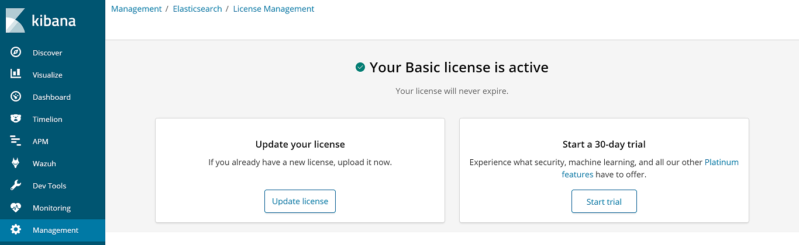
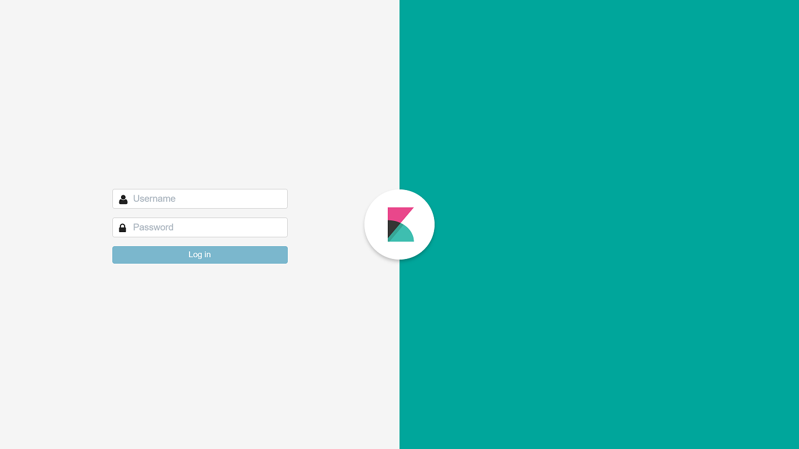

.. Copyright (C) 2018 Wazuh, Inc.

.. _kibana_xpack:

Wazuh app and X-Pack
====================

X-Pack provides RBAC (role based access control) capabilities, among other features, for the Elastic Stack. This guide provides steps to configure specific users to use the Wazuh app with X-Pack, using the `Security plugin <https://www.elastic.co/products/stack/security>`_.

In this `link <https://www.elastic.co/products/x-pack>`_ you can learn more about the X-Pack features for the Elastic Stack, and all the advanced capabilities that add to your Elastic installation.

.. note::

    As of the 6.3.0 version of the Elastic Stack, X-Pack comes pre-installed on the Elastic products. You can read more about this on their `announcement <https://www.elastic.co/blog/elastic-stack-6-3-0-released>`_.

.. warning::

    If you're using the OSS (Apache license) distribution of the Elastic Stack packages, X-Pack is not available.

Follow these steps to enable X-Pack:

1. Open *Management > License Management* on the Kibana interface. On this section, you can choose between a free 30-day trial to try the advanced X-Pack features, or upload a license if you already purchased one.

2. Enable the Security plugin on Elasticsearch. On the same machine where Elasticsearch is installed, open the ``/etc/elasticsearch/elasticsearch.yml`` file and set this option to ``true``:

  .. code-block:: yaml

    # Set this option in /etc/elasticsearch/elasticsearch.yml
    xpack.security.enabled: true

3. Restart Elasticsearch:

  .. code-block:: console

    # systemctl restart elasticsearch

  It's important to wait until Elasticsearch finishes loading. Check the current status with the following command:

  .. code-block:: console

    # curl "http://localhost:9200/?pretty"

    {
      "name" : "116m4ct",
      "cluster_name" : "elasticsearch",
      "cluster_uuid" : "2TbJlE6MRBKB6uHybVSQJA",
      "version" : {
        "number" : "6.6.2",
        "build_flavor" : "default",
        "build_type" : "deb",
        "build_hash" : "424e937",
        "build_date" : "2018-06-11T23:38:03.357887Z",
        "build_snapshot" : false,
        "lucene_version" : "7.3.1",
        "minimum_wire_compatibility_version" : "5.6.0",
        "minimum_index_compatibility_version" : "5.0.0"
      },
      "tagline" : "You Know, for Search"
    }

4. Create the passwords for the built-in users. The *interactive* mode prompts the user to enter new passwords for the ``elastic``, ``kibana``, ``logstash_system``, and ``beats_system`` users:

  .. code-block:: console

    # /usr/share/elasticsearch/bin/elasticsearch-setup-passwords interactive

.. note::

    Find more information about built-in users in `this Elastic documentation article <https://www.elastic.co/guide/en/elastic-stack-overview/6.3/built-in-users.html>`_.

5. The Logstash configuration file also needs some modifications in order to properly connect with Elasticsearch and send the alerts. Open the file at ``/etc/logstash/conf.d/01-wazuh.conf`` and add the ``elastic`` user credentials on the ``output`` section as follows:

  .. code-block:: console

    output {
        elasticsearch {
            hosts => ["localhost:9200"]
            index => "wazuh-alerts-3.x-%{+YYYY.MM.dd}"
            document_type => "wazuh"
            user => "elastic"
            password => "<elastic_password>"
        }
    }

6. Restart Logstash

  .. code-block:: console

    # systemctl restart logstash

7. On the host where Kibana is installed, set the `elastic` user in its configuration, editing the ``/etc/kibana/kibana.yml`` file as follow:

  .. code-block:: yaml

    # Set these options in /etc/kibana/kibana.yml
    elasticsearch.username: "elastic"
    elasticsearch.password: "<elastic_password>"

8. Restart Kibana

  .. code-block:: console

    # systemctl restart kibana

9. Login into the Kibana interface using the ``elastic`` user when prompted. Now you can continue configuring X-Pack Security on the following sections.

.. note::

    For more extended documentation about the Security plugin, you can read the `Securing the Elastic Stack <https://www.elastic.co/guide/en/elastic-stack-overview/current/xpack-security.html>`_ guide from the Elastic documentation.

.. topic:: Contents

    .. toctree::
        :maxdepth: 1

        defining-xpack-users
        configure-xpack-users
        xpack-troubleshooting
