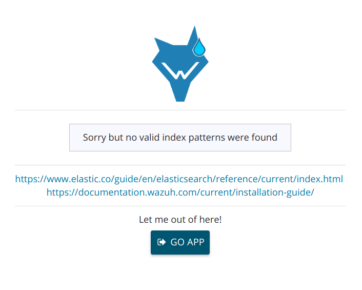

.. Copyright (C) 2018 Wazuh, Inc.

.. _xpack_troubleshooting:

X-Pack troubleshooting
======================

**"How can I use a different index pattern?"**

If you are indexing data with a different index pattern, for example ``my-alerts-*`` you need a different role with access to that new pattern:

  .. code-block:: none

      # curl -XPOST "http://localhost:9200/_xpack/security/role/my-user" -H 'Content-Type: application/json' -d'
      {
      "cluster": [],
      "indices": [
        {
          "names": [ "my-alerts-*" ],
          "privileges": ["read"]
        }
      ]
      }' -u elastic:elastic_password

      {"role":{"created":true}}

Now assign it to your desired user(s):

  .. code-block:: none

    # curl -XPUT "http://localhost:9200/_xpack/security/user/john" -H 'Content-Type: application/json' -d'
    {
      "password": "johnjohn",
      "roles":["wazuh-basic","my-user"],
      "full_name":"John",
      "email":"john@wazuh.com"
    }' -u elastic:elastic_password

    {"user":{"created":false}} // If the user did exist previously

**"I have issues when using the index pattern selector"**

The index pattern list is calculated from the server and it's filtered depending on the user role. It means the user can only select the index patterns it has access to.

If the user can't access to any pattern, the app will display the following screen:

