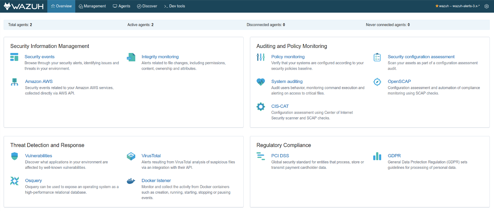
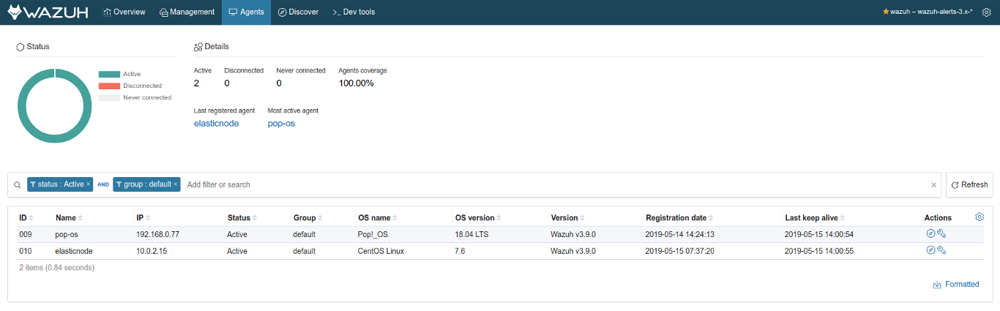
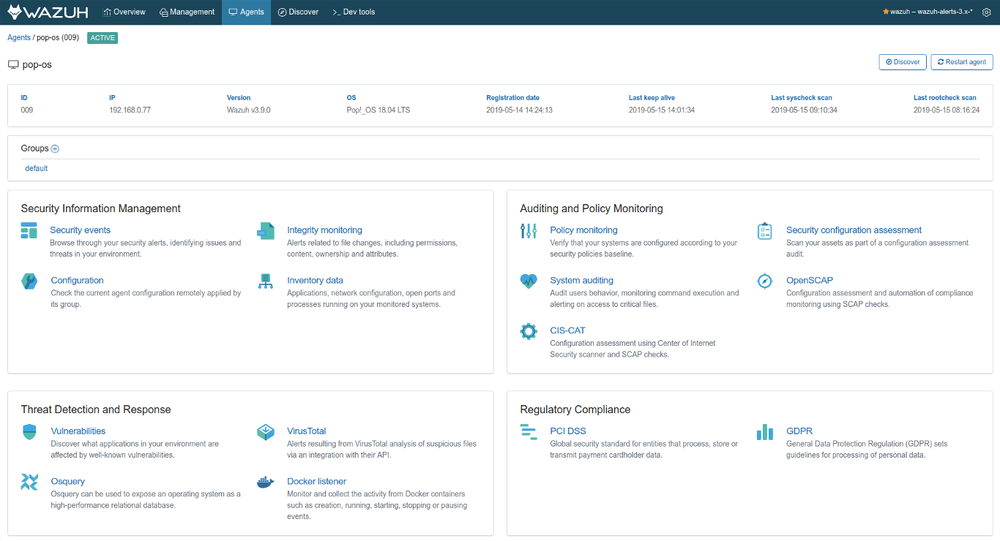
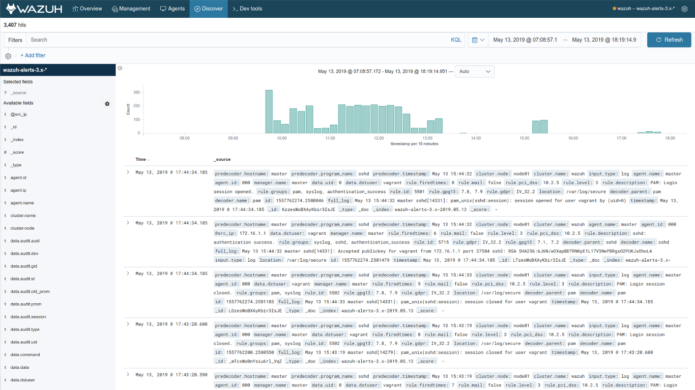

.. Copyright (C) 2018 Wazuh, Inc.

.. _kibana_app_overview:

App overview
============

The Wazuh app is available on the left side of the screen, on the Kibana sidebar. It's organized in four main sections on the top navigation bar, an indicator for the currently selected API and index pattern, and a button to open the Settings page. This section is a brief description of each of these sections, its features and what the user can do with them.

.. topic:: Overview

    This is the main Wazuh app section. It provides an overall view of your cluster in its *General* section, where you can visualize all the triggered alerts from a specified time range. On the other sections, such as *PCI DSS* or *Vulnerabilities*, you can find more specific dashboards and charts for different Wazuh capabilities. Take a look at the :ref:`user manual <user_manual>` for more information.

.. topic:: Management

    The management tab holds information related to your Wazuh cluster. You can check the configuration, ruleset, groups, status, logs, etc. In this tab you can also monitor your :ref:`cluster <wazuh-cluster>` and check all your generated :ref:`reports <kibana_reporting>`.

.. topic:: Agents list

    List all your agents in a single page. Get relevant information about them, such as current version, OS, IP, group, and more. You can refine your search using the bar and the filters above the list, or :ref:`download the list <kibana_download_csv>` using the ``Formatted`` button.

.. topic:: Single agent tab

    When clicking on an agent from the list, you can open a tab similar to *Overview*, but tailored to the agent. In addition to this, you can quickily switch to a different agent using the autocomplete search bar on the top right corner. You can check the agent connection status, its alerts, group configuration, hardware information, etc.

.. topic:: Discover

    You can interactively explore your Wazuh alerts from the *Discover* page. You have access to every alert from your currently selected index pattern. You can submit search queries, filter the search results, and view alerts data. You can also see the number of alerts that match the search query and get field value statistics.

.. topic:: Dev tools

    The *Dev tools* tab provides an user interface to interact with the Wazuh API. You can use it to send requests and get a response. Click :ref:`here <kibana_dev_tools>` for more details about this section.

.. topic:: Settings

    The *Settings* page allows you to configure and customize your Wazuh app experience. This section is fully described on its own :ref:`section <kibana_settings>` in the documentation.
