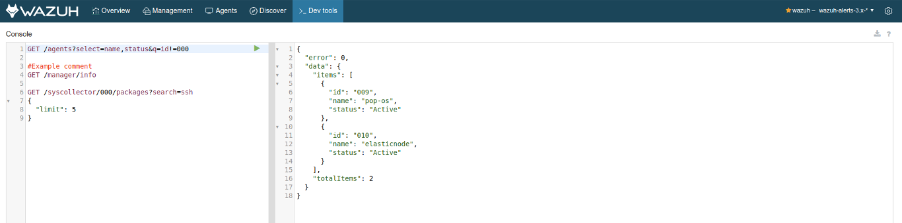

.. Copyright (C) 2018 Wazuh, Inc.

.. _kibana_dev_tools:

Dev tools
=========

The *Dev tools* tab provides an user interface to interact with the Wazuh API. You can use it to send requests and get a response. This tab uses your currently selected API from :ref:`kibana_settings`. The interface is split into two panes: **Editor pane** and **Response pane**.

On the editor pane, you can type API requests in several ways:

- Using **in-line parameters**, just like in a browser.
- Using **JSON-formatted parameters**.
- **Combining both** in-line and JSON-formatted parameters. Keep in mind that if you place the same parameters with different values, the in-line parameter has precedence over the JSON-formatted one.

To execute a request, place the cursor on the desired request line and click on the ``Play`` button. Comments are also compatible on the editor pane using the ``#`` character at the beginning of the line.

.. note::

  Using the web browser's local storage, you can close the tab, and the same content will be available the next time you open *Dev tools*.

.. warning::

  Currently, the tab only allows fetching data with ``GET`` requests.
