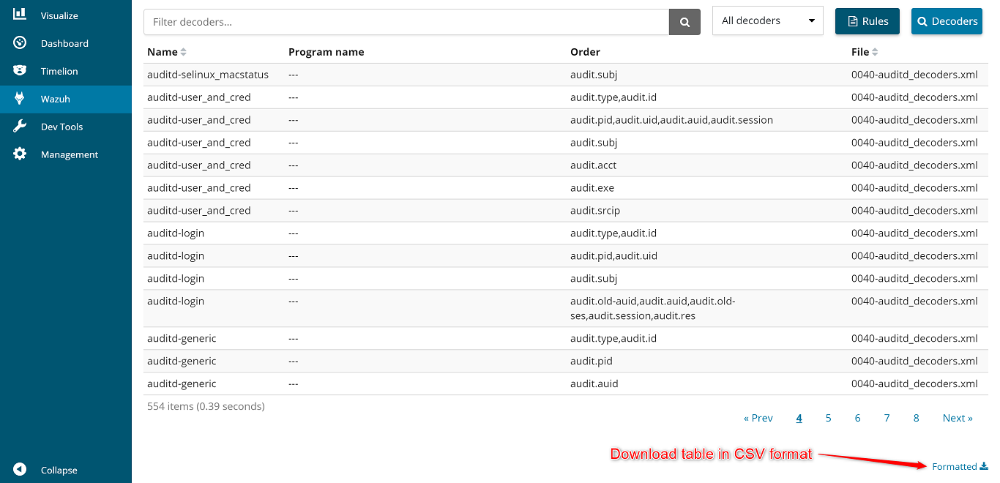

.. Copyright (C) 2018 Wazuh, Inc.

.. _kibana_download_csv:

Download as CSV
===============

You can download the content of some tables in CSV format. To do this, locate the ``Formatted`` button on the bottom right corner of each table. Once you click on it, the file will be downloaded to your computer.

This feature is currently available on tables from the following app pages:

- **Agents list**
- **Management > Ruleset**
- **Management > Groups**
- **Management > Logs**

