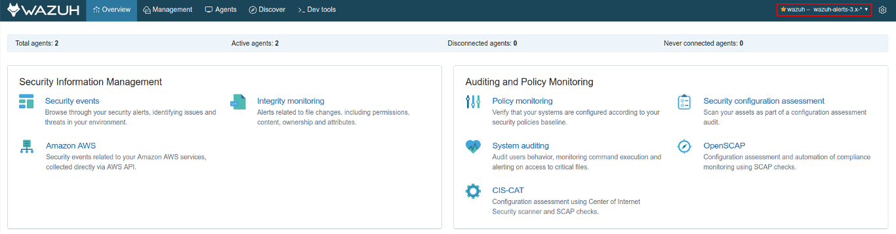
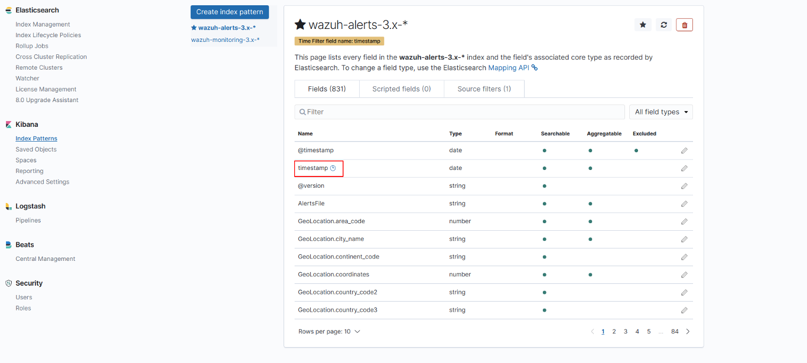

.. Copyright (C) 2018 Wazuh, Inc.

.. _kibana_index_pattern:

Index pattern selector
======================

The Kibana app lets you select a custom index pattern for the *Overview*, *Agents* and *Discover* tabs, used to run search and analytics against. You can create custom index patterns on Kibana, and select them on the app if they're compatible.

You can select a different index pattern in two ways:

- On the **Settings > Pattern** page.
- On the **top menu bar**. This selector is only enabled if you have more than one compatible index pattern.

You can open the *Management > Index Patterns* page on the Kibana interface to manage them, and create even more. Make sure to use ``@timestamp`` as the *Time Filter field name* to properly order the alerts by creation date.

.. note::

  If you change the index pattern using the top menu bar selector, the app will be reloaded to apply the change.
