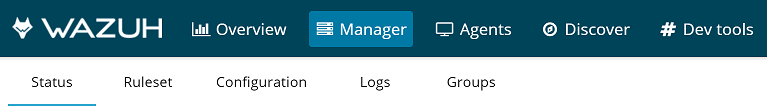

.. Copyright (C) 2018 Wazuh, Inc.

.. _manager_index:

Manager
=======

The Manager tab gives you an overview of your current Wazuh server, where you can check the current status of the daemons, ruleset, configuration, list the latest logs messages and the groups.

The following articles describe each section of this tab, showing the main capabilities and available options to administer the Wazuh manager.

.. topic:: Contents

    .. toctree::
        :maxdepth: 1

        status
        ruleset
        configuration
        logs
        groups
