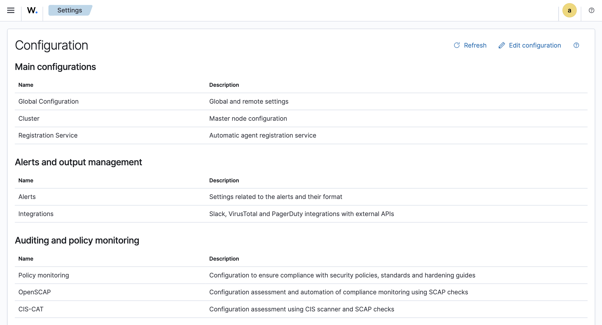
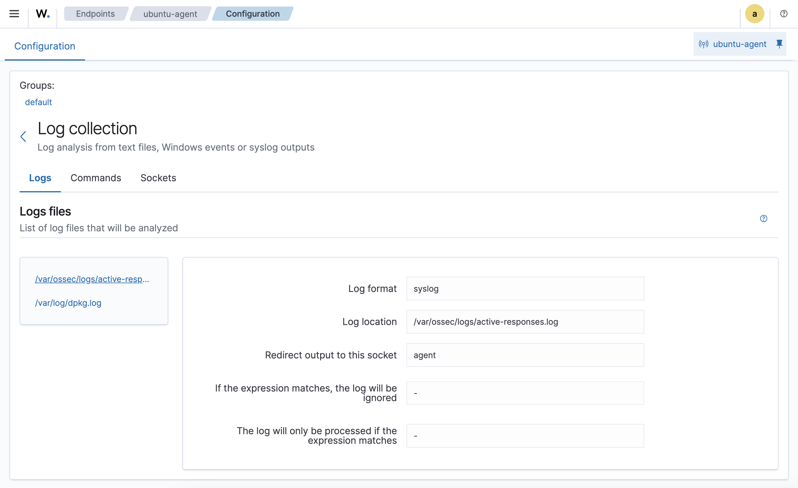

.. Copyright (C) 2018 Wazuh, Inc.

.. _kibana_query_configuration:

Query configuration
===================

The actual configuration of an agent, or the manager can be queried on demand by clicking on the *Agents* tab or the *Management* tab. From here you will be able to fetch the active configuration in real time.

.. image:: ../../../images/kibana-app/features/query-configuration/tab-agent.png
  :align: center
  :width: 100%

From here you can query the configuration section:

The image bellow shows that the agent configuration is synchronized:

.. image:: ../../../images/kibana-app/features/query-configuration/is-sync.png
  :align: center

A list of the avaiable configurations to query on *Manager* is shown bellow:

- Global
- Logcollector
- Syslog
- Syscheck
- Analysisd
- OpenScap
- CISCAT
- Cluster
- Auth
- Mail
- Monitor
- Remoted
- Wodles
  - OpenScap
  - CISCAT
  - Syscollector
  - Vulnerability Detector
  - Osquery
  - Azure
  - AWS

A list of the avaiable configurations to query on *Agent* is shown bellow:

- Global
- Labels
- Logcollector
- Syscheck
- Auth
- Mail
- Monitor
- Wodles
  - OpenScap
  - CISCAT
  - Syscollector
  - Osquery
  - AWS

By clicking on the *Log collection* configuration, the active configuration is shown:

It also has the capability to show the configuration in JSON or XML formats for better readability:

.. image:: ../../../images/kibana-app/features/query-configuration/logcollector-json.png
  :align: center
  :width: 100%

.. image:: ../../../images/kibana-app/features/query-configuration/logcollector-xml.png
  :align: center
  :width: 100%

Now for example, if you want to know the current cluster configuration from the **Manager**, click on the *Management > Configuration* tab and then click on the *Cluster* section:

.. image:: ../../../images/kibana-app/features/query-configuration/cluster.png
  :align: center
  :width: 100%

As you can see the cluster configuration has been fetched, and it also shows the cluster status in this case is *Enabled*.
