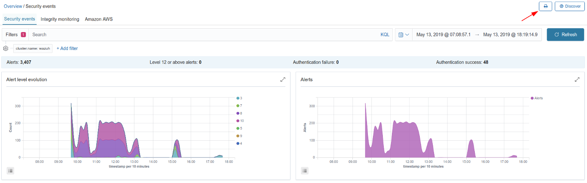
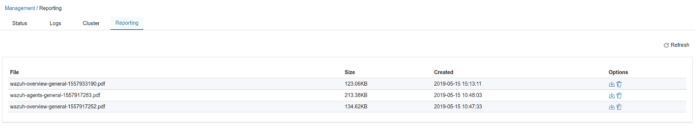

.. Copyright (C) 2019 Wazuh, Inc.

.. _kibana_reporting:

Reporting
=========

When you're navigating through the *Overview* or *Agents* tabs, you can generate a report of the current section when clicking on the printer icon button, on the top right corner in the interface. These reports are stored on the same machine where Kibana is installed, in the ``/usr/share/kibana/optimize/wazuh-reporting`` folder. A status message will indicate if the report was generated successfully, or if the process was aborted.

The generated reports are available on *Management > Reporting*. From there, you can list them, refresh the list to scan for new generated reports, download or delete them. The reports are generated and downloaded in PDF format to your computer.

The reports **can't be generated** on a tab when some of the conditions below are occurring:

- You're on the *Discover* sub-tab (clicking on the ``View Discover`` button).
- Your current time range doesn't have alerts (or you don't have alerts at all).

.. warning::

    If you change the tab while the report is being generated, it will be automatically aborted, and a warning message will appear on the top.
