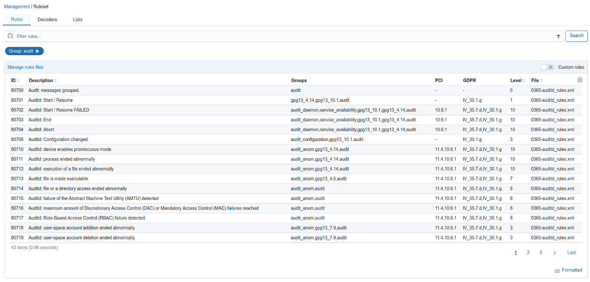
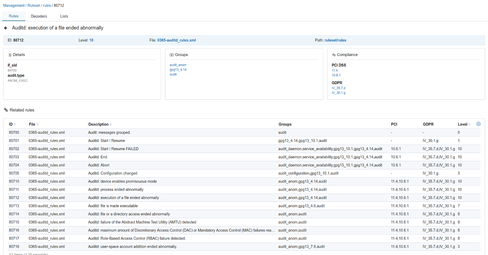

.. Copyright (C) 2018 Wazuh, Inc.

.. _kibana_ruleset:

Ruleset
=======

The ruleset is a key part of Wazuh. It's used by the manager to detect attacks, intrusions, software misuse, configuration problems, application errors, malware, rootkits, system anomalies or security policy violations. You can read more about it on this :ref:`link <ruleset>`.

The Wazuh app provides a section for the ruleset on the *Management* tab. It's divided in two parts: **Rules** and **Decoders**. You can easily switch between them with the buttons on the right side. The table allows you to navigate through the rules or decoders, and you can use the search bar to filter.

A special search syntax can be used on the bar for filtering rules and decoders, similar to the *Lucene* syntax used in Kibana. For example, if you type ``group: syslog``, it will create a filter pill under the search bar. You can remove the filter clicking on the `X` icon.

When the user clicks on a rule or decoder, it will open a detail view, where you can find the complete information. In the different sections you can find :ref:`PCI DSS <pci_dss>` or :ref:`GDPR <gdpr>` requirements, :ref:`groups <reference_agent_conf>`, regular expressions, and other details. The user can click on some elements to activate a filter on the previous list.

At the bottom of the page, there's a table of related rules or decoders that are defined on the same file.

