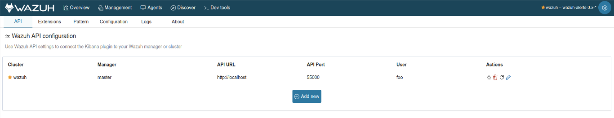
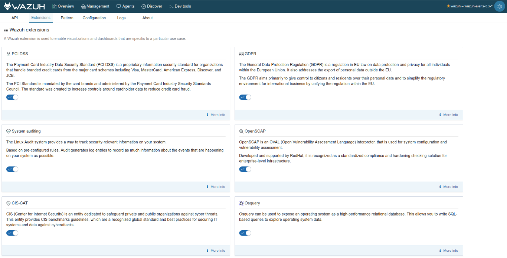
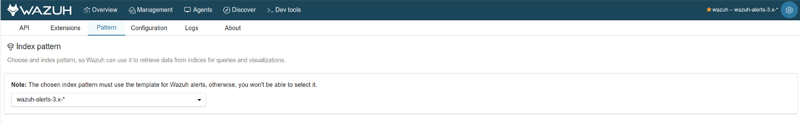
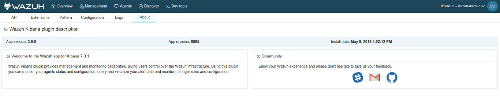

.. Copyright (C) 2018 Wazuh, Inc.

.. _kibana_settings:

Settings
========

The *Settings* page allows you to configure and customize your Wazuh app experience. This section is automatically opened the first time you open the app in order to configure your first Wazuh API credentials, so the app can work properly. There are multiple options to configure on *Settings*, such as:

- **API credentials**
- **Extensions**
- **Index pattern**

Each option is described on the following sections below.

API
---

In this section, you can list all your inserted API credentials. The yellow star icon indicates the currently used API to show information on the app. Each entry has multiple available actions to manage it. Keep in mind that a working API is needed in order to add or edit an entry. Check your API connection status prior to adding them to the app.

.. topic:: Mark as selected

  Select the API you want to use to filter the alerts on *Overview* and *Agents*, and show cluster information on *Management*.

.. note::

  The *Mark as selected* option only applies to your browser, and it's stored in a cookie. Multiple users can select different APIs on their own Internet browsers.

.. topic:: Check connection

  Check if the app can communicate with the API. An error message will appear indicating the reason if there is a connection problem.

.. topic:: Delete API

  Delete an API entry if it's not used anymore.

.. warning::

  You can't delete the currently selected API. If you want to remove it, select a different API before.

.. topic:: Edit API

  If you've changed your API credentials, you can modify the entry so you can continue using the API.

Extensions
----------

Wazuh provides multiple integrations and capabilities to monitor and analyze your hosts. If you're using some of them, you can enable multiple extensions on the app to visualize tailored dashboards, which provide rich and useful information. Some of these extensions are disabled by default because you have to previously enable them on your manager configuration in order to generate alerts.

The app provides the following extensions:

- :ref:`PCI DSS <pci_dss>`
- :ref:`GDPR <gdpr>`
- :ref:`Audit <system_call_monitoring>`
- :ref:`Open SCAP <openscap_module>`
- :ref:`CIS-CAT <ciscat_module>`
- :ref:`AWS <amazon>`
- :ref:`VirusTotal <virustotal-scan>`

.. note::

    The selected extensions are stored in a browser cookie. Multiple users can select different extensions on their own Internet browsers.

    The default extensions configuration can be customized for newly inserted APIs. You can read more about it on the :ref:`kibana_config_file` section.

Index pattern
-------------

The index pattern functionality is completely described at the :ref:`kibana_index_pattern` section.

About
-----

This section provides information about your currently installed Wazuh app package, such as version, revision, and installation date. If you want to discover what's new on each app release, you can go to our `Changelog file <https://github.com/wazuh/wazuh-kibana-app/blob/master/CHANGELOG.md>`_ to check it out.

