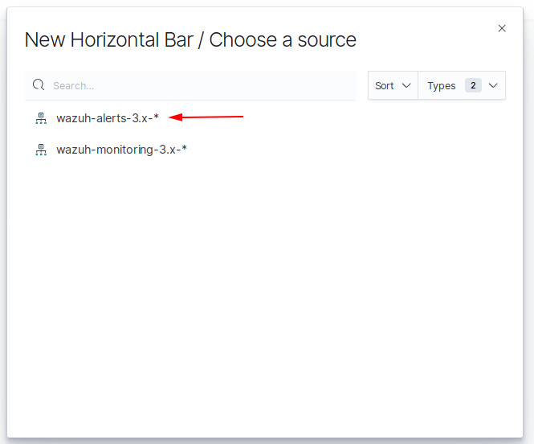
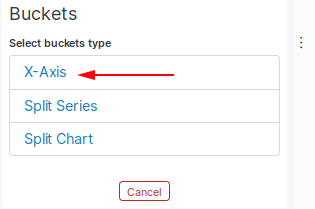
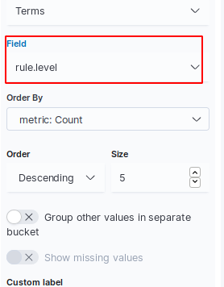
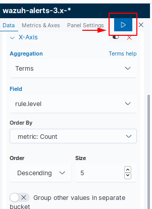
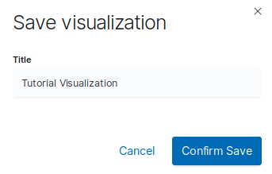
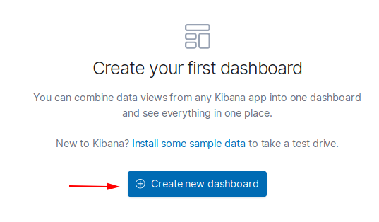
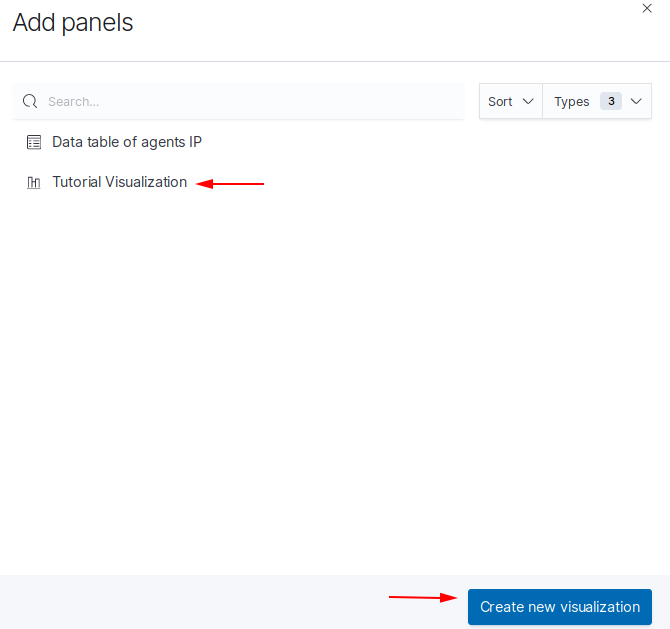
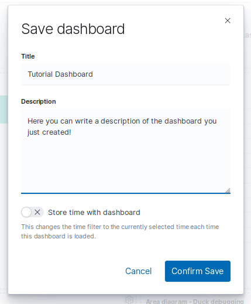

.. Copyright (C) 2019 Wazuh, Inc.

.. _kibana_custom_dashboard:

Create a custom dashboard
=========================

Visualizations are created by the series of aggregations to extract and process the data from indices stored in Elasticsearch. Those visualizations can be added to dashboards for further analysis.

Creating a custtom visualization
--------------------------------

Go to the *Visualize* tab:

.. thumbnail:: ../../../images/kibana-app/custom-dashboard/visualize-tab.png
   :align: center
   :width: 100%

Click on *Create new visualization*:

.. thumbnail:: ../../../images/kibana-app/custom-dashboard/create-new-visualization.png
   :align: center
   :width: 100%

Select a visualization type. This example uses ``Horizontal Bar`` chart:

.. thumbnail:: ../../../images/kibana-app/custom-dashboard/select-visualization-type.png
   :align: center
   :width: 100%

Select the index to be used as a data source. It can be any index previously created. This example uses the ``wazuh-alerts-3.x-*`` index:

At this point, a graph will be generated. Select a lapse of time to display the information related to that period:

.. thumbnail:: ../../../images/kibana-app/custom-dashboard/select-lapse-time.png
   :align: center
   :width: 100%

The chart can be configured by organizing the data using ``Metrics`` and ``Buckets``:

.. thumbnail:: ../../../images/kibana-app/custom-dashboard/metrics-and-buckets.png
   :align: center
   :width: 100%

``Metrics`` section has options in order to quantify the data: Count, Average, Sum, Max, Min, etc.

``Buckets`` are aggregations of data that are sorted according to the search criteria.

More information can be found on the `Aggregations <https://www.elastic.co/guide/en/elasticsearch/reference/current/search-aggregations.html>`_ section of the Elasticsearch documentation.

In this example, ``Metrics`` (Y-Axis) will remain as default ``Count`` aggregation, and ``Buckets`` (X-Axis) will be modified to sort the data according to the level of the rules that have been triggered.

Select `Buckets > Add > X-axis`:

Select `Aggregation > Terms`:

.. image:: ../../../images/kibana-app/custom-dashboard/bucket-select-an-aggregation-terms.png
   :align: center

Select a value for ``Field`` to sort by, this example uses ``rule.level``:

Click on the ``Apply changes`` button to generate the visualization:

The custom visualization example looks as follows:

.. thumbnail:: ../../../images/kibana-app/custom-dashboard/horizontal-example-chart.png
   :align: center
   :width: 100%

Saving the visualization
------------------------

Once the custom visualization is ready, it has to be saved, to be able to use it later in a custom dashboard:

.. thumbnail:: ../../../images/kibana-app/custom-dashboard/save-visualization.png
   :align: center
   :width: 100%

Set the visualization name and confirm:

Creating a Custom Dashboard
---------------------------

Select the `Dashboard` section:

.. thumbnail:: ../../../images/kibana-app/custom-dashboard/dashboard-tab.png
   :align: center
   :width: 100%

Click on `Create a new dashboard`:

Click on `Add` tab located in the top menu:

.. thumbnail:: ../../../images/kibana-app/custom-dashboard/add-visualization-to-dashboard.png
   :align: center
   :width: 100%

Select previously created visualization. It will be automatically added to the dashbord:

The custom visualization is now added to the dashboard. At this point, the user can modify a lapse of time to display the information in the visualization and add more custom visualizations to the dashbord:

.. thumbnail:: ../../../images/kibana-app/custom-dashboard/panel-was-properly-added.png
   :align: center
   :width: 100%

Click on `Save` tab located in the top menu:

.. thumbnail:: ../../../images/kibana-app/custom-dashboard/save-dashboard.png
   :align: center
   :width: 100%

Set the dashboard name, add the description and save it:

