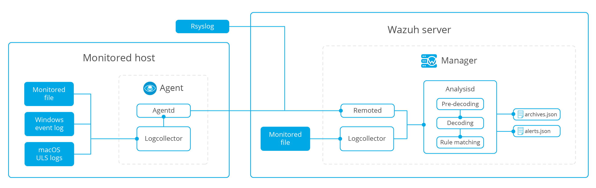

.. _manual_log_analysis:

Log analysis
================

Log Analysis is the real-time process of making sense out of the records generated by servers or devices. This component can receive logs through text files or Windows event logs.  It can also directly receive logs via remote syslog (useful for firewalls, etc...)
The purpose of this process is the identification of application or system errors, misconfigurations, intrusion attempts, policy violations or security issues.

The memory and CPU requirements of the Wazuh agent are insignificant because it mostly just forwards events to the manager.  However, on the Wazuh manager, CPU and memory consumption can increase quickly depending on the events per second (EPS) that the manager has to analyze.

Log analysis is configured in :ref:`ossec.conf <reference_ossec_conf>`, mainly in the following sections: :ref:`localfile <reference_ossec_localfile>`, :ref:`remote <reference_ossec_remote>` and :ref:`global <reference_ossec_global>`. Also, it is possible to configure it in :ref:`agent.conf <reference_agent_conf>` to centralize the distribution of these configuration settings to relevant agents.

.. topic:: Contents

    .. toctree::
        :maxdepth: 1

        log-analysis-examples
        log-analysis-FAQ

How it works
-------------------------------------

The below figure illustrates the event flow:

1. Log collection
^^^^^^^^^^^^^^^^^^^^^^^^^^^^^^^^^^^^

The log source can be:

Log files
~~~~~~~~~~~~~~~~~~~~~~~
The Log analysis engine can be configured to monitor specific files on the servers.

Configuration example:

Linux:
::

    <localfile>
        <location>/var/log/example.log</location>
        <log_format>syslog</log_format>
    </localfile>

Windows:
::

    <localfile>
        <location>C:\myapp\example.log</location>
        <log_format>syslog</log_format>
    </localfile>

Windows event log
~~~~~~~~~~~~~~~~~~~~~~~

Wazuh can monitor classic Windows event logs, as well as the newer Windows event channels:

Configuration example:

Event log:
::

  <localfile>
    <location>Security</location>
    <log_format>eventlog</log_format>
  </localfile>

Event channel:
::

  <localfile>
    <location>Microsoft-Windows-PrintService/Operational</location>
    <log_format>eventchannel</log_format>
  </localfile>

Remote syslog
~~~~~~~~~~~~~~~~~~~~~~~

For other devices like firewalls, you can configure the log analysis component to receive log events through syslog.

Configuration example:
::

  <ossec_config>
    <remote>
      <connection>syslog</connection>
      <allowed-ips>192.168.2.0/24</allowed-ips>
    </remote>
  <ossec_config>

``<connection>syslog</connection>`` indicates the manager will accept incoming syslog messages from across the network, and ``<allowed-ips>192.168.2.0/24</allowed-ips>`` defines the network from which syslog messages will be accepted.

Log Example::

  2016-03-15T15:22:10.078830+01:00 tron su:pam_unix(su-l:auth):authentication failure;logname=tm uid=500 euid=0 tty=pts/0 ruser=tm rhost= user=root
  1265939281.764 1 172.16.167.228 TCP_DENIED /403 734 POST http://lbcore1.metacafe.com/test/SystemInfoManager.php - NONE/- text/html
  [Sun Mar 06 08:52:16 2016] [error] [client 187.172.181.57] Invalid URI in request GET: index.php HTTP/1.0

2. Analysis
^^^^^^^^^^^^^^^^^^^^^^^^^^^^^^^^^^^^

Pre-decoding
~~~~~~~~~~~~~~~~~~~~~~~

In this phase, only static information is extracted from well-known fields.

::

  Feb 14 12:19:04 localhost sshd[25474]: Accepted password for leia from 192.168.1.133 port 49765 ssh2

Extracted information:
  - *hostname*: 'localhost'
  - *program_name*: 'sshd'

Decoding
~~~~~~~~~~~~~~~~~~~~~~~

The Decode phase identifies/evaluates the type of a log message and then extracts known fields for that message type. Example of a log and its extracted info:
::

  Feb 14 12:19:04 localhost sshd[25474]: Accepted password for leia from 192.168.1.133 port 49765 ssh2

Extracted information:
  - *program name*: sshd
  - *dstuser*: leia
  - *srcip*: 192.168.1.133

Rule matching
~~~~~~~~~~~~~~~~~~~~~~~

The next step is to check if any of the rules match.

For the previous example, rule 5715 is matched::

  <rule id="5715" level="3">
    <if_sid>5700</if_sid>
    <match>^Accepted|authenticated.$</match>
    <description>sshd: authentication success.</description>
    <group>authentication_success,pci_dss_10.2.5,</group>
  </rule>

.. note::
  More information about :ref:`Wazuh Ruleset <ruleset>`

3. Alert
^^^^^^^^^^^^^^^^^^^^^^^^^^^^^^^^^^^^

Once the rule is matched, the manager will create an alert::

  ** Alert 1487103546.21448: - syslog,sshd,authentication_success,pci_dss_10.2.5,
  2017 Feb 14 12:19:06 localhost->/var/log/secure
  Rule: 5715 (level 3) -> 'sshd: authentication success.'
  Src IP: 192.168.1.133
  User: leia
  Feb 14 12:19:04 localhost sshd[25474]: Accepted password for leia from 192.168.1.133 port 49765 ssh2

It will be stored in */var/ossec/logs/alerts/alerts.json* and/or */var/ossec/logs/alerts/alerts.log*.

By default, it will generate alerts on events that are important or of security relevance. To store all events even if they do not match a rule, you need to enable the ``<log_all>`` option.

Alerts will be stored at */var/ossec/logs/alerts/alerts.(json|log)* and events at */var/ossec/logs/archives/archives.(json|log)*. It uses log rotation and creates an individual directory for each year and month.

Archived logs are not automatically deleted.  You choose when to manually or automatically (i.e., cron job) delete logs according to your own legal and regulatory requirements.
