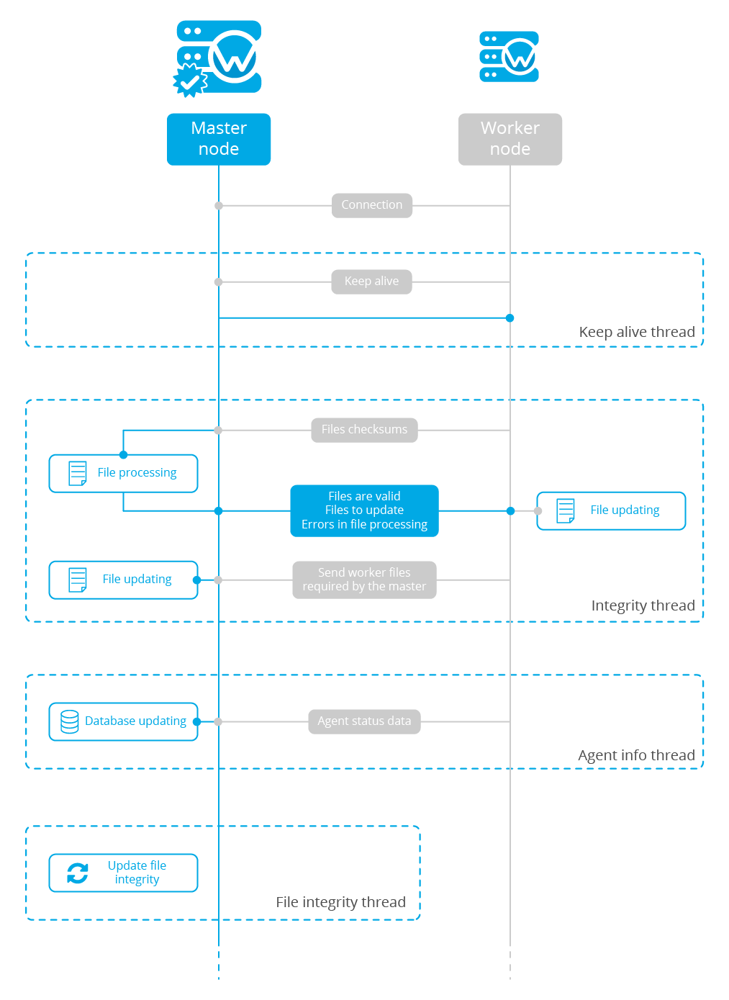

.. Copyright (C) 2018 Wazuh, Inc.

.. _wazuh-cluster:

Configuring a cluster
=====================

.. versionadded:: 3.0.0

- `Introduction`_
- `Getting started`_
- `Upgrading from older versions`_
- `How the cluster works`_
- `Cluster management`_

Introduction
------------
The cluster extends the managers into a cluster of managers to enhance the availability and scalability of the service.

Reasons for using a cluster
^^^^^^^^^^^^^^^^^^^^^^^^^^^

Horizontal scalability
~~~~~~~~~~~~~~~~~~~~~~

It multiplies Wazuh's event processing capacity and allows it to have thousands of agents reporting. Adding a new node to the cluster is very simple (just add the master's address in the configuration) and it can be automated easily, giving the user the ability to implement auto-scaling.

High availability
~~~~~~~~~~~~~~~~~

Servers eventually fail: hardware can be broken, a human can turn them off, the system can go down... And while the server is restored, you won't be able to see what is happening in your agents. Using a cluster you make sure your agents will always have a manager to report to.

.. thumbnail:: ../../images/manual/cluster/cluster_infrastructure.png
    :title: Wazuh cluster infrastructure
    :align: center
    :width: 80%

Types of nodes
^^^^^^^^^^^^^^

Master
~~~~~~

The master node centralizes and coordinates worker nodes, making sure the critical and required data is consistent across all nodes. It provides the centralization of the following:

- Agent registration.
- Agent deletion.
- Rules, decoders and CDB lists synchronization.
- Configuration of agents grouping.

.. warning::

    The master doesn't send its :doc:`local configuration file <../reference/index>` to the workers. If the configuration is changed in the master node, it should be changed manually in the workers. Take care of not overwriting the cluster section in the local configuration of each worker.

.. warning::
    When rules, decoders or CDB lists are synchronized, the worker nodes are not restarted. They must be restarted manually in order to apply the received configuration.

All communications among nodes in the cluster are encrypted using AES algorithm.

Worker
~~~~~~

Worker nodes are responsible of two main tasks:

    - Synchronizing :ref:`integrity files <integrity-thread>` from the master node.
    - Sending :ref:`agent status updates <agent-info-thread>` to the master.

Getting started
---------------

.. _deploy_wazuh_cluster:

Deploying a Wazuh cluster
^^^^^^^^^^^^^^^^^^^^^^^^^

.. note::
  To run the cluster, **Python 2.7 or higher** is required. In case you're using CentOS 6, please refer to `Running the cluster in CentOS 6`_ for instructions on how to update to and use **Python 2.7**.

Follow these steps to deploy a Wazuh cluster:

1. Install dependencies

  a. For RPM-based distributions:

    .. code-block:: console

      # yum install python-setuptools python-cryptography

  b. For Debian-based distributions:

    .. code-block:: console

      # apt-get install python-cryptography

2. Set the cluster configuration

  Using the ``<cluster>`` section in the :doc:`Local configuration <../reference/ossec-conf/cluster>`, set the cluster configuration as below:

  - ``<node_type>``: Set the node type.
  - ``<key>``: The key must be 32 characters long and should be the same for all of the nodes of the cluster. You may use the following command to generate a random one:

      .. code-block:: console

          # openssl rand -hex 16

  - ``<disabled>``: Set this field to ``no`` in order to enable the cluster.
  - ``<nodes>``: The address of the **master** must be specified in all nodes (including the master itself). The address can be either an IP or a DNS.

    The following is an example of the configuration of a **worker** node:

    .. code-block:: xml

        <cluster>
            <name>wazuh</name>
            <node_name>node02</node_name>
            <key>c98b62a9b6169ac5f67dae55ae4a9088</key>
            <node_type>worker</node_type>
            <port>1516</port>
            <bind_addr>0.0.0.0</bind_addr>
            <nodes>
              <node>master</node>
            </nodes>
            <hidden>no</hidden>
            <disabled>no</disabled>
        </cluster>

    And the following is an example of the configuration of a **master** node:

    .. code-block:: xml

      <cluster>
          <name>wazuh</name>
          <node_name>node01</node_name>
          <key>c98b62a9b6169ac5f67dae55ae4a9088</key>
          <node_type>master</node_type>
          <port>1516</port>
          <bind_addr>0.0.0.0</bind_addr>
          <nodes>
            <node>master</node>
          </nodes>
          <hidden>no</hidden>
          <disabled>no</disabled>
      </cluster>

3. Restart the node

    .. code-block:: console

        # systemctl restart wazuh-manager

.. _agent-registration-cluster:

Agent registration in the cluster
^^^^^^^^^^^^^^^^^^^^^^^^^^^^^^^^^

**All agents must be registered in the master node**. The master is responsible for replicating the new agent's information across all worker nodes. If an agent is registered in a worker node, it will be deleted by the master node.

Configuring the Wazuh app for Kibana/Splunk
^^^^^^^^^^^^^^^^^^^^^^^^^^^^^^^^^^^^^^^^^^^

The following must be considered when configuring a Wazuh app:

    - The apps must be configured to point to the master's API.
    - All worker nodes need an event forwarder in order to send data to Elasticsearch or Splunk. Install **Filebeat** if you're using the **Elastic stack** or **Splunk forwarder** if you're using **Splunk**. This is only necessary if the node is in a separated instance from Elasticsearch or Splunk.

    **Installing Filebeat:**

    +------------------------------------------------------------------------+-------------------------------------------------------------+
    | Type                                                                   | Description                                                 |
    +========================================================================+=============================================================+
    | :ref:`RPM packages <wazuh_server_rpm_filebeat>`                        | Install Filebeat on CentOS/RHEL/Fedora.                     |
    +------------------------------------------------------------------------+-------------------------------------------------------------+
    | :ref:`DEB packages <wazuh_server_deb_filebeat>`                        | Install Filebeat on Debian/Ubuntu.                          |
    +------------------------------------------------------------------------+-------------------------------------------------------------+

    **Installing Splunk forwarder:**

    +-------------------------------------------------------------------+-------------------------------------------------------------+
    | Type                                                              | Description                                                 |
    +===================================================================+=============================================================+
    | :ref:`RPM/DEB packages <splunk_forwarder>`                        | Install Splunk forwarder for RPM or DEB based OS.           |
    +-------------------------------------------------------------------+-------------------------------------------------------------+

Pointing agents to the cluster with a load balancer
^^^^^^^^^^^^^^^^^^^^^^^^^^^^^^^^^^^^^^^^^^^^^^^^^^^

A **load balancer** is a service that distributes the workloads across multiple resources.
In Wazuh's case, users want to use a load balancer to catch all the agent events and distribute them between the different workers in the cluster.

The correct way to use it is to point every agent to send the events to the *load balancer*:

1. Edit the Wazuh agent configuration in ``/var/ossec/etc/ossec.conf`` to add the **Load Balancer** IP address. In the ``<client><server>`` section, change the ``LOAD_BALANCER_IP`` value to the ``load balancer`` address and ``port``:

  .. code-block:: xml

    <client>
      <server>
        <address>LOAD_BALANCER_IP</address>
        ...
      </server>
    </client>

2. Restart the agents:

  a. For Systemd:

    .. code-block:: console

      # systemctl restart wazuh-agent

  b. For SysV Init:

    .. code-block:: console

      # service wazuh-agent restart

3. Include in the ``Load Balancer`` the IP of every instance of the cluster we want to deliver events.

  This configuration will depend of the load balancer service choosen.

Here is a short configuration guide of a **load balancer** using Nginx:

  1. Install Nginx in the *load balancer instance*:

    - Download the packages from the `Official Page. <http://nginx.org/en/linux_packages.html>`_
    - Follow the steps related on that guide to install the packages.

  2. Configure the instance as a *load balancer*:

    - The way nginx and its modules work is determined in the configuration file. By default, the configuration file is named nginx.conf and placed in the directory /usr/local/nginx/conf, /etc/nginx, or /usr/local/etc/nginx.
    - Now, open the configuration file and add the following structure:

      .. code-block:: xml

        cluster-stream {
          upstream mycluster {
            server <INSTANCE_IP>:1516;
            server <INSTANCE_IP>:1516;
            server <INSTANCE_IP>:1516;
            ...
          }

          server {
            listen 1516;

            location / {
              proxy_pass mycluster;
            }
          }
        }

    3. Restart nginx configuration files:
    
      - nginx -s reload

Keep in mind the following considerations:

* **It is recommended to use TCP protocol instead of UDP**. Permanent connections and stickiness are needed in order to make sure agent data is consistent. In order to use the TCP protocol, you should configure both your :ref:`agents <server_protocol>` and your :ref:`nodes <manager_protocol>`.

* **Disable the option**  :ref:`use_source_ip <auth_use_source_ip>` **in your authd configuration**. When using a LB, the cluster nodes will only see the LB's IP and no the agents'. This will make the agents unable to connect to the cluster.

.. _run-cluster-centos6:

Running the cluster in CentOS 6
^^^^^^^^^^^^^^^^^^^^^^^^^^^^^^^

Python 2.6 is the default python version in CentOS 6. Since Python 2.7 is required to run the cluster, follow these steps to install and use this version:

1. Install Python 2.7 as follows:

  .. code-block:: console

    # yum install -y centos-release-scl
    # yum install -y python27

2. Install the Python package ``cryptography`` via pip:

  .. code-block:: console

    # export LD_LIBRARY_PATH=$LD_LIBRARY_PATH:/opt/rh/python27/root/usr/lib64:/opt/rh/python27/root/usr/lib
    # /opt/rh/python27/root/usr/bin/pip2.7 install cryptography

3. Since the cluster doesn't use the default python version in CentOS 6, the service file should be modified to load the correct python version when ``wazuh-manager`` service starts:

  .. code-block:: console

     # sed -i 's#echo -n "Starting OSSEC: "#echo -n "Starting OSSEC (EL6): "; source /opt/rh/python27/enable; export LD_LIBRARY_PATH=$LD_LIBRARY_PATH:/var/ossec/framework/lib#' /etc/init.d/wazuh-manager

4. Use the ``service`` command instead of ``/var/ossec/bin/ossec-control`` to start, stop and restart Wazuh:

  .. code-block:: console

    # service wazuh-manager restart
    Stopping OSSEC:                                            [  OK  ]
    Starting OSSEC (EL6):                                      [  OK  ]

5. Finally, check the cluster is running:

  .. code-block:: console

    # ps aux | grep cluster
    ossec     9725  0.1  1.3 137364 14216 ?        S    14:22   0:00 python /var/ossec/bin/wazuh-clusterd
    root      9767  0.0  0.0 103340   904 pts/0    S+   14:22   0:00 grep cluster

Running the cluster in Ubuntu Trusty (14.04)
^^^^^^^^^^^^^^^^^^^^^^^^^^^^^^^^^^^^^^^^^^^^

In order to run the Wazuh cluster in Ubuntu Trusty, ensure that Python 2.7 is installed in your machine. After that, to run the cluster follow these steps:

1. Install the following packages:

  .. code-block:: console

      # apt-get install python-pip libssl-dev python-dev libffi-dev

2. Install the latests version of `setuptools` package using `pip`:

  .. code-block:: console

      # pip install setuptools --upgrade

3. Install `cryptography` module, its dependencies and `ipaddress`:

  .. code-block:: console

      # pip install enum34 six cffi cryptography ipaddress

Once you have executed all these commands, you can set the cluster configuration and run the cluster.

Upgrading from older versions
-----------------------------

If you already have a cluster installation from a **version older or equal to 3.2.2**, you should do some changes in your cluster configuration:

    * Remove ``<interval>`` section.
    * Remove worker nodes from ``<nodes>`` section. Only the master node is allowed.

The cluster will work with an old configuration but it is recommended to update it.

How the cluster works
---------------------

The cluster is managed by a daemon, called **wazuh-clusterd**, which communicates with all the nodes following a master-worker architecture. Refer to the :doc:`Daemons <../reference/daemons/clusterd>` section for more information about its use.

The image below shows the communications between a worker and a master node. Each worker-master communication is independent from each other, since workers are the ones who start the communication with the master.

There are different independent threads running, each one is framed in the image:

    - **Keep alive thread**: Responsible of sending a keep alive to the master every so often.
    - **Agent info thread**: Responsible of sending the statuses of the agents that are reporting to that node.
    - **Integrity thread**: Responsible of synchronizing the files sent by the master.

All cluster logs are written in the file ``logs/cluster.log``.

Keep alive thread
^^^^^^^^^^^^^^^^^

The *keep alive thread* sends a keep-alive to the master every so often. It is necessary to keep the connection opened between master and worker, since the cluster uses permanent connections.

.. _agent-info-thread:

Agent info thread
^^^^^^^^^^^^^^^^^

The *agent info thread* sends the :ref:`statuses of the agents <agent-status-cycle>` that are reporting to the worker node. The master checks the modification date of each received agent status file and keeps the most recent one.

The master also checks whether the agent exists or not before saving its status update. This is done to prevent the master to store unnecessary information. For example, this situation is very common when an agent is removed but the master hasn't notified worker nodes yet.

.. _integrity-thread:

Integrity thread
^^^^^^^^^^^^^^^^

The *integrity thread* is in charge of synchrozing the files sent by the master node to the workers. Those files are:

- :ref:`agent-keys-registration` file.
- :doc:`User defined rules, decoders <../ruleset/custom>` and :doc:`CDB lists <../ruleset/cdb-list>`.
- :doc:`Agent groups files and assignments <../agents/grouping-agents>`.

Usually, the master is responsible for sending group assignments, but just in case a new agent starts reporting in a worker node, the worker will send the new agent's group assignment to the master.

File Integrity Thread
^^^^^^^^^^^^^^^^^^^^^

The integrity of each file is calculated using its MD5 checksum and its modification time. To avoid calculating the integrity with each worker connection, the integrity is calculated in a different thread, called *File integrity thread*, in the master node every so often.

Cluster management
------------------

The **cluster_control** tool allows you to obtain real-time information about the cluster health, connected nodes and the agents reporting to the cluster. This information can also be obtained using the :doc:`API requests <../api/reference>`.

For example, the following snippet shows the connected nodes in the cluster:

.. code-block:: shell

    # /var/ossec/bin/cluster_control -l
    ---------------------------------------
    Name    Address         Type    Version
    ---------------------------------------
    node01  192.168.56.101  master  3.8.2
    node02  192.168.56.103  worker  3.8.2
    node03  192.168.56.105  worker  3.8.2
    ---------------------------------------

This information can also be obtained using the Restful API:

.. code-block:: console

    # curl -u foo:bar -X GET "http://localhost:55000/cluster/nodes?pretty"
    {
       "error": 0,
       "data": {
          "totalItems": 3,
          "items": [
             {
                "ip": "192.168.56.103",
                "version": "3.8.2",
                "type": "worker",
                "name": "node02"
             },
             {
                "ip": "192.168.56.105",
                "version": "3.8.2",
                "type": "worker",
                "name": "node03"
             },
             {
                "ip": "192.168.56.101",
                "version": "3.8.2",
                "type": "master",
                "name": "node01"
             }
          ]
       }
    }

If you want to see more examples and check all its options, refer to :doc:`the cluster_control manual <../reference/tools/cluster_control>` or the :doc:`API requests <../api/reference>`.
