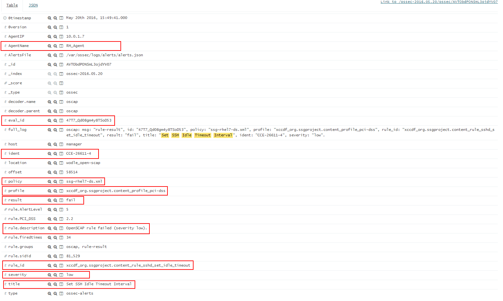
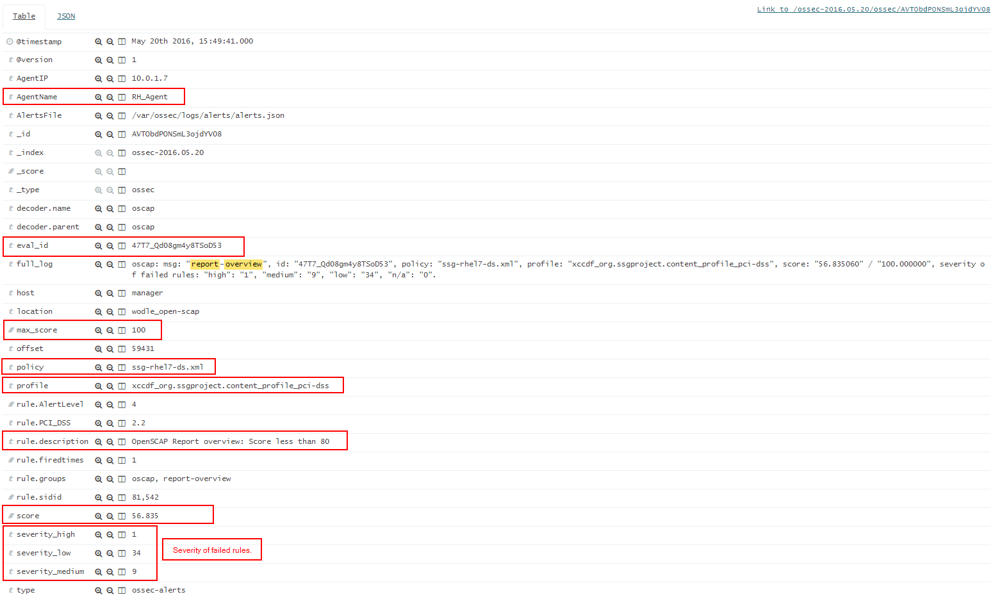
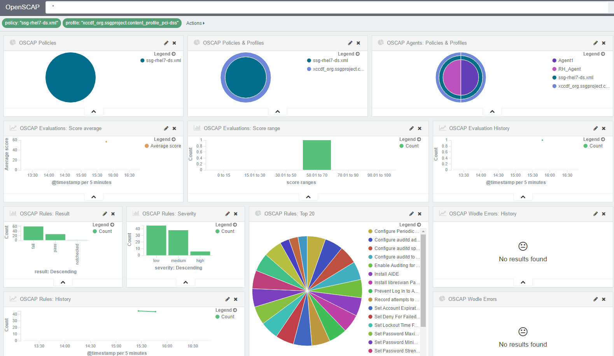
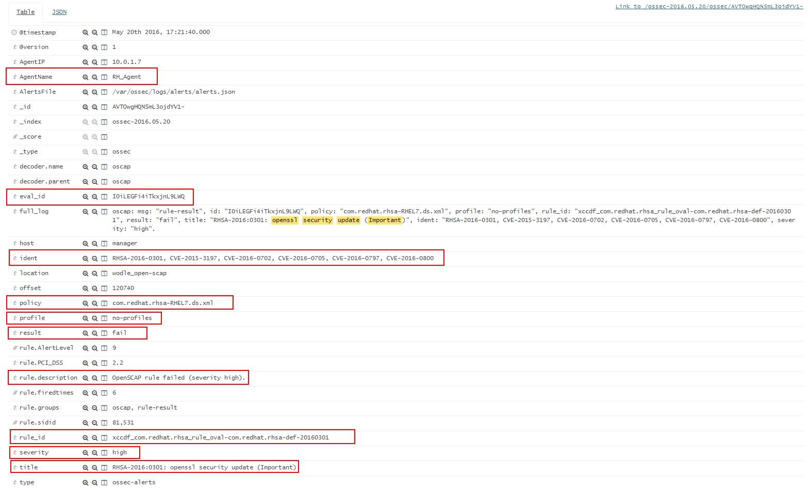
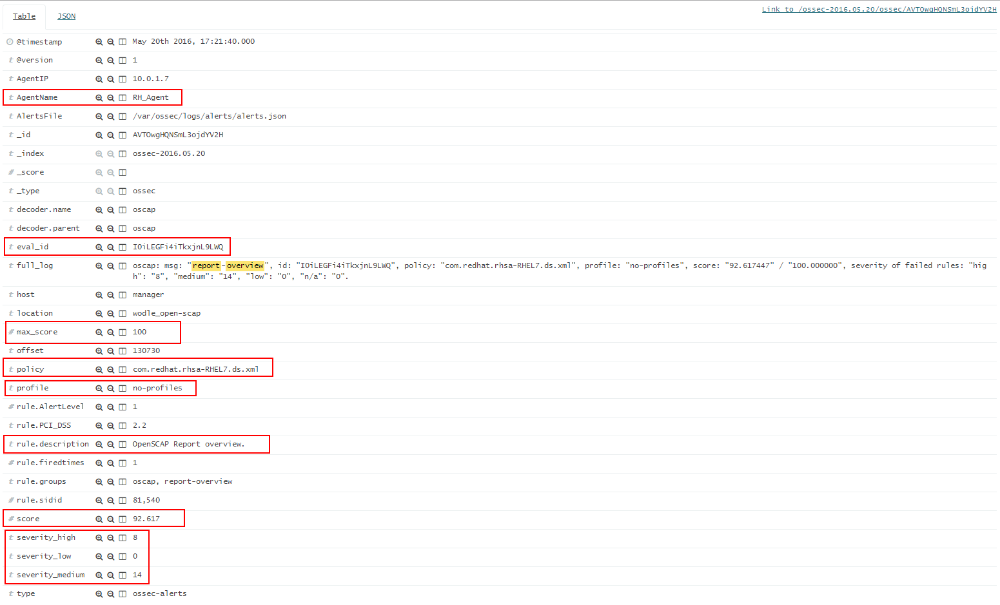
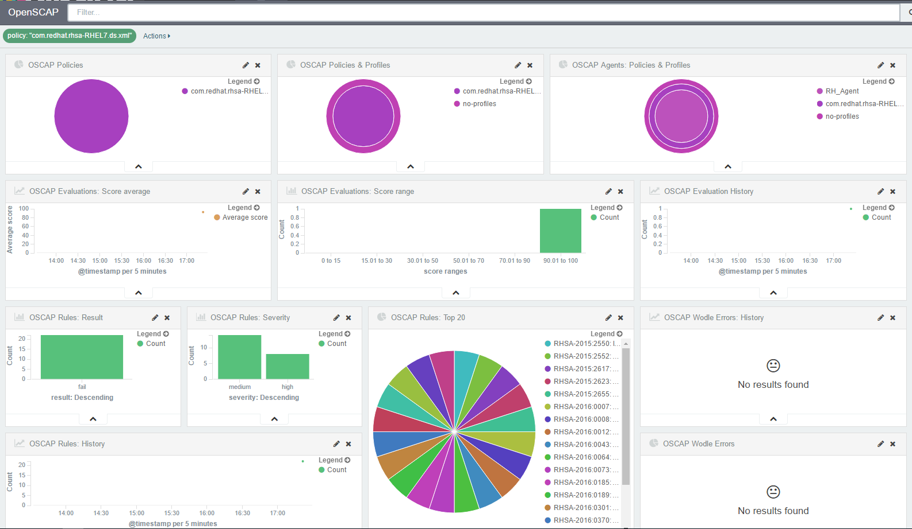

.. _openscap_use_cases:

How to Evaluate PCI-DSS on RHEL7
-------------------------------------------------------------------------
This section describes how to evaluate the Payment Card Industry Data Security Standard (PCI-DSS) on Red Hat Enterprise Linux 7.

**Step 1: Configure agents**

Each agent must be properly identified in order to know which policy and profile to execute.

Agent ``ossec.conf``:

::

  <client>
    <server-ip>10.0.1.4</server-ip>
    <config-profile>redhat7</config-profile>
  </client>

**Step 2: Configure manager**

We want to execute the PCI-DSS profile of SSG RH7 policy only on Red Hat 7 servers.

Manager ``shared/agent.conf``:

::

  <agent_config profile="redhat7">

    <wodle name="open-scap">
      <content type="xccdf" path="ssg-rhel7-ds.xml">
        <profile>xccdf_org.ssgproject.content_profile_pci-dss</profile>
      </content>
    </wodle>

  </agent_config>

**Step 3: Restart manager and agents**

To apply the new configuration restart the manager and agents:

::

  $ /var/ossec/bin/ossec-control restart
  $ /var/ossec/bin/agent_control -R -a

If you prefer, you can restart a specific agent with option ``-u <id>``.

**Step 4: See alerts**

When the evaluation is completed you will see the results as OSSEC alerts:

``/var/ossec/logs/alerts/alerts.log``

::

  ** Alert 1463752181.32768: - oscap,rule-result,pci_dss_2.2,
  2016 May 20 13:49:41 (RH_Agent) 10.0.1.7->wodle_open-scap
  Rule: 81529 (level 5) -> 'OpenSCAP rule failed (severity low).'
  oscap: msg: "rule-result", id: "47T7_Qd08gm4y8TSoD53", policy: "ssg-rhel7-ds.xml", profile: "xccdf_org.ssgproject.content_profile_pci-dss", rule_id: "xccdf_org.ssgproject.content_rule_sshd_set_idle_timeout", result: "fail", title: "Set SSH Idle Timeout Interval", ident: "CCE-26611-4", severity: "low".

::

  ** Alert 1463752181.33254: - oscap,report-overview,pci_dss_2.2,
  2016 May 20 13:49:41 (RH_Agent) 10.0.1.7->wodle_open-scap
  Rule: 81542 (level 4) -> 'OpenSCAP Report overview: Score less than 80'
  oscap: msg: "report-overview", id: "47T7_Qd08gm4y8TSoD53", policy: "ssg-rhel7-ds.xml", profile: "xccdf_org.ssgproject.content_profile_pci-dss", score: "56.835060" / "100.000000", severity of failed rules: "high": "1", "medium": "9", "low": "34", "n/a": "0".

``Kibana``

Note that each field is removed to facilitate searches.

**Step 5: Dashboards**

Finally, you can explore all results using the OpenSCAP dashboards for Kibana.

Auditing Security Vulnerabilities of Red Hat Products
-------------------------------------------------------------------------
The Red Hat Security Response Team provides OVAL definitions for all vulnerabilities (identified by CVE name) that affect Red Hat Enterprise Linux 3, 4, 5, 6 and 7. This enables users to perform a vulnerability scan and diagnose whether a system is vulnerable or not.

**Step 1: Configure agents**

Each agent must be properly identified in order to know which policy and profile execute.

Agent ``ossec.conf``:

::

  <client>
    <server-ip>10.0.1.4</server-ip>
    <config-profile>redhat7</config-profile>
  </client>

**Step 2: Configure manager**

We want to execute the RedHat secutiy policy only on Red Hat 7 servers.

Manager ``shared/agent.conf``:

::

  <agent_config profile="redhat7">

    <wodle name="open-scap">
      <content type="xccdf" path="com.redhat.rhsa-RHEL7.ds.xml"/>
    </wodle>

  </agent_config>

**Step 3: Restart manager and agents**

To apply the new configuration restart the manager and agents:

::

  $ /var/ossec/bin/ossec-control restart
  $ /var/ossec/bin/agent_control -R -a

If you prefer, you can restart a specific agent with option ``-u <id>``.

**Step 4: See alerts**

When the evaluation is completed you will see the results as OSSEC alerts:

``/var/ossec/logs/alerts/alerts.log``

::

  ** Alert 1463757700.70731: mail  - oscap,rule-result,pci_dss_2.2,
  2016 May 20 15:21:40 (RH_Agent) 10.0.1.7->wodle_open-scap
  Rule: 81531 (level 9) -> 'OpenSCAP rule failed (severity high).'
  oscap: msg: "rule-result", id: "I0iLEGFi4iTkxjnL9LWQ", policy: "com.redhat.rhsa-RHEL7.ds.xml", profile: "no-profiles", rule_id: "xccdf_com.redhat.rhsa_rule_oval-com.redhat.rhsa-def-20160722", result: "fail", title: "RHSA-2016:0722: openssl security update (Important)", ident: "RHSA-2016-0722, CVE-2016-0799, CVE-2016-2105, CVE-2016-2106, CVE-2016-2107, CVE-2016-2108, CVE-2016-2109, CVE-2016-2842", severity: "high".

::

  ** Alert 1463757700.71339: - oscap,report-overview,pci_dss_2.2,
  2016 May 20 15:21:40 (RH_Agent) 10.0.1.7->wodle_open-scap
  Rule: 81540 (level 1) -> 'OpenSCAP Report overview.'
  oscap: msg: "report-overview", id: "I0iLEGFi4iTkxjnL9LWQ", policy: "com.redhat.rhsa-RHEL7.ds.xml", profile: "no-profiles", score: "92.617447" / "100.000000", severity of failed rules: "high": "8", "medium": "14", "low": "0", "n/a": "0".

``Kibana``

Note that each field is removed to facilitate searches.

**Step 5: Dashbaords**

Finally, you can explore all results using the OpenSCAP dashboards for Kibana.

