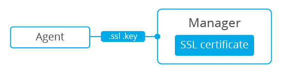

.. Copyright (C) 2019 Wazuh, Inc.

.. _manager-verification-registration:

Registration with Manager verification
--------------------------------------

To verify the Wazuh manager using SSL, we will create an SSL certificate and sign it using the :ref:`Certificate of Authority (CA) <host-verification-registration>` created in the previous section. This will allow the agents to ensure that they are connected to the correct manager during the registration service.

.. note::
	In this example, we will create a certificate for the manager, whose IP address is ``192.168.1.2``

Manager
^^^^^^^

Follow these steps in the Wazuh manager host:

1. Create a configuration file ``req.conf`` and enter the hostname or the IP address of the Wazuh server where the agents are going to be registered. The configuration file could be as follows:

   .. code-block:: console

    [req]
    distinguished_name = req_distinguished_name
    req_extensions = req_ext
    prompt = no
    [req_distinguished_name]
    C = US
    CN = 192.168.1.2
    [req_ext]
    subjectAltName = @alt_names
    [alt_names]
    DNS.1 = wazuh
    DNS.2 = wazuh.com

   .. note:: The ``subjectAltName`` extension is optional but necessary to allow the registration of Wazuh agents with a SAN certificate. In this case, the Wazuh server DNS are ``wazuh`` and ``wazuh.com``.

2. Issue and sign a certificate for the manager:

   .. code-block:: console

    # openssl req -new -nodes -newkey rsa:4096 -keyout sslmanager.key -out sslmanager.csr -config req.conf
    # openssl x509 -req -days 365 -in sslmanager.csr -CA rootCA.pem -CAkey rootCA.key -out sslmanager.cert -CAcreateserial -extfile req.conf -extensions req_ext

   .. note:: The ``-extfile`` and ``-extensions`` options are required to copy the subject and the extensions from ``sslmanager.csr`` to ``sslmanager.cert``. This allows the registration of the agents with a SAN certificate.

3. Copy the newly created certificate and its key to the ``/var/ossec/etc`` folder:

   .. code-block:: console

    # cp sslmanager.cert sslmanager.key /var/ossec/etc

4. Restart the Wazuh manager:

   a) For Systemd:

   .. code-block:: console

      # systemctl restart wazuh-manager

   b) For SysV Init:

   .. code-block:: console

      # service wazuh-manager restart

Agents
^^^^^^

Once you have completed the manager section, you need to copy the CA file (``.pem``) to the agent host. In this example, the CA file is ``rootCA.pem``.

Now, follow the instructions to register the agent depending on the OS of the host:

.. toctree::
    :maxdepth: 4

    Linux and Unix host<agents/linux-unix-manager-verification>
    Windows host<agents/windows-manager-verification>
    MacOS X host<agents/macos-manager-verification>
